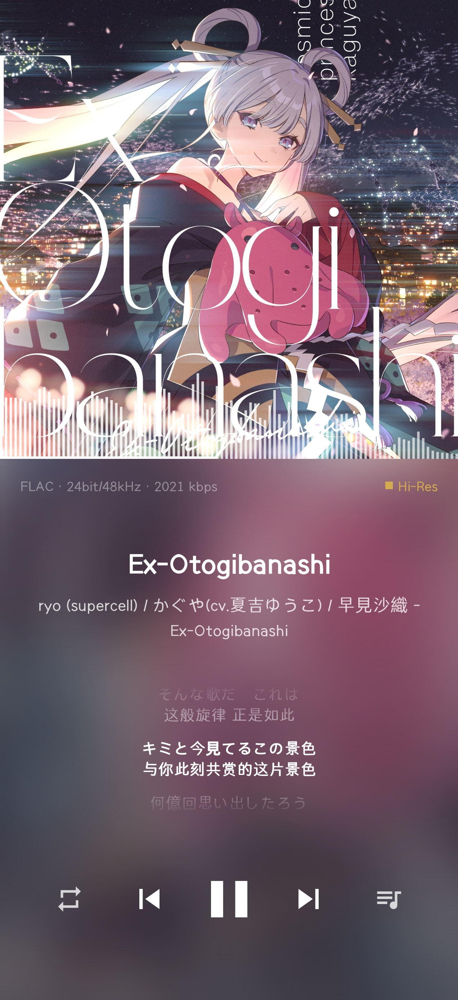
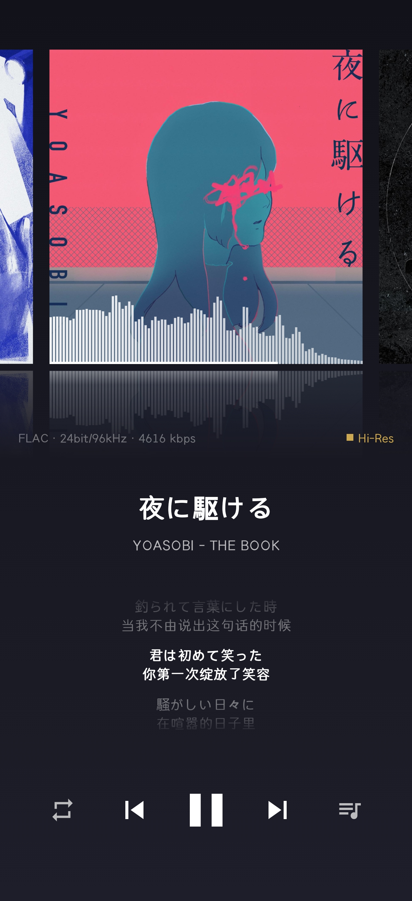
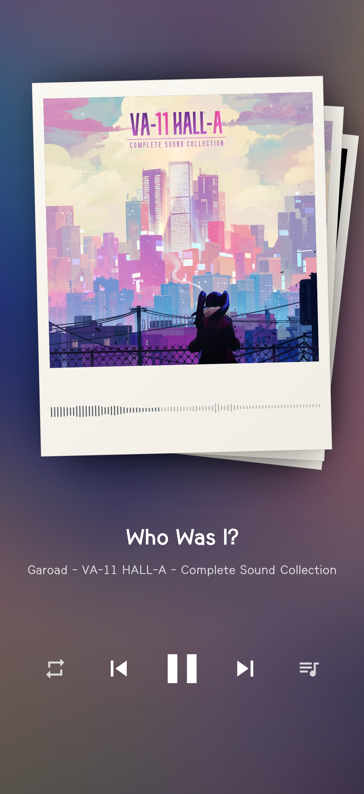
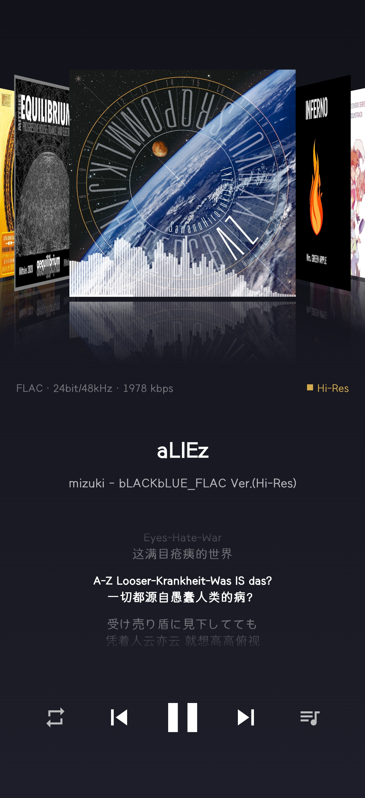
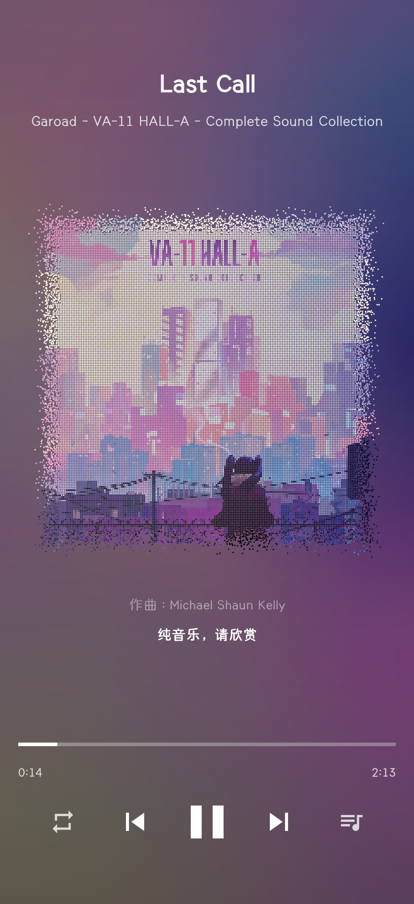
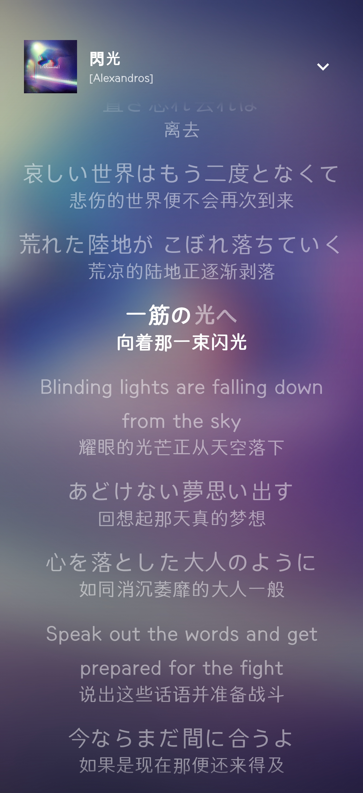
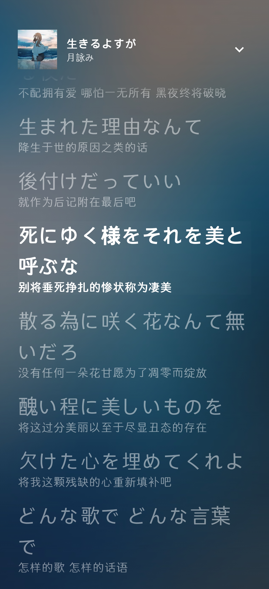
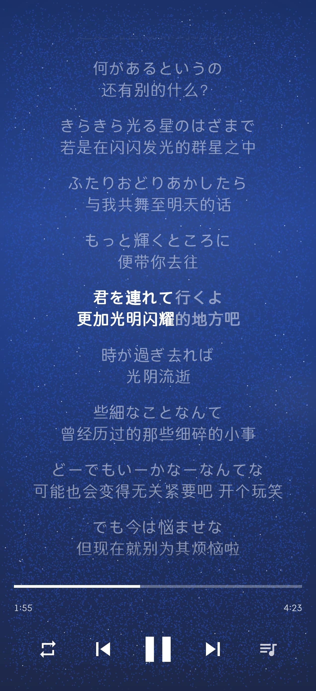
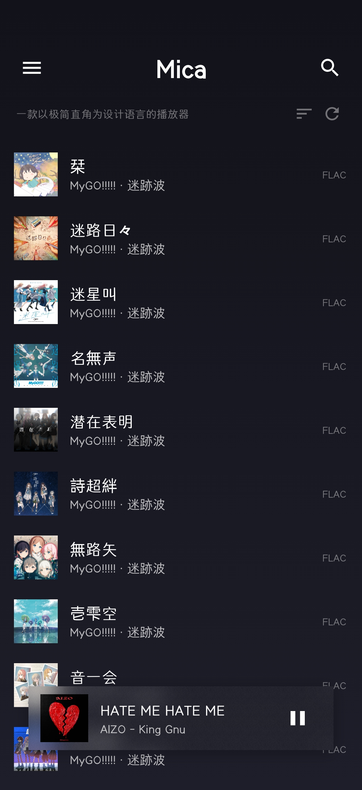

# Mica — HiFi 本地音乐播放器（Android）

> 极简直角 · 多种主题 · 自定义

一款不专业的 **本地 HiFi 播放器**，特色包括：多种主题样式、丰富的自定义选项、内嵌/外挂歌词优先级自由调整与 ALAC/DSF/APE 支持。

---
<p align="center">
  
   
   
   
   
</p>
<p align="center">
  
  
   
   
   
   
</p>

---
### 环境要求

- **Android Studio**：Hedgehog (2023.1.1) 或更新
- **JDK**：17
- **Android SDK**：API 35（compileSdk）/ API 26+（minSdk）
- **设备**：Android 8.0+，**arm64-v8a**（项目目前仅编 64 位；Media3 FFmpeg 扩展包含在工程内）

### 自行编译

1. Android Studio → `File → Open`，选择**本仓库根目录**
2. 等待 Gradle Sync（首次会下载 Gradle 8.9 与依赖）
3. 连接 **arm64 真机**（或 arm64 模拟器），点击 `Run 'app'`

命令行编译：

```bash
.\gradlew.bat :app:assembleDebug
```

质量门（编译 + Lint + 单测 + 截图比对，无需真机）：

```powershell
.\gradlew :app:micaCheck --no-configuration-cache
```

Windows PowerShell 5.1 若看到中文乱码，先在当前会话启用 UTF-8：

```powershell
. .\scripts\use-utf8-console.ps1
```


---

## 主要功能

| 模块 | 说明 |
|------|------|
| **播放页主题** | 标准 / 自定义 / **粒子封面**（GLES）/ 平行封面带 / 复古立体 / **拍立得回忆** |
| **播放页背景** | 主题色、封面渐变、封面模糊、流光溢彩 |
| **播放页其他行为** | 沉浸模式、频谱条（可选）、封面底边进度、共享封面转场 |
| **播放** | Media3 ExoPlayer 单链路；Jellyfin FFmpeg 扩展解码 ALAC/DSF/APE；顺序/循环/随机；10 段软件 EQ；通知歌词（可选） |
| **曲库扫描** | MediaStore 或 SAF；深度元数据、封面缓存与取色、增量同步 |
| **持久化** | Room 曲库；`ServicePlaybackStateStore` 冷启动恢复队列与进度 |
| **歌词** | 内嵌 + 外挂 `.lrc` `逐字歌词` `TTML歌词`；三行歌词、展开歌词页、双语/逐字等设置 |
| **浏览** | 歌曲 / 歌手 / 专辑 / 最近 / 歌单 / 音乐库分析 |
| **迷你栏** | 浮岛毛玻璃（BlurView）/ 极简 Hi‑Fi 底栏 |
| **界面** | 可自定义配置强调色&背景色、自定义背景图片、全局动效（`MicaMotion`）、横屏模式 |

---

## 项目结构（概要）

```
├── CONTEXT.md              # 领域词汇
├── DESIGN_SPEC.md
├── REASONIX.md             # AI/工具速览
├── docs/
│   ├── DOC_INDEX.md
│   ├── TODO.md
│   ├── PLAYER_PAGE_CONTRACT.md
│   ├── COVER_FLOW_IMPLEMENTATION.md
│   └── …
└── app/src/main/java/com/mica/music/
    ├── MainActivity.kt     # BlurTarget + 双 ComposeView
    ├── data/
    ├── media/
    └── ui/
```

`data/MockData.kt` 为早期占位，**主流程已不再使用**。

---


## 相关文件

- 文档索引：[`docs/DOC_INDEX.md`](./docs/DOC_INDEX.md)
- 领域词汇：[`CONTEXT.md`](./CONTEXT.md)
- 设计规范：[`DESIGN_SPEC.md`](./DESIGN_SPEC.md)
- 动效与 Compose/View 分工：[`docs/MOTION.md`](./docs/MOTION.md)
- 功能清单：[`docs/TODO.md`](./docs/TODO.md)
- 测试：[`docs/TESTING.md`](./docs/TESTING.md)

---
#爱发电：https://ifdian.net/a/lwcoz
**Made with AI · 2026-08**
