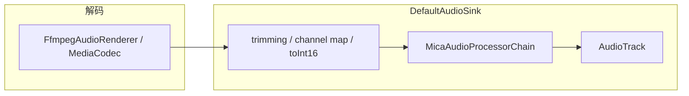

# Exo PCM 链路：变速、频谱、格式与 USB 前瞻

> **整理日期**：2026-07-07  
> **状态**：设计讨论记录（**未落地**；部分改动仅在本地 diff 中试探）  
> **可执行计划**：结论与分阶段实施已整理至 [`AUDIO_PIPELINE_REFACTOR.md`](AUDIO_PIPELINE_REFACTOR.md)（Sink Profile、P0–P6、验收表）。**实施以 REFACTOR 为准。**  
> **关联实现**：[`DSD_EXO_PLAYBACK.md`](DSD_EXO_PLAYBACK.md)、[`MicaAudioProcessorChain.kt`](../app/src/main/java/com/mica/music/media/MicaAudioProcessorChain.kt)、[`MicaRenderersFactory.kt`](../app/src/main/java/com/mica/music/media/MicaRenderersFactory.kt)  
> **背景**：单链路重构时绕开 Media3 默认尾链（`SilenceSkippingAudioProcessor` / `SonicAudioProcessor`）后，速度/变调改走 `AudioTrack.setPlaybackParams`，引发频谱 tap 偶发断供；本文汇总相关格式、架构与后续 USB 独占的前瞻约束。

---

## 1. 文档目的与范围

| 在范围内 | 不在范围内 |
|----------|------------|
| Float vs 24-bit PCM 语义与链路位置 | USB Native DSD / DoP 的具体 native 实现 |
| Sonic / SilenceSkipping 与自定义链关系 | 已验收的 USB DAC 实机矩阵 |
| `setEnableAudioOutputPlaybackParameters` vs Sonic 对频谱的影响 | 设置页「独占 / Hi-Res 直通」UI（[`DESIGN_SPEC.md`](../DESIGN_SPEC.md) 仍标注未实现） |
| 按设备/route 探测 Hi-Res 档位的模型 | |
| 未来 USB 独占/直通对架构的分叉要求 | |

**固定产品前提（讨论中确认）**：

- **保 Hi-Res** = 每台设备、每条 audio route 上取 **探测到的最高可用 PCM 档**，而非全设备统一固定格式。
- 未来需兼容 **USB 独占/直通**（产品 spec 待办，实现未开始）。

---

## 2. 当前 Exo PCM 链路（现状）

### 2.1 端到端



`MicaAudioProcessorChain` 当前处理器顺序（[`MicaRenderersFactory.kt`](../app/src/main/java/com/mica/music/media/MicaRenderersFactory.kt)）：

```
DsdDecimationAudioProcessor → SpectrumAudioProcessor → SoftwareEqualizerAudioProcessor
```

**故意省略**的 Media3 默认尾链（[`MicaAudioProcessorChain.kt`](../app/src/main/java/com/mica/music/media/MicaAudioProcessorChain.kt)）：

| Processor | 省略原因 |
|-----------|----------|
| `SilenceSkippingAudioProcessor` | 不接受 packed 24-bit PCM |
| `SonicAudioProcessor` | 仅接受 16-bit 与 float，不接受 24-bit |

### 2.2 变速 / 变调（现状）

| 项 | 现状 |
|----|------|
| 用户 API | `PlaybackTuning` → `ExoPlayer.setPlaybackParameters(speed, pitch)` |
| Sink 配置 | 历史上 **`setEnableAudioOutputPlaybackParameters(true)` 硬编码**；本地 diff 改为透传 `DefaultRenderersFactory` 参数 |
| 链内 Sonic | **无**；`applyPlaybackParameters` 为透传 |
| 实际变速 | 设备支持时由 **`AudioTrack.setPlaybackParams`** 在输出层完成 |

### 2.3 DSD 路径格式变化（摘要）

详见 [`DSD_EXO_PLAYBACK.md`](DSD_EXO_PLAYBACK.md)。

| 阶段 | 典型采样率 | 格式 |
|------|-----------|------|
| FFmpeg DSD 解码后 | ~1.4 MHz（DSD256 示例） | float（sink 入口常经 toInt16） |
| `DsdDecimationAudioProcessor` 后 | 176.4 kHz（有线 Hi-Res 优先） | **24-bit packed** |
| 进 `AudioTrack` | 与 `DsdOutputPolicy` + 探测结果一致 | 24-bit 或 16-bit |

`setEnableFloatOutput(false)` 的目的：**避免 Media3 在超高采样率下走 float 直通并跳过自定义 Processor**，否则无法对 ~1.4 MHz 流做降采样。

---

## 3. 格式基础：Float PCM vs 24-bit Packed PCM

两者是 **不同维度的编码**，不是简单的「谁更 Hi-Fi」。

| | **24-bit PCM（packed）** | **Float PCM（32-bit float）** |
|---|---|---|
| 存储 | 每样本 **3 字节**，有符号整数 | 每样本 **4 字节**，IEEE 754 |
| 数值 | 约 −8 388 608 … +8 388 607 | 通常归一化 **−1.0 … +1.0** |
| 语义 | 固定位深，与 FLAC/DSD 输出位深一致 | 浮点样本，适合中间 DSP |
| 项目中的位置 | DSD 降采样 **最终输出**；`AudioTrack` Hi-Res 目标 | FFmpeg 解码输出；降采样 **内部累加** |

`DsdDecimationAudioProcessor` 已在 float 域完成平均与滤波，仅在 `writeOutputSample` 量化成 24-bit/16-bit。因此「改成 float 输出」在算法上可行，但是 **策略与设备探测** 问题，不是能力问题。

**绕开 Sonic 的直接原因**：不是 float 音质更好，而是 Media3 内置 Processor **未实现 packed 24-bit 的字节读写**。

---

## 4. SonicAudioProcessor 与 SilenceSkippingAudioProcessor

### 4.1 关系：兄弟节点，非调用关系

Media3 `DefaultAudioProcessorChain` 的固定结构：

```
[用户自定义 Processor…]
        ↓
SilenceSkippingAudioProcessor    ← 曲间/段内静音裁剪
        ↓
SonicAudioProcessor              ← 变速 / 变调（time-stretch）
        ↓
AudioTrack
```

- 两者 **串行、并列**，由 `DefaultAudioProcessorChain` 通过 `AudioProcessorChain` 接口编排。
- **互不调用**；各自响应不同 Exo 开关：
  - `applySkipSilenceEnabled` → SilenceSkipping
  - `applyPlaybackParameters` → Sonic
  - `getMediaDuration` / `getSkippedOutputFrameCount` → 时间轴换算

### 4.2 格式支持（Media3 1.9.0）

| Processor | 输入/输出格式 |
|-----------|--------------|
| `SilenceSkippingAudioProcessor` | **16-bit PCM** |
| `SonicAudioProcessor` | **16-bit PCM 或 float**（输出 encoding 与输入相同） |

### 4.3 项目中的处置

整段替换为 `MicaAudioProcessorChain` 后，上述尾链 **均未接入**。代价：

- 无自动静音裁剪（DSD 文档已记录）；
- 变速依赖 `AudioTrack` PlaybackParams，而非 Sonic。

---

## 5. 频谱断供问题与根因分析

### 5.1 现象

开启速度/变调且使用 `setEnableAudioOutputPlaybackParameters(true)` 时：

- `SpectrumAudioProcessor` 的 PCM tap **偶发数秒无输入**；
- `MicaSpectrumAnalyzer` 固定 60fps tick，队列空转 → **频谱条停滞**；
- 诊断日志可关注 `SpectrumTap` 的 `maxInputGapMs` / `maxTapGapMs`（[`SpectrumAudioProcessor.kt`](../app/src/main/java/com/mica/music/media/SpectrumAudioProcessor.kt)）。

### 5.2 Media3 两条变速路径

| 路径 | Builder 配置 | 变速执行层 | 进入 Processor 链的 PCM 节奏 |
|------|-------------|-----------|------------------------------|
| **AudioTrack** | `setEnableAudioOutputPlaybackParameters(true)` | `AudioTrack.setPlaybackParams` | 解码仍按 **1x 媒体时间** 喂入；消费速率由硬件 speed 决定 |
| **Sonic** | `setEnableAudioOutputPlaybackParameters(false)` | 链内 `SonicAudioProcessor` | 经 Sonic 拉伸/压缩；`AudioTrack` 以 **1x** 播放 |

官方说明（Media3 `DefaultAudioSink.Builder`）：AudioTrack 路径延迟更低，但 **设备相关、可靠性较差**；Sonic 路径由 Exo 在链内处理。

### 5.3 机制推断（与 Media3 1.9.0 源码一致）

当走 **AudioTrack 变速** 时：

1. `DefaultAudioSink.handleBuffer()` → `processBuffers()` → 写入 `AudioTrack`；
2. 若 `AudioTrack` 缓冲区满或 playout 与 feed 速率不匹配，`handleBuffer` **返回 false**（backpressure）；
3. 上游解码暂停向 Processor 链送数据 → `SpectrumAudioProcessor.queueInput()` 出现长间隔；
4. 变速参数变更时，`afterDrainParameters` 会 **阻塞新输入直至 drain 完成**，加剧断供。

当走 **Sonic 变速** 时：

- 时间拉伸在 Processor 链 **内部** 完成；
- `AudioTrack` 始终以 1x 消费，feed 与 drain 节奏更一致；
- **理论上** 有利于频谱 tap 稳定（**需实机验证**；Sonic 仍有内部缓冲，且 CPU 开销更高）。

### 5.4 本地试探性改动

`MicaRenderersFactory.kt` 本地 diff（未合并）：

```diff
- .setEnableAudioOutputPlaybackParameters(true)
+ .setEnableAudioOutputPlaybackParameters(enableAudioOutputPlaybackParams)
```

若 factory 默认为 `false` 且 **未** 接回 Sonic，则变速可能在链内 **无效**（`MicaAudioProcessorChain.applyPlaybackParameters` 当前为透传）。任何「关 AudioTrack 变速」方案 **必须** 同步接入 Sonic 并正确实现 `applyPlaybackParameters`。

---

## 6. 重新启用 Sonic 的前置条件与推荐链顺序

### 6.1 必要改动（缺一不可）

| # | 改动 | 说明 |
|---|------|------|
| 1 | `setEnableAudioOutputPlaybackParameters(false)` | 避免输出层变速与 Processor 喂入抢 backpressure |
| 2 | 在链末接入 `SonicAudioProcessor` | 并实现 `applyPlaybackParameters` / `getMediaDuration` |
| 3 | 解决 Sonic 前格式 **≠ 24-bit packed** | 见 §6.2 |
| 4 | **`SpectrumAudioProcessor` 放在 Sonic 之前** | tap 解码侧稳定 PCM，而非 time-stretch 后输出 |

推荐顺序：

```
DsdDecimation → Spectrum → EQ → Sonic → AudioTrack (1x)
```

### 6.2 24-bit 与 Sonic 的冲突

DSD 降采样当前输出 `ENCODING_PCM_24BIT`（[`DsdDecimationAudioProcessor.kt`](../app/src/main/java/com/mica/music/media/DsdDecimationAudioProcessor.kt)）。Sonic **无法** 直接接收。

可选方案：

| 方案 | 做法 | Hi-Res | AudioTrack float 探测 |
|------|------|--------|----------------------|
| **A** | 降采样改输出 **float** | 保精度，非 24-bit 整数语义 | **需要**（若贯穿到 AudioTrack） |
| **B** | Sonic 前 **24→float** 转换 Processor | 链内 float，出链可再量化 | 取决于 Sonic 后格式 |
| **C** | Sonic 路径强制 **16-bit** 输出 | 放弃 DSD 24-bit | **不需要** |
| **D** | **链内 float、出 Sonic 后按探测量化成 24-bit** | 兼顾 Sonic 与现有 24-bit 探测 | **不必**赌 float AudioTrack |

讨论倾向：若 **保 Hi-Res 整数档位** 为固定前提，**方案 D** 与现有 `DsdOutputPolicy` / `AudioOutputCapabilities` 最对齐；方案 C 适合 **先验证频谱假设** 的最小实验。

### 6.3 不确定项（须实机验证）

- Sonic 路径是否 **完全消除** 频谱 `maxInputGapMs` 尖峰；
- 非 1x 变速下 CPU 与发热相对 PlaybackParams 的变化；
- 变调音质差异；
- DSD + Sonic + 方案 D 全链路在 API 33+ USB DAC 上的 configure 成功率。

---

## 7. Hi-Res 档位：API、设备、Route 三层模型

「每台设备/route 取探测最高档」**不能**简化为只看 API 版本。

### 7.1 三层分工

```text
┌─────────────────────────────────────────────────────────┐
│  API 版本     → 编码类型是否存在、探测 API 是否可用        │
│  设备硬件/HAL → 同 API 上 88.2k/176.4k/24bit 是否真能播   │
│  Audio Route  → 蓝牙 / USB / 内置 各自上限不同            │
└─────────────────────────────────────────────────────────┘
                              ↓
              候选 ladder → probe → 取最高可用档
```

### 7.2 API 门槛（项目已编码）

| API | 影响 |
|-----|------|
| **< 31 (S)** | 无 packed 24-bit；`bitsPerSample > 16` 在 `AudioOutputCapabilities.supports` 中 **直接 false** |
| **≥ 31** | 可使用 `ENCODING_PCM_24BIT_PACKED` |
| **≥ 33 (T)** | 可用 `AudioManager.getDirectPlaybackSupport()` |
| **< 33** | 回退 `AudioTrack` 试初始化（`canInitializeAudioTrack`） |
| **21+** | 存在 `ENCODING_PCM_FLOAT`；**高采样率 float 是否可播仍因设备而异** |

### 7.3 Route 差异（`DsdOutputPolicy`）

| Route | 候选 ladder（简化） |
|-------|-------------------|
| **蓝牙** | 48k / 24bit → 48k / 16bit |
| **非蓝牙**（含 USB、有线、内置） | 176.4k/24 → 88.2k/24 → 88.2k/16 → 48k/16 |

**注意**：当前 `route.usb` **仅用于日志**，USB **没有** 独立于「非蓝牙」的 ladder。USB DAC 常与有线共用 176.4k/24 候选，但实机最高档仍依赖 probe。

### 7.4 Float AudioTrack 是否要探？

- **仅当** 最终输出贯穿 **float 到 AudioTrack**（§6.2 方案 A）时，必须扩展探测（现有 `AlacPcmFormat` **无 float 映射**）。
- **若** 链内 float、出链量化 24-bit/16-bit（方案 D），可 **复用现有整数探测**，不必单独赌 float AudioTrack。
- **不能假设**：「设备支持 176.4k/24bit」⇒「同采样率 float 也一定支持」——两者是 **独立 probe 项**。

---

## 8. 未来 USB 独占 / 直通的前瞻影响

> Android **无** Windows 式内核独占；发烧语境通常指：**固定 USB 设备 + 格式匹配 + direct playback（少混音/少重采样）**；极端为 **DoP / Native DSD 比特流**（[`DSD_EXO_PLAYBACK.md`](DSD_EXO_PLAYBACK.md) §后续可扩展）。

### 8.1 与当前共享 PCM 链的冲突

| 能力 | 共享 PCM 链（现状） | USB 独占/直通（未来） |
|------|-------------------|---------------------|
| `DsdDecimation` 降采样 PCM | ✅ | ❌ 与 Native DSD 目标冲突 |
| `SpectrumAudioProcessor` | ✅ | ❌ 或仅旁路 tap |
| `SoftwareEqualizerAudioProcessor` | ✅ | ❌ 破坏 bit-perfect |
| Sonic / `PlaybackParams` 变速 | 讨论中 | ❌ 或限制 1.0x |
| `getDirectPlaybackSupport` 探测 | ✅ 已有 | ✅ **更关键**（须绑 USB 设备） |

结论：USB 独占不是「在现有链上加探测」，而是 **输出 path 分叉**。

### 8.2 建议的模式枚举（前瞻，未实现）

```text
SharedPcm(route)      → 现有链 + 可选 Sonic；频谱/EQ 按设置
UsbDirectPcm(device)  → 最小 Processor；probe 该 DAC 最高 PCM direct 档
UsbNativeDsd(device)  → 解复用后分叉；Raw DSD/DoP → USB（无 Exo PCM 链）
```

与现有机制类比：

- `configureQualityMode`：EQ/频谱开 → 关 offload；
- USB 独占：可能需 **更强约束**（旁路整段 Processor 或禁用 EQ/频谱/变速）。

### 8.3 对当前 Sonic/频谱决策的约束

- **Sonic 修复频谱** 应限定在 **`SharedPcm` 模式**；
- 架构上预留 **`PlaybackOutputMode`**（或等价）维度，避免 USB 直通与 Sonic 链硬耦合；
- 插拔 USB、切换独占开关 → **`flushAudioPipeline`** + 重新 probe + 可能切换 path（项目已有 flush 机制，[`MicaMediaService.kt`](../app/src/main/java/com/mica/music/media/MicaMediaService.kt)）。

### 8.4 产品 spec 缺口

[`DESIGN_SPEC.md`](../DESIGN_SPEC.md) §十五：设置 · 音频（输出 / 独占 / Hi‑Res 直通）仍为 **❌ 未实现**。USB 行为的产品定义（何时 bit-perfect、何时允许 EQ）需在实现 path 分叉前补齐。

---

## 9. 建议实施顺序

| 阶段 | 目标 | 风险 |
|------|------|------|
| **P0 验证** | `enableAudioOutputPlaybackParameters(false)` + 临时 Default 尾链 Sonic；**16-bit FLAC** 上对比 `maxInputGapMs` | 低；可快速验证假设 |
| **P1 正式接入** | `MicaAudioProcessorChain` 持有 Sonic；Spectrum 在 Sonic 前；正确实现 `applyPlaybackParameters` | 中；需处理 DSD 24-bit |
| **P2 DSD 兼容** | 方案 D（链内 float / Sonic，出链量化 24-bit）或方案 C（Sonic 路径 16-bit） | 中；需回归 DSD 与 EQ |
| **P3 USB** | `UsbDirectPcm` / `UsbNativeDsd` path；USB 专用 ladder + 绑设备 probe | 高；依赖产品与实机矩阵 |

**不建议**：在 USB 独占未定义前，为 Sonic 统一全格式 float 输出并假设所有设备 AudioTrack 支持。

---

## 10. 关键代码索引

| 主题 | 路径 |
|------|------|
| 自定义 Processor 链 | `app/.../media/MicaAudioProcessorChain.kt` |
| Sink / 变速开关 | `app/.../media/MicaRenderersFactory.kt` |
| DSD 降采样与 24-bit 量化 | `app/.../media/DsdDecimationAudioProcessor.kt` |
| 频谱 tap | `app/.../media/SpectrumAudioProcessor.kt` |
| 频谱分析 | `app/.../media/MicaSpectrumAnalyzer.kt` |
| Hi-Res 候选与 route | `app/.../media/DsdOutputPolicy.kt` |
| 设备能力探测 | `app/.../media/AudioOutputCapabilities.kt` |
| 格式 → AudioTrack encoding | `app/.../media/AlacPcmFormat.kt` |
| Pipeline flush | `app/.../media/MicaMediaService.kt` → `flushAudioPipeline` |
| 用户变速 API | `app/.../data/PlaybackTuning.kt` |
| DSD 端到端说明 | `docs/DSD_EXO_PLAYBACK.md` |

---

## 11. 讨论结论摘要

1. **Float vs 24-bit**：float 适合链内 DSP；24-bit packed 是 Hi-Res 整数交付格式；绕开 Sonic 因 **格式支持**，非听感优劣。
2. **Sonic 与 SilenceSkipping**：默认链 **固定尾兄弟**；项目整段替换后两者皆无，变速改走 AudioTrack。
3. **频谱断供**：高度可能与 **AudioTrack 层变速** 导致 Processor 链 backpressure 有关；**Sonic 链内变速** 是合理修复方向，但须完整接入且 **Spectrum 在 Sonic 前**。
4. **保 Hi-Res**：= **probe 驱动**，非固定格式；受 **API 门槛 + 设备 + route** 三重约束。
5. **USB 独占未来**：将 forcing **path 分叉**；与 EQ/频谱/Sonic/降采样 PCM **不可混为一条链**；当前 Sonic 讨论应 scoped 在 **SharedPcm**。
6. **落地前必验证**：P0 实机对比 `SpectrumTap` 指标；勿在未接 Sonic 时单独关闭 `enableAudioOutputPlaybackParameters`。

---

## 12. 修订记录

| 日期 | 说明 |
|------|------|
| 2026-07-07 | 初版：汇总 PCM 格式、Sonic/频谱、探测模型、USB 前瞻讨论 |
