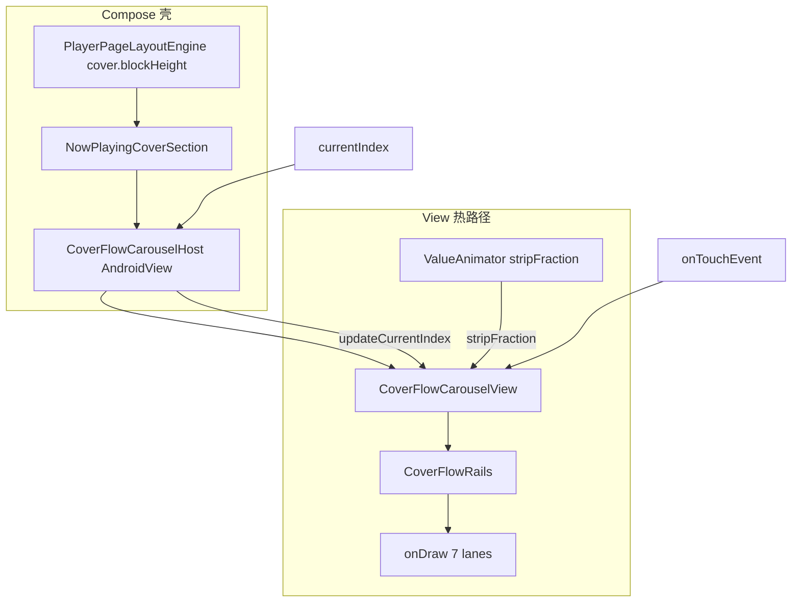

# 封面流实现手册（View + Canvas 七轨）

> **状态**：2026-06 现网热路径  
> **读者**：以后改封面流、间距、倒影、切歌动画的人——先读本文，再动代码。  
> 产品设计见 [`COVER_FLOW.md`](COVER_FLOW.md)。播放页契约见 [`PLAYER_PAGE_CONTRACT.md`](PLAYER_PAGE_CONTRACT.md)。

---

## 1. 一句话结论

**七张图、七条固定轨道（lane ∈ [-3,3]），唯一动画量是 `stripFraction`，所有视觉量只查 `railOffset = laneIndex - stripFraction`。**

切歌末帧提交时：`logicalCenter` 换歌、`stripFraction` 归零、各 lane 歌曲索引平移——**每张图在屏幕上的 `railOffset` 必须连续不变**。违反这条就会出现拖了两周的跳变、闪帧、缩放突变。

---

## 2. 架构分层（热路径）

| 层 | 文件 | 职责 |
|----|------|------|
| Compose 外壳 | [`NowPlayingCoverSection.kt`](../app/src/main/java/com/mica/music/ui/screens/NowPlayingCoverSection.kt) | 布局高度、`AndroidView` 挂载、倒影溢出绘制、歌词遮罩点击 |
| View 宿主 | [`CoverFlowCarouselHost.kt`](../app/src/main/java/com/mica/music/ui/screens/player/view/CoverFlowCarouselHost.kt) | `AndroidView` factory/update、预载位图、把 `currentIndex` 交给 View |
| 绘制核心 | [`CoverFlowCarouselView.kt`](../app/src/main/java/com/mica/music/ui/screens/player/view/CoverFlowCarouselView.kt) | 手势、`ValueAnimator`、`onDraw` 单遍绘制 |
| **轨道数学（唯一真相源）** | [`CoverFlowRails.kt`](../app/src/main/java/com/mica/music/ui/screens/player/CoverFlowRails.kt) | `railOffset` → 位移 / 缩放 / 旋转 / 透明度 / 枢轴 / z 序 |
| 共享公式 | [`CoverFlowMath.kt`](../app/src/main/java/com/mica/music/ui/screens/player/CoverFlowMath.kt) | 中心缩放、基础 slot 公式（Rails 复用） |
| 位图 | [`CoverFlowBitmaps.kt`](../app/src/main/java/com/mica/music/ui/screens/player/view/CoverFlowBitmaps.kt) | 从 Coil 内存缓存取 `Bitmap`，避免 Compose 每槽一张图 |
| 布局引擎 | [`PlayerPageLayoutEngine.kt`](../app/src/main/java/com/mica/music/ui/screens/player/PlayerPageLayoutEngine.kt) | `cover.blockHeight`、`zoneStop`；**不含倒影额外高度** |
| 标准封面轻扫 | [`CoverGestureCoordinator.kt`](../app/src/main/java/com/mica/music/ui/screens/player/CoverGestureCoordinator.kt) | 仅标准主题横向轻扫；封面流手势在 View 内 |
| 单测 | [`CoverFlowRailsTest.kt`](../app/src/test/java/com/mica/music/ui/screens/player/CoverFlowRailsTest.kt) | 末帧 `railOffset` 连续性、切歌起点钳制 |

### 为何从 Compose 迁出（简史）

早期用 Compose `CoverFlowStage`（每槽 `SongCover` + 离屏倒影）+ Lane 环形池 + `CoverGestureCoordinator` 动画。问题在于：动画帧触发整树重组、`key(song.id)` 切歌重建、位移/缩放双轨不同步——表现为闪帧与跳变。现网已 **删除** 上述 Compose 热路径，改为单 View 绘制；旧方案文档已清理，**勿再引入第二套轨道状态机**。

---

## 3. 核心不变式（背下来）

### 3.1 变量

```text
laneIndex      ∈ {-3, -2, -1, 0, 1, 2, 3}   // 固定槽位，不随切歌改 key
logicalCenter  : Int                         // 中心歌曲在 queue 中的下标
stripFraction  : Float                       // 唯一动画量；0=居中，+1=刚切完下一首的视觉终点
railOffset     = laneIndex - stripFraction   // 轨道坐标（浮点）
virtualCenter  = logicalCenter + stripFraction
```

### 3.2 视觉量（全部只依赖 `railOffset`）

```kotlin
tx          = CoverFlowRails.translationPx(railOffset, coverWidthPx, mode)
drawScale   = CoverFlowRails.drawScale(railOffset, mode, foldProgress)
rotationY   = CoverFlowRails.rotationY(railOffset, mode)
alpha       = CoverFlowRails.alpha(railOffset, foldProgress, mode)
scalePivotX = CoverFlowRails.pivotX(railOffset, slotWidthPx, mode)   // 复古：平滑插值，禁止按整数 lane 硬切
zIndex      = CoverFlowRails.zIndex(railOffset, mode)
song        = queue[logicalCenter + laneIndex]
```

**禁止**：位移用 `stripFraction`、缩放用整数 `laneIndex`、旋转用 `transformOrigin` 阶跃——这就是跳变根源。

### 3.3 相邻切歌末帧提交

动画终点 `stripFraction = ±1` 时，执行 `commitTrackIndex`：

```text
logicalCenter ← newIndex
stripFraction ← 0
// 各 lane 歌曲：queue[logicalCenter + laneIndex] 等价于提交前 queue[(logicalCenter-Δ) + (laneIndex-Δ)]
```

**断言**（单测已覆盖）：对任意 `lane`，提交前后 `CoverFlowRails.railOffset(lane, strip)` 与 `CoverFlowRails.railOffset(lane-Δ, 0)` 相等。

---

## 4. 动画时序

### 4.1 拖动（View 内完成，不经 Compose）

1. `ACTION_DOWN` → `cancelAnimators()`，跟手改 `stripFraction`
2. 步进：`stripFraction -= deltaPx / (coverWidthPx * laneStepFraction())`
3. `ACTION_UP`：`stripFraction > 0.35` → `onPlayQueueIndex`；`< -0.35` → 上一首；否则 `animateStripTo(0)`

`laneStepFraction()`：平行用 `PauseFoldStep`，复古用 `RetroFirstStep`（与位移首格一致）。

### 4.2 外部切歌（播放器改 `currentIndex`）

入口：[`CoverFlowCarouselHost`](../app/src/main/java/com/mica/music/ui/screens/player/view/CoverFlowCarouselHost.kt) `update` → `view.updateCurrentIndex(index)`。

1. 若 `trackAnimator != null`：**直接 return**（动画中不插队）
2. `|delta| != 1` 或无动画 → `commitTrackIndex` 瞬切
3. 相邻切歌：`ValueAnimator` 动画 `virtualCenter` 从 `clampTrackChangeStartVisual(...)` 到 `endVisual`
4. 每帧：`stripFraction = animatedVisual - fromCenter`；`invalidate()` only
5. `onAnimationEnd`：先设 `stripFraction = endVisual - fromCenter`，再 `commitTrackIndex`

`CoverFlowRails.clampTrackChangeStartVisual`：拖动已滑到 0.6 再点下一首时，起点钳在 `[fromCenter, endVisual]`，避免先弹回 0 再动画。

### 4.3 与 Compose 的关系

- 动画帧 **不触发** Compose 重组；只有 `invalidate()` → `onDraw`
- `AndroidView` 的 `update` 在父级重组时跑（`foldProgress`、尺寸等），**不是**每动画帧
- 改间距 / 倒影 / 轨道公式时，先跑 `CoverFlowRailsTest`，再真机拖+点切歌

---

## 5. 绘制管线

### 5.1 单遍绘制顺序

[`CoverFlowCarouselView.onDraw`](../app/src/main/java/com/mica/music/ui/screens/player/view/CoverFlowCarouselView.kt)：

1. 对 `lane ∈ [-3,3]` 构建 `LaneDrawState`（`railOffset` 超 `MaxViewDistance` 或 alpha≈0 则跳过）
2. 按 `zIndex` 排序（远 → 近）
3. 每槽 `drawLane`：同一 `canvas.save/restore` 栈内画封面 + 倒影

### 5.2 复古 3D

- `Camera` + `Matrix` 施加 `rotationY`（非 Compose `graphicsLayer`）
- `pivotX` 随 `|railOffset|` 在中心与外缘之间 **线性插值**，禁止在整数边界突变

### 5.3 倒影（平行 / 复古均有）

- 取 centerCrop 后位图 **底部 28%** 条带，垂直翻转；**不要**把整张图压进倒影区
- 与封面 **同一变换栈**（含复古 `rotationY`），保证倾斜封面与倒影衔接
- 渐变：`saveLayer` + `PorterDuff.Mode.DST_IN`（每可见槽一次，性能热点）
- 常量：`ReflectionHeightFraction = 0.28f`，`ReflectionAlpha = 0.24f`

### 5.4 坐标系

- 步进基准：**封面宽 `coverWidthPx`**（`layoutWidthPx()`），不用屏宽（否则间距被拉大、与 Compose 封面区错位）
- 中心 X：`coverStartPaddingPx + coverWidthPx * 0.5f`（与 `PlayerPageLayoutEngine` 对齐）
- 有倒影时封面 **顶对齐**：`contentCenterY = slotH * 0.5f`，下方留给倒影区

---

## 6. 布局与下半区（踩坑高发）

### 6.1 封面区占位

- **布局高度** = `cover.blockHeight`（= `coverHeight + topPadding`），由 [`PlayerPageLayoutEngine`](../app/src/main/java/com/mica/music/ui/screens/player/PlayerPageLayoutEngine.kt) 计算
- **倒影不占布局**：`CoverFlowCarouselView` 画布可高于 `blockHeight`（`cover.height + reflectionExtra`），通过 `clip = false` + `zIndex(1f)` 画进封面与标题之间的 `afterCover` 空隙
- **禁止** `blockHeight + reflectionExtra` 作为 Column 子项高度——会把下半区 `weight(1f)` 挤矮（「下半区上界被压低」）

### 6.2 手势

- 封面流拖动 / 点击在 **View `onTouchEvent`** 内处理
- 歌词展开时：仅叠 **无 `combinedClickable` 的透明 Box**（`NowPlayingCoverSection`），避免挡住 `AndroidView` 手势
- **禁止** 在铺满的 Compose `Box` 上挂 `combinedClickable` 盖住 `AndroidView`

### 6.3 背景 `zoneStop`

- 仍按 **无倒影** 的 `coverBlockHeight / screenHeight` 计算
- 倒影视觉上落在 `zoneStop` 以下、标题区以上的间隙

---

## 7. 间距与缩放参数（调参只改 `CoverFlowRails`）

| 常量 | 当前值 | 含义 |
|------|--------|------|
| `PauseFoldStep` | `0.80` | 平行：相邻槽间距 × 封面宽 |
| `RetroFirstStep` | `1.10` | 复古：\|railOffset\|=1 的累计位移系数 |
| `RetroOuterStep` | `1.20` | 复古：\|railOffset\|=2 的累计位移系数 |
| `NearSideScale` | `0.85` | 复古 ±1 额外缩放（相对基础 slotScale） |
| `OuterSideScale` | `0.90` | 复古 ±2、±3 再缩 10% 相对近邻 |

复古位移在 \|offset\|∈(1,2] 线性插值，\|offset\|>2 按 `thirdStep` 外推（±3 不与 ±2 叠位）。

平行与复古 **分开调系数**；用户反馈「平行偏宽、复古偏近」时勿共用一个 `LaneStepFraction`。

---

## 8. 两周踩坑清单（禁止重演）

| 现象 | 根因 | 正确做法 |
|------|------|----------|
| 切歌闪到屏外 / 末帧跳变 | 平行模式「父层 `carouselShift` + 子槽整数 `laneOffset`」双轨位移；提交时与 `stripFraction` 不同步 | 只保留 `translationPx(railOffset)` 单轨 |
| 滑到位缩放才突变 | 缩放 / 枢轴绑整数 `laneIndex`，位移绑 `railOffset` | 全部 `CoverFlowRails.*(railOffset)` |
| 下一张开头闪一下 | 末帧先改 `logicalCenter` 再归零 `stripFraction`，或动画起点未 `clamp` | 末帧先对齐 `stripFraction`，再 `commitTrackIndex` |
| 倒影不可见 | View 高度不足被裁切 | 画布加高 + 父级 `clip=false` |
| 倒影像顶行像素拉伸 | 整图压进倒影区 | 只取底部 28% 条带翻转 |
| 复古倒影与倾斜封面脱节 | 倒影第二遍绘制未跟封面变换栈 | 同一 `drawLane` 栈内先封面后倒影 |
| 倒影盖住中心图 | 倒影单独全量第二遍绘制 | 按 z 序逐槽：封面+倒影 |
| 滑动切歌失效 | Compose 透明层 `combinedClickable` 拦截触摸 | 手势交给 View；遮罩仅歌词展开 |
| 下半区变矮 | 倒影高度计入 Column 布局 | 布局 `blockHeight`，倒影溢出绘制 |
| 外侧 ±2 看不见 | 复古步进过大 | 调 `RetroFirstStep` / `RetroOuterStep`（平行不动除非明确要求） |

---

## 9. 性能（相对旧 Compose Stage）

| 维度 | 旧 `CoverFlowStage` | 现 `CoverFlowCarouselView` |
|------|---------------------|----------------------------|
| 动画帧 | 每帧 Compose 重组 + 7 槽 `graphicsLayer` | `ValueAnimator` + `invalidate()`，无重组 |
| 图片 | 每槽 2× `SongCover`（封面+倒影） | Coil 缓存 `Bitmap` + `drawBitmap` |
| 倒影 | 每槽 `CompositingStrategy.Offscreen` | 每槽 `canvas.saveLayer`（仍贵，但单 View 内） |
| 固定成本 | 纯 Compose | `AndroidView` 桥接 + `update` 回调 |

**结论**：动画热路径通常 **不比原来差、往往更好**；瓶颈仍在最多 7 槽倒影的离屏绘制。未在真机跑 Systrace 前，不要为「性能」再拆回 Compose 双轨。

---

## 10. 改代码前检查清单

- [ ] 位移 / 缩放 / 旋转 / alpha / pivot / z 序是否 **全部** 只依赖 `railOffset`？
- [ ] 相邻切歌末帧是否满足 `railOffset` 连续？（跑 `CoverFlowRailsTest`）
- [ ] 调间距是否只改 `CoverFlowRails`，且平行/复古分开？
- [ ] 倒影是否仍在同一变换栈、底部条带翻转？
- [ ] 布局高度是否仍为 `cover.blockHeight`（倒影不撑 Column）？
- [ ] 是否在 View 热路径上误接 Compose 槽位动画或第二套 `stripFraction` 状态？
- [ ] 真机：拖动切歌 + 按钮切歌 + 平行/复古各测一遍

---

## 11. 数据流简图



---

## 12. 文档维护

- 改热路径架构 → 更新本文 §2、§4
- 改间距常量 → 更新本文 §7 表格 + `CoverFlowRails.kt` 注释
- 新踩坑 → 追加 §8
- 产品设计 / 交互文案 → 仍写 [`COVER_FLOW.md`](COVER_FLOW.md)
