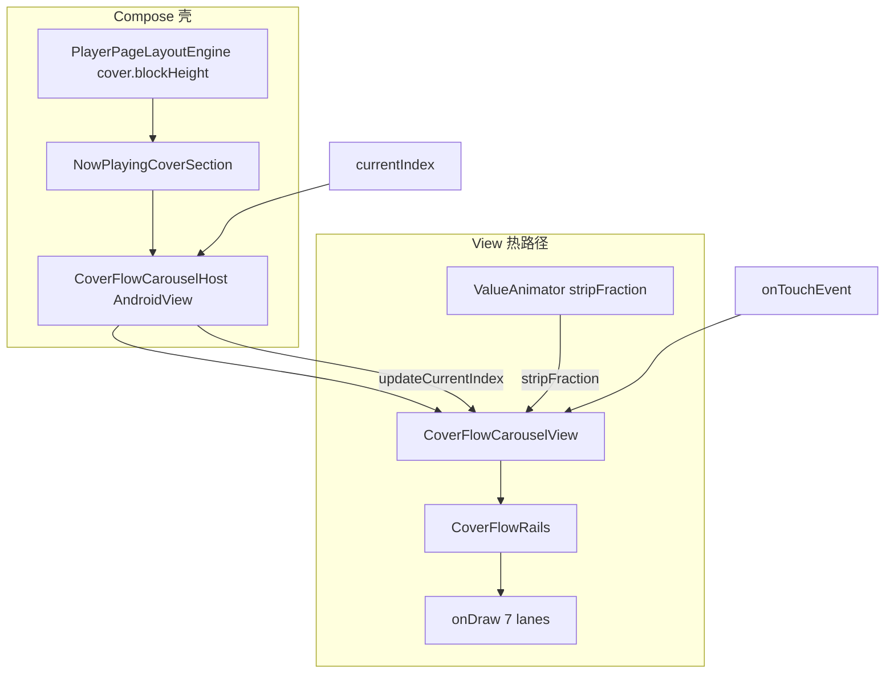
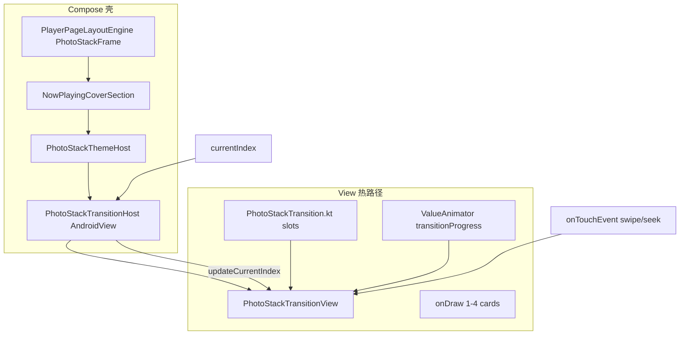

# 播放页封面行为手册（产品 + 实现）

> **状态**：2026-07 现网热路径  
> **读者**：改播放页封面交互、间距、切歌动画前必读。  
> **范围**：**平行 / 复古封面流**（七轨 `CoverFlowRails`）、**拍立得回忆**（`PhotoStack` 叠放转场）。粒子封面见 [`PARTICLE_COVER_OPENGL_MIGRATION.md`](PARTICLE_COVER_OPENGL_MIGRATION.md)。  
> 播放页边界见 [`PLAYER_PAGE_CONTRACT.md`](PLAYER_PAGE_CONTRACT.md)；动效 token 见 [`MOTION.md`](MOTION.md)。

---

## 0. 产品设计

### 0.1 定位

设置 → **播放页封面行为**（`PlayerCoverFlowMode`）除「标准大封面」外，有三类 **View 岛**特殊主题：

| 主题 | 枚举 | 实现族 |
|------|------|--------|
| 平行封面带 | `PAUSE_FOLD` | **封面流七轨**（§1–§12） |
| 复古立体封面 | `RETRO_3D` | **封面流七轨**（§1–§12） |
| 拍立得回忆 | `PHOTO_STACK` | **拍立得叠放栈**（§13） |

共性：

- 播放 / 暂停：不改变封面区布局形态。
- 歌词页：平行 / 复古继续使用特殊主题的歌词聚焦过渡；拍立得使用 §13.5 的页面级左右滑转场，保持播放页布局帧稳定。
- 特殊主题下播放页强制**裁切填充**，忽略设置里「原样比例」。

封面流（平行 / 复古）：启用后封面区常驻**横向七轨**队列带。  
拍立得：启用后封面区为**三张叠放**的竖版卡片（当前 + 后两首），切歌时整组转场，**不是** `railOffset` 模型。

### 0.2 设置（已实现）

设置 → **播放页封面行为**（`PlayerCoverFlowMode` / `AppUiSettings.playerCoverFlowMode`）：

| 选项 | 枚举 | 说明 |
|------|------|------|
| 标准 | `STANDARD` | 普通大封面；Compose 横向轻扫切歌 |
| 粒子封面 | `PARTICLE_COVER` | 边缘粒子化 + 切歌分解（**GLES** View 岛，`ParticleCoverHost`）；**不在本文** — 见 [`PARTICLE_COVER_OPENGL_MIGRATION.md`](PARTICLE_COVER_OPENGL_MIGRATION.md) §0 |
| 平行封面带 | `PAUSE_FOLD` | 同尺寸并排，暂停不折叠 |
| 复古立体封面 | `RETRO_3D` | 两侧透视倾斜 + 倒影 |
| 拍立得回忆 | `PHOTO_STACK` | 三张拍立得叠放 + 切歌抽换动画 |

与「播放页背景」（主题色 / 封面渐变 / 封面模糊等）**并列、可任意组合**。

### 0.3 交互

**标准封面**（Compose `CoverGestureCoordinator`）：

- 横向轻扫：超过约 **13%** 屏宽切歌（提交阈值 `0.13125`）。

**封面流**（平行 / 复古 · `CoverFlowCarouselView`）：

- 点击侧槽封面 → 切到对应曲目。
- 横向拖动 → 跟手；松手超过约 **26%** 的单轨步进切歌，否则回弹（提交阈值 `0.2625`；见 §4.1）。
- 特殊主题遵循「封面底边进度」开关：关闭时保留下方普通进度条与普通频谱条；开启时将进度条与已启用的频谱条移到中心专辑图底边，并隐藏普通进度区域。底边覆盖层由 Compose 按中心槽缩放对齐，封面/倒影/切歌动画仍由 View 绘制。
- 横屏稳定播放态长按标题 → 进入封面流沉浸：隐藏标题、歌词、普通进度与播放控制，同时隐藏状态栏和导航栏；背景继续复用当前播放页背景，封面底边进度/频谱仍遵循原开关。
- 横屏封面流沉浸使用同一个 `CoverFlowCarouselView` Host；进入后由 Compose 外层统一放大：以平行封面带中心封面本体高度铺满屏幕为基准，复古立体复用完全相同的外层缩放数字。中心封面本体上下居中，倒影不参与尺寸或居中计算。不得为沉浸态创建第二套 lane/`stripFraction`。
- 返回键优先退出横屏封面流沉浸；旋回竖屏、切换到其他封面主题或进入歌词页也会退出。横屏标题长按在这两个主题下不再打开歌曲菜单，封面长按仍保留歌曲菜单入口。

**拍立得回忆**（`PhotoStackTransitionView` · 见 §13）：

- 横向轻扫最前一张：跟手旋转/平移；松手 **\|fraction\| > 11%**（`SwipeCommitFraction`）切上一首 / 下一首，否则回弹（视觉钳制 ±15%）。
- 点击最前一张卡片**底部波形/进度带** → 拖动 seek（`TouchMode.Seek`）；进度嵌在前卡底部，非下半屏 chrome。
- 长按最前一张 → `onCoverLongPress`。
- 转场动画进行中 **禁用**触摸（`activeTransitionCards` 非空）。
- 播放页其余未被子组件消费的空白区域：向左进入歌词页，向右退出；方向锁定后进度跟手，松手沿当前页方向移动不足四分之一屏宽回到原页。
- 拍立得卡片、波形 seek、播放控制和歌词列表滚动继续由各自组件消费，不参与歌词页手势竞争。
- 歌词页沿用粒子歌词的列表与底部播放控制，隐藏歌词聚焦顶栏；LIST 页保留 48dp 控制行，底部留白取 `min(有效屏高 × 5%, 剩余空间 ÷ 2)`；CLOUD / LETTER 以及无歌词空状态仍使用同一套页面级滑入/滑出与淡出转场。
- 支持下半屏沉浸：卡片从普通态约 **80%** 屏宽放大到约 **90%** 屏宽；歌名/歌手与频谱/进度收进前卡白边，轻点前卡播放/暂停、长按前卡退出沉浸。设置「沉浸时标题显示歌词」（默认关）后，**播放中**白边主位换成当前歌词、副位为译文，单语言歌词副位为「歌名 - 艺术家」；过长走马灯（同信息行 `basicMarquee` 节奏），有逐字时间轴时主位改用窄条柔边填充与按行进度平移。暂停、无当前行或关闭开关时仍显示歌名/歌手。沉浸只改变绘制尺寸，封面 decode target 固定为沉浸态最大尺寸，避免尺寸动画触发重新解码闪烁。

**共用**：

- 播放 / 暂停、特殊主题内布局：**不**随播放状态切换。
- 系统「减少动态效果」→ `0ms` 瞬切（`MicaMotion` / `setMotionEnabled(false)`）。

### 0.4 动效（`MicaMotion`）

| 变化 | Token |
|------|-------|
| 进入 / 退出封面流布局 | Long `400ms` |
| 横屏封面流沉浸进入 / 退出 | Long `400ms`；系统减少动效时瞬切 |
| 切歌换位（平行） | Medium `320ms` |
| 复古立体切歌 | Long `400ms`；沿连续中心索引，避免角度阶跃 |
| 拍立得切歌转场 | **`620ms`**（`PhotoStackPullAwayDurationMs`）；`DecelerateInterpolator(1.65f)` |
| 减少动态效果 | `0ms` |

播放页通用约束：**先冻结布局 → 再算目标 → 单一 progress 驱动 lerp**（见 [`MOTION.md`](MOTION.md) §8.5）。

### 0.5 视觉参数

下表为**设计意图**；像素级间距 / 缩放以 [`CoverFlowRails.kt`](../app/src/main/java/com/mica/music/ui/screens/player/CoverFlowRails.kt) 与本文 §7 为准。

**平行封面带**

| 元素 | 设计参考 |
|------|----------|
| 当前封面 | 约 `0.76` 缩放，直角、不旋转 |
| 左右封面 | 同尺寸并排；外侧可降低 alpha |
| 倒影 | 位图底部约 **28%** 条带翻转渐隐；非整屏玻璃舞台 |
| 背景 | 复用现有播放页背景 |

**复古立体**

| 元素 | 设计参考 |
|------|----------|
| 当前封面 | 正面居中，较强主视觉 |
| 两侧 | 透视 `rotationY`；位移/缩放见 `CoverFlowRails` |
| 倒影 | 与封面同一变换栈（§5.3） |

底边进度与频谱启用时，其轻量倒影与中心专辑图共用 `ReflectionHeightFraction`、`ReflectionAlpha` 和倒影间隙，仅向下绘制矩形/柱条渐隐，不创建位图、模糊或额外离屏图层。

**拍立得回忆**

| 元素 | 设计参考 / 现网 |
|------|----------------|
| 卡片比例 | 普通态屏宽 × **80%**（`PhotoStackScreenFraction`）；沉浸态 × **90%**（`PhotoStackImmersiveScreenFraction`）；高宽比 **0.78** |
| 稳态栈 | 前 / 中 / 后：`queue[i]`、`queue[i+1]`、`queue[i+2]` |
| 稳态位姿 | 前卡 `rotationZ ≈ -1.4°`；中卡 offset `(14,10)dp` + `3.2°` + scale `0.95`；后卡 `(28,22)dp` + `6.4°` + scale `0.90` |
| 纸框 | 米白渐变 + 1dp 描边；封面 inset 约 **5.5%** 顶 / **3.8%** 左右 |
| 阴影 | 预烘焙 `BlurMaskFilter` 圆角阴影（全局直角规则的**有意例外**） |
| 前卡底带 | 86 条波形 + 进度（`waveformHeight = 24dp`） |
| 垂直节奏 | 顶/底留白约屏高 **10%**（`PhotoStackEdgeFraction`） |

### 0.6 范围

**已做**：播放页封面区；平行 / 复古七轨 ±3 + 拖动 + 按钮切歌；拍立得三卡栈 + 轻扫/seek；各主题 × 各播放页背景。

**横屏封面流沉浸已做**：平行 / 复古标题长按入口、平行中心封面全屏高且复古复用同一缩放数字、封面本体上下居中、系统栏隐藏、返回/旋转/主题/歌词退出；沉浸进退期间冻结 decode target，避免系统栏/viewport 变化触发 bitmap prune 闪烁；沉浸态水平拖动由全屏 Compose 输入层接管并桥接回同一套 View 拖动状态机。

**未做**：专辑浏览页 Cover Flow；强拟物舞台；拍立得歌词页转场的真机触摸与视觉自动化。

---

## 1. 封面流一句话结论（平行 / 复古）

> **以下 §1–§12 仅适用于 `PAUSE_FOLD` / `RETRO_3D`。** 拍立得见 §13。

**七张图、七条固定轨道（lane ∈ [-3,3]），唯一动画量是 `stripFraction`，所有视觉量只查 `railOffset = laneIndex - stripFraction`。**

切歌末帧提交时：`logicalCenter` 换歌、`stripFraction` 归零、各 lane 歌曲索引平移——**每张图在屏幕上的 `railOffset` 必须连续不变**。违反这条就会出现拖了两周的跳变、闪帧、缩放突变。

---

## 2. 封面流架构分层（平行 / 复古）

| 层 | 文件 | 职责 |
|----|------|------|
| Compose 外壳 | [`NowPlayingCoverSection.kt`](../app/src/main/java/com/mica/music/ui/screens/NowPlayingCoverSection.kt) | 布局高度、`AndroidView` 挂载、倒影溢出绘制、歌词遮罩点击 |
| View 宿主 | [`CoverFlowCarouselHost.kt`](../app/src/main/java/com/mica/music/ui/screens/player/view/CoverFlowCarouselHost.kt) | `AndroidView` factory/update、预载位图、把 `currentIndex` 交给 View |
| 绘制核心 | [`CoverFlowCarouselView.kt`](../app/src/main/java/com/mica/music/ui/screens/player/view/CoverFlowCarouselView.kt) | 手势、`ValueAnimator`、`onDraw` 单遍绘制 |
| **轨道数学（唯一真相源）** | [`CoverFlowRails.kt`](../app/src/main/java/com/mica/music/ui/screens/player/CoverFlowRails.kt) | `railOffset` → 位移 / 缩放 / 旋转 / 透明度 / 枢轴 / z 序 |
| 共享公式 | [`CoverFlowMath.kt`](../app/src/main/java/com/mica/music/ui/screens/player/CoverFlowMath.kt) | 中心缩放、基础 slot 公式（Rails 复用） |
| 位图 | [`CoverFlowBitmaps.kt`](../app/src/main/java/com/mica/music/ui/screens/player/view/CoverFlowBitmaps.kt) | 从 Coil 内存缓存取 `Bitmap`，避免 Compose 每槽一张图 |
| 布局引擎 | [`PlayerPageLayoutEngine.kt`](../app/src/main/java/com/mica/music/ui/screens/player/PlayerPageLayoutEngine.kt) | `cover.blockHeight`、`zoneStop`；**不含倒影额外高度** |
| 标准封面轻扫 | [`CoverGestureCoordinator.kt`](../app/src/main/java/com/mica/music/ui/screens/player/CoverGestureCoordinator.kt) | 仅标准主题横向轻扫；封面流手势在 View 内 |
| 单测 | [`CoverFlowRailsTest.kt`](../app/src/test/java/com/mica/music/ui/screens/player/CoverFlowRailsTest.kt) | 末帧 `railOffset` 连续性、切歌起点钳制 |

### 为何从 Compose 迁出（简史）

早期用 Compose `CoverFlowStage`（每槽 `SongCover` + 离屏倒影）+ Lane 环形池 + `CoverGestureCoordinator` 动画。问题在于：动画帧触发整树重组、`key(song.id)` 切歌重建、位移/缩放双轨不同步——表现为闪帧与跳变。现网已 **删除** 上述 Compose 热路径，改为单 View 绘制；旧方案文档已清理，**勿再引入第二套轨道状态机**。

通用判据与决策清单见 [`MOTION.md`](MOTION.md) **§七**（Compose 与 AndroidView 岛分工）。

---

## 3. 核心不变式（背下来）

### 3.1 变量

```text
laneIndex      ∈ {-3, -2, -1, 0, 1, 2, 3}   // 固定槽位，不随切歌改 key
logicalCenter  : Int                         // 中心歌曲在 queue 中的下标
stripFraction  : Float                       // 唯一动画量；0=居中，+1=刚切完下一首的视觉终点
railOffset     = laneIndex - stripFraction   // 轨道坐标（浮点）
virtualCenter  = logicalCenter + stripFraction
```

### 3.2 视觉量（全部只依赖 `railOffset`）

```kotlin
tx          = CoverFlowRails.translationPx(railOffset, coverWidthPx, mode)
drawScale   = CoverFlowRails.drawScale(railOffset, mode, foldProgress)
rotationY   = CoverFlowRails.rotationY(railOffset, mode)
alpha       = CoverFlowRails.alpha(railOffset, foldProgress, mode)
scalePivotX = CoverFlowRails.pivotX(railOffset, slotWidthPx, mode)   // 复古：平滑插值，禁止按整数 lane 硬切
zIndex      = CoverFlowRails.zIndex(railOffset, mode)
song        = queue[logicalCenter + laneIndex]
```

**禁止**：位移用 `stripFraction`、缩放用整数 `laneIndex`、旋转用 `transformOrigin` 阶跃——这就是跳变根源。

### 3.3 相邻切歌末帧提交

动画终点 `stripFraction = ±1` 时，执行 `commitTrackIndex`：

```text
logicalCenter ← newIndex
stripFraction ← 0
// 各 lane 歌曲：queue[logicalCenter + laneIndex] 等价于提交前 queue[(logicalCenter-Δ) + (laneIndex-Δ)]
```

**断言**（单测已覆盖）：对任意 `lane`，提交前后 `CoverFlowRails.railOffset(lane, strip)` 与 `CoverFlowRails.railOffset(lane-Δ, 0)` 相等。

---

## 4. 动画时序

### 4.1 拖动（同一套 View 状态机，两种输入入口）

普通竖/横屏由 `CoverFlowCarouselView.onTouchEvent` 直接接收原生 `MotionEvent`；横屏封面流沉浸由于 Compose `graphicsLayer` 会放大/平移视觉而不会同步扩大原生 View hit bounds，改由全屏 Compose `pointerInput` 在 Initial pass 接管水平拖动，再经 `CoverFlowCarouselNavigationBridge` 调回同一套 `beginDrag / dragBy / endDrag` 状态机。沉浸期间关闭 View 自己的 direct touch，避免双重消费；退出沉浸立即恢复。

统一状态机：

1. drag begin → `cancelAnimators()`，初始化 `dragAccumPx` / `stripFraction`
2. 步进：`stripFraction -= deltaPx / (layoutWidthPx() * laneStepFraction())`
3. drag end：`stripFraction > 0.2625` → 下一首；`< -0.2625` → 上一首；否则 `animateStripTo(0)`

`laneStepFraction()`：平行用 `PauseFoldStep`，复古用 `RetroFirstStep`（与位移首格一致）。

### 4.2 外部切歌（播放器改 `currentIndex`）

入口：[`CoverFlowCarouselHost`](../app/src/main/java/com/mica/music/ui/screens/player/view/CoverFlowCarouselHost.kt) `update` → `view.updateCurrentIndex(index)`。

1. 若 `trackAnimator != null`：**直接 return**（动画中不插队）
2. `|delta| != 1` 或无动画 → `commitTrackIndex` 瞬切
3. 相邻切歌：`ValueAnimator` 动画 `virtualCenter` 从 `clampTrackChangeStartVisual(...)` 到 `endVisual`
4. 每帧：`stripFraction = animatedVisual - fromCenter`；`invalidate()` only
5. `onAnimationEnd`：先设 `stripFraction = endVisual - fromCenter`，再 `commitTrackIndex`

`CoverFlowRails.clampTrackChangeStartVisual`：拖动已滑到 0.6 再点下一首时，起点钳在 `[fromCenter, endVisual]`，避免先弹回 0 再动画。

### 4.3 与 Compose 的关系

- 动画帧 **不触发** Compose 重组；只有 `invalidate()` → `onDraw`
- `AndroidView` 的 `update` 在父级重组时跑（`foldProgress`、尺寸等），**不是**每动画帧
- 改间距 / 倒影 / 轨道公式时，先跑 `CoverFlowRailsTest`，再真机拖+点切歌

---

## 5. 绘制管线

### 5.1 单遍绘制顺序

[`CoverFlowCarouselView.onDraw`](../app/src/main/java/com/mica/music/ui/screens/player/view/CoverFlowCarouselView.kt)：

1. 对 `lane ∈ [-3,3]` 构建 `LaneDrawState`（`railOffset` 超 `MaxViewDistance` 或 alpha≈0 则跳过）
2. 按 `zIndex` 排序（远 → 近）
3. 每槽 `drawLane`：同一 `canvas.save/restore` 栈内画封面 + 倒影

### 5.2 复古 3D

- `Camera` + `Matrix` 施加 `rotationY`（非 Compose `graphicsLayer`）
- `pivotX` 随 `|railOffset|` 在中心与外缘之间 **线性插值**，禁止在整数边界突变

### 5.3 倒影（平行 / 复古均有）

- 取 centerCrop 后位图 **底部 28%** 条带，垂直翻转；**不要**把整张图压进倒影区
- 与封面 **同一变换栈**（含复古 `rotationY`），保证倾斜封面与倒影衔接
- 渐变：`saveLayer` + `PorterDuff.Mode.DST_IN`（每可见槽一次，性能热点）
- 常量：`ReflectionHeightFraction = 0.28f`，`ReflectionAlpha = 0.24f`

### 5.4 坐标系

- 步进基准：**封面宽 `coverWidthPx`**（`layoutWidthPx()`），不用屏宽（否则间距被拉大、与 Compose 封面区错位）
- 中心 X：`coverStartPaddingPx + coverWidthPx * 0.5f`（与 `PlayerPageLayoutEngine` 对齐）
- 有倒影时封面 **顶对齐**：`contentCenterY = slotH * 0.5f`，下方留给倒影区

---

## 6. 布局与下半区（踩坑高发）

### 6.1 封面区占位

- **布局高度** = `cover.blockHeight`（= `coverHeight + topPadding`），由 [`PlayerPageLayoutEngine`](../app/src/main/java/com/mica/music/ui/screens/player/PlayerPageLayoutEngine.kt) 计算
- **倒影不占布局**：`CoverFlowCarouselView` 画布可高于 `blockHeight`（`cover.height + reflectionExtra`），通过 `clip = false` + `zIndex(1f)` 画进封面与标题之间的 `afterCover` 空隙
- **禁止** `blockHeight + reflectionExtra` 作为 Column 子项高度——会把下半区 `weight(1f)` 挤矮（「下半区上界被压低」）

### 6.2 手势

- 封面流拖动 / 点击在 **View `onTouchEvent`** 内处理
- 歌词展开时：仅叠 **无 `combinedClickable` 的透明 Box**（`NowPlayingCoverSection`），避免挡住 `AndroidView` 手势
- **禁止** 在铺满的 Compose `Box` 上挂 `combinedClickable` 盖住 `AndroidView`

### 6.3 背景 `zoneStop`

- 仍按 **无倒影** 的 `coverBlockHeight / screenHeight` 计算
- 倒影视觉上落在 `zoneStop` 以下、标题区以上的间隙

---

## 7. 间距与缩放参数（调参只改 `CoverFlowRails`）

| 常量 | 当前值 | 含义 |
|------|--------|------|
| `PauseFoldStep` | `0.80` | 平行：相邻槽间距 × 封面宽 |
| `RetroFirstStep` | `1.10` | 复古：\|railOffset\|=1 的累计位移系数 |
| `RetroOuterStep` | `1.20` | 复古：\|railOffset\|=2 的累计位移系数 |
| `NearSideScale` | `0.85` | 复古 ±1 额外缩放（相对基础 slotScale） |
| `OuterSideScale` | `0.90` | 复古 ±2、±3 再缩 10% 相对近邻 |

复古位移在 \|offset\|∈(1,2] 线性插值，\|offset\|>2 按 `thirdStep` 外推（±3 不与 ±2 叠位）。

平行与复古 **分开调系数**；用户反馈「平行偏宽、复古偏近」时勿共用一个 `LaneStepFraction`。

---

## 8. 两周踩坑清单（禁止重演）

| 现象 | 根因 | 正确做法 |
|------|------|----------|
| 切歌闪到屏外 / 末帧跳变 | 平行模式「父层 `carouselShift` + 子槽整数 `laneOffset`」双轨位移；提交时与 `stripFraction` 不同步 | 只保留 `translationPx(railOffset)` 单轨 |
| 滑到位缩放才突变 | 缩放 / 枢轴绑整数 `laneIndex`，位移绑 `railOffset` | 全部 `CoverFlowRails.*(railOffset)` |
| 下一张开头闪一下 | 末帧先改 `logicalCenter` 再归零 `stripFraction`，或动画起点未 `clamp` | 末帧先对齐 `stripFraction`，再 `commitTrackIndex` |
| 倒影不可见 | View 高度不足被裁切 | 画布加高 + 父级 `clip=false` |
| 倒影像顶行像素拉伸 | 整图压进倒影区 | 只取底部 28% 条带翻转 |
| 复古倒影与倾斜封面脱节 | 倒影第二遍绘制未跟封面变换栈 | 同一 `drawLane` 栈内先封面后倒影 |
| 倒影盖住中心图 | 倒影单独全量第二遍绘制 | 按 z 序逐槽：封面+倒影 |
| 滑动切歌失效 | Compose 透明层 `combinedClickable` 拦截触摸 | 普通态手势交给 View；遮罩仅歌词展开 |
| 横屏沉浸只有局部区域能拖 | Compose `graphicsLayer(scale/translation)` 只改变 AndroidView 的视觉结果，不会同步改变原生 View hierarchy 的 layout/hit bounds；`clip=false` / `zIndex` 也不会扩大 hit 区 | 沉浸态关闭 View direct touch，由全屏 Compose Initial-pass 手势层接管后桥接回同一套 View drag 状态机；不要靠视觉 transform 推断 native hit rect |
| 进入沉浸封面闪一下 | 沉浸尺寸/系统栏变化导致 decode target 跨 bucket，`setCoverDecodeTarget` 后 prune bitmap/reflection cache | 沉浸动画期间固定 decode target：拍立得从普通态即按最大沉浸尺寸解码；横屏封面流进退期间冻结当前 target |
| 下半区变矮 | 倒影高度计入 Column 布局 | 布局 `blockHeight`，倒影溢出绘制 |
| 外侧 ±2 看不见 | 复古步进过大 | 调 `RetroFirstStep` / `RetroOuterStep`（平行不动除非明确要求） |

### 8.1 AndroidView + Compose 视觉变换的输入边界

横屏沉浸的实机故障证明：**Compose 里的 `graphicsLayer { scaleX/scaleY/translationX/translationY }` 可以把 `AndroidView` 的内容画到原布局矩形之外，但不会把 Android View hierarchy 中该 View 的 `left/top/right/bottom` 或触摸命中区域一起放大/搬移。** `clip = false` 只允许越界绘制，`zIndex` 只改变 Compose 层级，两者都不能让越界区域收到原生 `MotionEvent`。

因此对“AndroidView 岛 + Compose 外层大幅 transform”的组件，必须把三件事分开考虑：

```text
layout bounds   = AndroidView 真正占据的原生矩形
draw bounds     = graphicsLayer 变换后眼睛看到的区域
gesture bounds  = 产品希望允许起手的区域
```

三者**不能默认相等**。如果沉浸视觉需要全屏拖动，优先让 Compose 全屏节点成为 gesture viewport，再通过桥接调用 View 内唯一状态机；不要每帧 resize/re-layout AndroidView 来追视觉动画，也不要再复制第二套 `stripFraction` / commit 逻辑。

本次 API 31 真机诊断曾扫到沉浸态 native hit 区近似只剩左上矩形，而视觉已铺到全屏；普通横屏同坐标可正常拖，证明故障由沉浸 transform 输入映射触发。最终四象限均通过全屏桥接进入 `coverflow-drag-start`，左下完整验证 `drag-start → drag-commit → cover-animation-end`。

---

## 9. 性能（相对旧 Compose Stage）

| 维度 | 旧 `CoverFlowStage` | 现 `CoverFlowCarouselView` |
|------|---------------------|----------------------------|
| 动画帧 | 每帧 Compose 重组 + 7 槽 `graphicsLayer` | `ValueAnimator` + `invalidate()`，无重组 |
| 图片 | 每槽 2× `SongCover`（封面+倒影） | Coil 缓存 `Bitmap` + `drawBitmap` |
| 倒影 | 每槽 `CompositingStrategy.Offscreen` | 每槽 `canvas.saveLayer`（仍贵，但单 View 内） |
| 固定成本 | 纯 Compose | `AndroidView` 桥接 + `update` 回调 |

**结论**：动画热路径通常 **不比原来差、往往更好**；瓶颈仍在最多 7 槽倒影的离屏绘制。未在真机跑 Systrace 前，不要为「性能」再拆回 Compose 双轨。

---

## 10. 改代码前检查清单

- [ ] 位移 / 缩放 / 旋转 / alpha / pivot / z 序是否 **全部** 只依赖 `railOffset`？
- [ ] 相邻切歌末帧是否满足 `railOffset` 连续？（跑 `CoverFlowRailsTest`）
- [ ] 调间距是否只改 `CoverFlowRails`，且平行/复古分开？
- [ ] 倒影是否仍在同一变换栈、底部条带翻转？
- [ ] 布局高度是否仍为 `cover.blockHeight`（倒影不撑 Column）？
- [ ] 是否在 View 热路径上误接 Compose 槽位动画或第二套 `stripFraction` 状态？
- [ ] 若 AndroidView 外层用了 `graphicsLayer` scale/translation，是否单独验证了 transform 后的 gesture viewport，而不是假设视觉 bounds = native hit bounds？
- [ ] 沉浸动画是否保持 decode target 稳定，避免尺寸/系统栏变化触发 bitmap prune？
- [ ] 真机：拖动切歌 + 按钮切歌 + 平行/复古各测一遍；横屏沉浸额外从四象限分别起手拖动

---

## 11. 封面流数据流简图（平行 / 复古）


```mermaid
flowchart TB
    subgraph compose [Compose 壳]
        NPC[NowPlayingCoverSection]
        Host[CoverFlowCarouselHost AndroidView]
        PLE[PlayerPageLayoutEngine cover.blockHeight]
    end

    subgraph view [View 热路径]
        CFV[CoverFlowCarouselView]
        Rails[CoverFlowRails]
        VA[ValueAnimator stripFraction]
        Draw[onDraw 7 lanes]
    end

    PLE --> NPC
    NPC --> Host
    Host --> CFV
    Player[currentIndex] --> Host
    Host -->|updateCurrentIndex| CFV
    VA -->|stripFraction| CFV
    CFV --> Rails
    Rails --> Draw
    Touch[onTouchEvent] --> CFV
```

---

## 13. 拍立得回忆（`PHOTO_STACK`）

### 13.1 一句话结论

**三张固定角色卡片（前 / 中 / 后），稳态用 `PhotoStackPose` 叠放；切歌时用 `PhotoStackTransitionSlot` + 单一 `transitionProgress` 做抽换，与封面流 `railOffset` 无关。**

末帧：`commitTrackIndex` 更新 `logicalCenter`，清空 `activeTransitionCards`，`transitionProgress = 1` 回到稳态栈。

### 13.2 架构分层

| 层 | 文件 | 职责 |
|----|------|------|
| Compose 入口 | [`PhotoStackTheme.kt`](../app/src/main/java/com/mica/music/ui/screens/PhotoStackTheme.kt) | 薄包装 → `PhotoStackTransitionHost` |
| Compose 挂载 | [`NowPlayingCoverSection.kt`](../app/src/main/java/com/mica/music/ui/screens/NowPlayingCoverSection.kt) | `photoStack.normalLayerVisible` 时挂载；与标准/粒子/封面流互斥 |
| View 宿主 | [`PhotoStackTransitionHost.kt`](../app/src/main/java/com/mica/music/ui/screens/player/view/PhotoStackTransitionHost.kt) | `AndroidView` factory/update、帧像素、`PhotoStackCarouselNavigationBridge` |
| 绘制 + 手势 | [`PhotoStackTransitionView.kt`](../app/src/main/java/com/mica/music/ui/screens/player/view/PhotoStackTransitionView.kt) | 稳态/转场绘制、轻扫、前卡 seek、频谱波形 |
| 转场规划 | [`PhotoStackTransition.kt`](../app/src/main/java/com/mica/music/ui/screens/player/PhotoStackTransition.kt) | `PhotoStackTransitionPlan`、slot → card 列表 |
| 布局帧 | [`PlayerPageLayoutEngine.kt`](../app/src/main/java/com/mica/music/ui/screens/player/PlayerPageLayoutEngine.kt) | `PhotoStackFrame`、卡片尺寸、垂直留白 |
| 类型 | [`PlayerPageTypes.kt`](../app/src/main/java/com/mica/music/ui/screens/player/PlayerPageTypes.kt) | `PhotoStackFrame` 字段 |
| 沉浸白边文案 | [`PhotoStackImmersiveCaption.kt`](../app/src/main/java/com/mica/music/ui/screens/player/PhotoStackImmersiveCaption.kt) | 播放中可选把歌名换成当前歌词；走马灯 / 逐字填充由 View Canvas 绘制 |
| 导航桥 | [`PhotoStackCarouselNavigationBridge.kt`](../app/src/main/java/com/mica/music/ui/screens/player/view/PhotoStackCarouselNavigationBridge.kt) | 外部 `updateCurrentIndex` → View |
| 歌词页转场 | [`PhotoStackLyricsTransition.kt`](../app/src/main/java/com/mica/music/ui/screens/PhotoStackLyricsTransition.kt) + [`PhotoStackLyricsPage.kt`](../app/src/main/java/com/mica/music/ui/screens/PhotoStackLyricsPage.kt) | 空白区域左右滑、跟手 progress、无顶栏歌词列表与底部 chrome |
| 阴影调参 | [`PhotoStackShadowTuning.kt`](../app/src/main/java/com/mica/music/ui/screens/player/view/PhotoStackShadowTuning.kt) | 预览页可调；现网默认构造 |
| 预览 | [`PhotoStackShadowPreviewScreen.kt`](../app/src/main/java/com/mica/music/ui/screens/PhotoStackShadowPreviewScreen.kt) | 设置 → 高级 → 阴影预览路由 |

### 13.3 稳态 vs 转场槽位

**稳态**（`photoStackSteadyCards`）：

| Slot | 队列语义 | 进度/频谱 |
|------|----------|-----------|
| `SteadyFront` | `queue[currentIndex]` | `showProgress = true` |
| `SteadyMiddle` | `queue[currentIndex + 1]` | 否 |
| `SteadyBack` | `queue[currentIndex + 2]` | 否 |

**切下一首**（`TrackSkipDirection.TO_NEXT`）：`NextEmergingBack` / `NextStackMiddle` / `NextStackFront` / `NextLeavingFront`（离场的旧前卡带进度）。

**切上一首**（`TO_PREVIOUS`）：`PreviousFadingBack` / `PreviousStackBack` / `PreviousStackMiddle` / `PreviousIncomingFront`。

各 slot 的 `PhotoStackPose` 由 `poseFor(slot, transitionProgress)` **lerp**；禁止在转场中途改 Compose 槽位 key。

### 13.4 动画时序

1. **外部切歌**：`PhotoStackTransitionHost` update → `navigationBridge.view?.applyHostUpdate` / `updateCurrentIndex`
2. `|delta| != 1` 或无动画 → `resetToIndex` 瞬切
3. 相邻切歌：构建 `activeTransitionCards`，`ValueAnimator` **0→1**，时长 **`620ms`**
4. 每帧：`transitionProgress` + `invalidate()` only（**不**重组 Compose）
5. `onAnimationEnd`：`commitTrackIndex` → 清空转场卡 → `flushPendingPlayQueueIndex`

**跟手轻扫**（稳态、无转场卡）：

- `dragFraction` 累加 `deltaX / width`，钳制 ±`SwipeVisualLimitFraction`（0.15）
- 松手：`> 0.11` 上一首，`< -0.11` 下一首；否则 `animateDragFractionToZero`
- 前卡 idle 位姿：`translationX = dragFraction × slotWidth × 0.35`，`rotationZ = -1.4° + dragFraction × 6°`

**Host 索引守卫**：binder 延迟时 `pendingHostIndex` / `hostIndexGuardUntilMs`（1500ms）避免 UI 索引被旧回调打回。

### 13.5 布局（`PlayerPageLayoutEngine`）

| 常量 | 值 | 含义 |
|------|-----|------|
| `PhotoStackScreenFraction` | `0.80` | 普通态卡片宽度 / 屏宽 |
| `PhotoStackImmersiveScreenFraction` | `0.90` | 沉浸态卡片宽度 / 屏宽 |
| `PhotoStackAspectRatio` | `0.78` | 高 / 宽 |
| `PhotoStackEdgeFraction` | `0.10` | 普通态期望顶/底留白 / 屏高 |
| `PhotoStackImmersiveHorizontalBleed` | `40dp` | 沉浸绘制 viewport 的横向溢出预算（最终仍受屏宽限制） |
| `PhotoStackImmersiveTopBleed` | `52dp` | 顶部阴影/旋转溢出预算 |
| `PhotoStackImmersiveBottomBleed` | `104dp` | 底部阴影 + 后两张卡片露边预算 |

`PhotoStackFrame` 明确区分 **slot viewport** 与 **card 本体**：`slotWidth/Height` 可以大于 `cardWidth/Height`，`cardTopInset` 决定卡片在 viewport 内的 y 偏移。AndroidView 必须按 slot 尺寸挂载，否则 `clip=false` 也无法让 View 自己 bounds 外的阴影/后卡真正显示。`artworkInset*`、`waveformHeight`（24dp）继续按 card 本体计算。

`normalLayerVisible = photoStackMode && !lyricsExpanded`；沉浸态与竖屏队列都保持同一 PhotoStack View 常驻。队列期间卡片几何不跟 `headerFocus` 缩到顶栏，Host 原位按 `queueProgress` 淡出；顶栏 overlay 用歌词迷你封面尺寸，小专辑图与歌名/关闭一并淡入，解码目标与队列行相同（`CoverDecodeTarget.forCompactCover()`），走同一 Coil 缓存。`cover.blockHeight` 仍 lerp 到顶栏高度，供队列列表 overlay 上收。

拍立得歌词页保持播放页布局帧稳定；页面级 `PhotoStackLyricsTransitionState` 持有单一跟手 progress，纯函数 `photoStackLyricsTransitionFrame` 决定双页挂载、位移、透明度与输入资格。转场中播放页和歌词页作为 sibling layer 持续挂载，只有到达 `0 / 1` 稳定端点后才卸载完全不可见的一页。播放页整体向左并淡出，歌词页从右侧滑入并淡入；关闭时反向执行。这样不改变拍立得卡片本身的尺寸、旋转、阴影和波形绘制，也不把卡片手势交给歌词页。

### 13.6 绘制管线

单遍 `onDraw`（稳态或转场卡列表）：

1. 按 slot 算 `PhotoStackPose`（含 alpha）
2. `canvas.save` → translate / rotate / scale
3. `drawShadowHalo`：预烘焙 Bitmap（三层 `BlurMaskFilter` + **`drawRoundRect` 阴影**）
4. 纸框 **`drawRect`**（米白渐变 + 描边）——卡片本体直角，圆角仅阴影层
5. 封面 `centerCrop` 位图（Coil → `bitmapByKey` 缓存）
6. 若 `showProgress`：沉浸白边 `drawImmersiveMetadata`（歌名/歌手，或可选当前歌词：过长走马灯，有 cues 时窄条逐字填充）+ `drawProgressStrip`（波形 + 进度条）

频谱：`MicaSpectrumAnalyzer` → 86 条 `spectrumDisplayLevels`；仅绑定前卡 `song.id`。

### 13.7 与封面流七轨的差异

| 维度 | 封面流 §1–§12 | 拍立得 §13 |
|------|----------------|------------|
| 可见队列深度 | ±3 lane | 稳态 3 张 |
| 动画变量 | `stripFraction` / `railOffset` | `transitionProgress` + `dragFraction` |
| 数学真相源 | `CoverFlowRails.kt` | `PhotoStackTransition.kt` + View 内 `poseFor` |
| 倒影 | 28% 条带翻转 | 无；纸框 + 阴影 |
| 进度 UI | 下半屏 chrome 或封面底边 | **前卡底带**内嵌 seek |
| 点击侧槽切歌 | 有 | 无（轻扫 / 按钮 / 队列） |
| 单测 | `CoverFlowRailsTest` | `PhotoStackTransitionTest` + `PhotoStackLyricsTransitionTest` |

**勿**把拍立得硬套 `CoverFlowRails` 或 Compose 七槽 `AnimatedContent`。

### 13.8 踩坑与调参

| 现象 | 根因 | 做法 |
|------|------|------|
| 切歌后仍播旧曲 | Host index 与 View `logicalCenter` 竞态 | 查 `pendingHostIndex` / `playQueueIndexAfterVisualCommit` |
| 转场中误触 seek | 未禁用手势 | `activeTransitionCards.isNotEmpty()` 时 `onTouchEvent` return false |
| 阴影变更不刷新 | Bitmap 缓存 key 未变 | `setShadowTuning` → `clearShadowBitmapCache` |
| 沉浸态底部阴影/后卡被切平 | `slotHeight == cardHeight`，前卡底边正好贴 View 底边；阴影和后卡 positive-Y 内容实际画到 AndroidView bounds 外 | slot/card 分离；沉浸 viewport 额外留 top/bottom bleed，并用 `cardTopInset` 保持卡片本体位置/触摸坐标一致 |
| 进入沉浸封面闪一下 | decode target 直接跟动画中的 `cardWidth` 变化，跨 bucket 后 bitmap window 被 prune | Host 从普通态开始就固定到 90% 沉浸最大 artwork decode target；动画只改变绘制尺寸 |

阴影预览：设置 → 高级 → **拍立得阴影预览**（`PhotoStackShadowPreviewScreen`）。

### 13.9 数据流简图


```mermaid
flowchart TB
    subgraph compose [Compose 壳]
        NPC[NowPlayingCoverSection]
        PSH[PhotoStackThemeHost]
        Host[PhotoStackTransitionHost AndroidView]
        PLE[PlayerPageLayoutEngine PhotoStackFrame]
    end

    subgraph view [View 热路径]
        PST[PhotoStackTransitionView]
        Plan[PhotoStackTransition.kt slots]
        VA[ValueAnimator transitionProgress]
        Draw[onDraw 1-4 cards]
    end

    PLE --> NPC
    NPC --> PSH --> Host --> PST
    Player[currentIndex] --> Host
    Host -->|updateCurrentIndex| PST
    Plan --> PST
    VA --> PST
    Touch[onTouchEvent swipe/seek] --> PST
```

---

## 12. 文档维护

- 改产品交互 / 设置项 → 更新本文 §0
- 改封面流热路径 → 更新本文 §2、§4
- 改拍立得热路径 → 更新本文 §13
- 改间距常量 → 更新 §7 表格 + `CoverFlowRails.kt` 注释
- 新踩坑 → 封面流追加 §8；拍立得追加 §13.8
