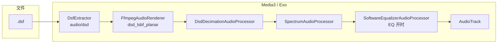

# DSD / Exo 播放扩展

> 最后更新：2026-06-18  
> 状态：`.dsf` 经 **Media3（Exo）单链路** 播放；`.dff` **不支持播放**（可扫描，播放时提示改用 DSF）。

---

## 目标与范围

| 项目 | 说明 |
|------|------|
| **主路径** | `.dsf` → `DsfExtractor` + 自编 `libffmpegJNI`（`dsd_lsbf_planar`）+ PCM 降采样 → `AudioTrack` |
| **不支持** | `.dff` / DSDIFF：路由层拒绝，不启动 Exo |
| **不在范围** | USB DAC Native DSD / DoP 直出（以后可在解复用后分叉，与本文路径并存） |

设计取舍：**不在手机端保 DSD 原生比特流**，而是解码为 PCM 后按设备能力降到可播采样率（优先 **176.4 kHz / 24-bit**）。对内置扬声器 / 蓝牙而言，信息量已足够。

---

## 端到端数据流



**采样率变化（DSD256 示例）**

| 阶段 | 采样率 | 格式 |
|------|--------|------|
| DSF 内 1-bit 流 | 11.2896 MHz | DSD |
| FFmpeg 解码后（每 DSD 字节 → 1 PCM 样本） | 1.4112 MHz | float（sink 内常先 ToInt16） |
| 降采样后（factor=8） | **176.4 kHz** | **24-bit packed** |
| 进 `AudioTrack` | 176.4 kHz | 与设备能力探测一致 |

---

## 分层实现

### 1. 容器：`DsfExtractor`

- 路径：`app/src/main/java/com/mica/music/media/dsf/`
- 解析 Sony DSF 头（`DsfHeaderReader` / `DsfFormat`），`sniff()` 匹配文件头。
- 输出 MIME：`audio/dsd`（`DsfFormat.MIME_DSF`）；容器 MIME `audio/x-dsf` 仅用于诊断。
- `Format.sampleRate` 使用 **`decoderSampleRateHz = sampleRateHz / 8`**（与 FFmpeg packed-byte 解码率一致）。
- 在 `MicaExtractorsFactory` 中**始终注册**（靠 `sniff()` 命中，不影响其他格式）。

### 2. 解码：自编 `media3-ffmpeg-decoder`

- 模块：`third_party/media3-ffmpeg-decoder/`
- 基于 Jellyfin/Media3 FFmpeg 扩展，补丁要点：
  - `FfmpegLibrary`：`audio/dsd` → 解码器名 `dsd_lsbf_planar`
  - `ffmpeg_jni.cc`：`createContext` 对 DSD codec 设置 `sample_rate` / `ch_layout`；输出经 `swresample` 转为请求格式（float 或 s16）
- Native 构建：`scripts/build-media3-ffmpeg-dsd.ps1`（Docker）→ `libffmpegJNI.so` 打入 `src/main/jniLibs/arm64-v8a/`
- App 依赖：检测到本地 so 时使用该模块，否则回退 Maven 坐标（无 DSD）。

### 3. 渲染与 Sink：`MicaRenderersFactory`

- 开启 FFmpeg **扩展 Renderer**（`EXTENSION_RENDERER_MODE_PREFER`）；ALAC 禁用平台 `MediaCodec`，强制 `FfmpegAudioRenderer`。
- **`setEnableFloatOutput(false)`**：强制走「非 float 直通」分支，否则 Media3 会跳过自定义 `AudioProcessor`，无法对 ~1.4 MHz PCM 降采样。
- **`MicaAudioProcessorChain`**（自定义链，替代默认 `DefaultAudioProcessorChain` 尾巴）：
  - 包含：`DsdDecimationAudioProcessor` → `SpectrumAudioProcessor` → `SoftwareEqualizerAudioProcessor`
  - **省略** `SilenceSkippingAudioProcessor`（不认 packed 24-bit）与 `SonicAudioProcessor`（不认 24-bit）
  - 变速：依赖 `setEnableAudioOutputPlaybackParameters`（`AudioTrack.setPlaybackParams`）

### 4. 降采样：`DsdDecimationAudioProcessor`

- 仅在 Exo PCM 链上运行；阈值 `sampleRate >= 352_800`。
- 目标码率/位深与 **`DsdOutputPolicy`** 一致（有线 Hi-Res 优先 176.4k/24bit；蓝牙封顶 48k）。
- 整倍数抽取（如 1.4112M → 176.4k，factor=8），避免非整数 resample。

### 5. 路由：`PlaybackRouter` / `ServicePlaybackEngineCoordinator`

- `.dsf`：`Supported("dsf-exo-extractor")`
- `.dff`：`Unsupported`，用户提示「不支持 DFF/DSDIFF 格式，请使用 DSF」
- ALAC / 常规格式：`Supported`，统一走 Exo + `libffmpegJNI`
- 解码失败可自动跳曲（权限错误等除外），无软件回退

### 6. 诊断：`PlaybackCapabilityDiagnostics`

关于页「播放能力」区块；关键行：

- `Exo · DSD (audio/dsd)=支持` → 主路径 MIME
- `Exo · DSF 容器=不支持` → 仅 `audio/x-dsf` 映射探测，**不代表不能播 DSF**
- 播放时日志：`DsdProcessor: [DEBUG-dsd-output] input=1411200Hz/... output=176400Hz/24bit factor=8`

---

## 构建与打包

```powershell
# Windows：Docker 编 arm64 libffmpegJNI（含 dsd_lsbf_planar）
.\scripts\build-media3-ffmpeg-dsd.ps1
```

确认 `third_party/media3-ffmpeg-decoder/src/main/jniLibs/arm64-v8a/libffmpegJNI.so` 存在后再编 APK。`perf` 变体需 library 模块同步 `perf` buildType。

---

## 验收要点

1. 播 `.dsf`：有 `DsdProcessor` 且 `output=176400Hz/24bit`
2. 播 `.dff`：播放前拒绝，UI 显示不支持提示
3. 进度、seek、频谱正常
4. 切 FLAC / ALAC 等格式仍走 Exo，无回归

---

## Exo 播 DSD 与「系统音效」的关系

### 应用内均衡器（Mica EQ）

| EQ 状态 | 模式 | Exo offload | 对 DSD 的影响 |
|---------|------|-------------|----------------|
| **关**（默认 HiFi） | `HIFI`：`dsp=false offload=true` | Media3 可尝试硬件 offload | DSD 经降采样后为 PCM；**不走** App 软件 EQ 处理（`SoftwareEqualizerAudioProcessor.isActive() == false`） |
| **开** | `DSP`：`dsp=true offload=false` | 关闭 offload | 与 FLAC 等相同：PCM 在 **`SoftwareEqualizerAudioProcessor` 内做 10 段软件 EQ**，再进 `AudioTrack` |

实现要点：

- EQ **不是**系统 `android.media.audiofx.Equalizer` 处理播放流；`MicaEqualizerManager` 创建系统 Equalizer 时 **`enabled = false`**，仅用于读取系统预设名称/曲线。
- EQ 开关通过 `configureQualityMode()` 联动 Exo **offload**，对 **所有 Exo 曲目**（含 DSD）生效，无 DSD 特例。

结论：**Exo 播 DSD 不会单独「禁用」或「启用」Mica EQ；行为与其他 Exo 格式一致——关 EQ 即直通降采样 PCM，开 EQ 即软件均衡 + 关 offload。**

### 厂商 / 系统级音效（OPLUS、NXP、杜比等）

- Exo 最终仍通过 **`AudioTrack`** 出声，并带有 **`audioSessionId`**（见 `MicaMediaService` 里 `onAudioSessionIdChanged`）。
- 本 App **未**对 DSD 关闭 `AudioEffect` 或厂商音效套件；诊断里的 `registeredEffects=EqualizerBundle@NXP...` 表明设备上注册了系统效果。
- 这些效果是否作用于本 App 的 PCM，由 **ROM / 音频策略** 决定（常见：全局「音效增强」会作用在媒体流上，与是否 DSD 源无关，因为到 `AudioTrack` 时已是 PCM）。
- **本 App 无法保证**「开杜比 / 蝰蛇时 DSD 与普通 FLAC 效果完全一致」；若需对比，请在同设备上 A/B 试听并看 `AudioEnv` / `AudioRoute` 诊断。

### Media3 offload（HiFi 模式）

- `offload=true` 时，Media3 可能对部分 PCM 使用 **HAL 卸载播放**（省电、低延迟）。
- DSD 路径在降采样后为 **176.4k/24bit PCM**；是否实际 offload 取决于机型与 `AudioOffload` 能力，**不是** DSD 原生 offload。
- 开启 App EQ 会 **`offload=false`**，与播 FLAC 时相同。

---

## 已知限制

1. **无 bit-perfect DSD**：输出为解码 + 降采样 PCM，非 DoP / Native DSD。
2. **无曲首静音裁剪**：自定义链移除了 `SilenceSkippingAudioProcessor`。
3. **共用 Sink**：`setEnableFloatOutput(false)` 为 DSD 降采样服务，**Hi-Res FLAC 等也可能经 ToInt16 收成 16bit**（见对话记录）；进一步改动须遵守 **Audio quality consent**（`CONTEXT.md`）。
4. **大文件**：DSD256 单文件体积大，首次缓冲 / seek 可能较慢。
5. **`.dff`**：不支持播放。

### 音质改动政策

任何新的降音质实现须**事先说明**并获**明确允许**。项目约束：`.cursor/rules/audio-quality-consent.mdc`、`CONTEXT.md` → **Audio quality consent**。

---

## 关键源码索引

| 用途 | 路径 |
|------|------|
| DSF 解复用 | `app/.../media/dsf/` |
| Extractor 注册 | `app/.../media/MicaExtractorsFactory.kt` |
| 渲染 / Sink | `app/.../media/MicaRenderersFactory.kt` |
| 自定义 Processor 链 | `app/.../media/MicaAudioProcessorChain.kt` |
| DSD 降采样 | `app/.../media/DsdDecimationAudioProcessor.kt` |
| 频谱 tap | `app/.../media/SpectrumAudioProcessor.kt` |
| 输出码率策略 | `app/.../media/DsdOutputPolicy.kt` |
| 路由 | `app/.../media/PlaybackArchitecture.kt` |
| FFmpeg JNI 模块 | `third_party/media3-ffmpeg-decoder/` |
| Native 构建 | `scripts/build-media3-ffmpeg-dsd.ps1` |
| 能力诊断 | `app/.../media/PlaybackCapabilityDiagnostics.kt` |
| HiFi / DSP / offload | `app/.../media/MicaMediaService.kt` → `configureQualityMode()` |
| App 均衡器 | `app/.../media/MicaEqualizerManager.kt` |

---

## 后续可扩展（未实现）

- 解复用后分叉：**Raw DSD / DoP → USB DAC**（与当前 PCM 路径共用 `DsfExtractor`）
- 按格式动态 Processor 链（例如仅 DSD 省略 Sonic，普通 FLAC 保留默认尾链）
