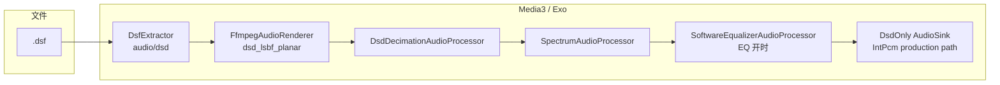
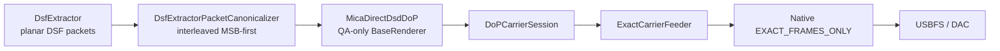

# DSD / Exo 播放扩展

> 最后更新：2026-08-14
> 状态：生产默认仍为 `.dsf` 经 **Media3（Exo）单链路解码为 PCM**；`.dff` **不支持播放**。USB Direct DSD / DoP 已进入 **QA-only Media3 renderer 原型阶段**，但尚未成为生产输出模式。

---

## 目标与范围

| 项目 | 说明 |
|------|------|
| **生产主路径** | `.dsf` → `DsfExtractor` → `DsdOnly` `FfmpegAudioRenderer`（`dsd_lsbf_planar`）→ DSD 专用 Sink（PCM 降采样 / 频谱 / EQ）→ `AudioTrack` |
| **QA Direct DSD 原型** | `.dsf` → `DsfExtractor` → `MicaDirectDsdDoP` → canonical DSD → P5 `DoPCarrierSession` → P3 `ExactCarrierFeeder` → Native `EXACT_FRAMES_ONLY` → USBFS |
| **不支持** | `.dff` / DSDIFF：生产路由层拒绝，不启动 Exo |
| **仍不承诺** | 生产 Direct DSD 开关、DSD pause/resume、seek/自动换轨、DSD256、Native RAW_DATA、任意 DAC 兼容性 |

生产设计取舍仍然是：**SharedPcm 不保留 DSD 原生比特流**，而是解码为 PCM 后按设备能力降到可播采样率（优先 **176.4 kHz / 24-bit**）。Direct DSD 是并行的 USB 独占输出分支，不替换内置扬声器 / 蓝牙 / 普通 SharedPcm 路径。

---

## 端到端数据流



**采样率变化（DSD256 示例）**

| 阶段 | 采样率 | 格式 |
|------|--------|------|
| DSF 内 1-bit 流 | 11.2896 MHz | DSD |
| FFmpeg 解码后（每 DSD 字节 → 1 PCM 样本） | 1.4112 MHz | PCM；由 DsdOnly 输出策略接收 |
| 降采样后（factor=8） | **176.4 kHz** | **24-bit packed** |
| 进 `AudioTrack` | 176.4 kHz | 与设备能力探测一致 |

### QA Direct DSD 分叉

Direct DSD 不能接在 `AudioOutputProvider` 后面：到那里时 `FfmpegAudioRenderer` / `DsdDecimationAudioProcessor` 已经把 DSD 变成 PCM。当前原型因此在 **renderer 层**、FFmpeg 之前分叉，并继续复用同一个 ExoPlayer / MediaSession / timeline，而不是创建第二套播放器。



关键合同：

- `DsfExtractor` 的 packet 是 **按声道 planar 的 DSF block**，不是 canonical interleaved DSD；final block 会按每声道相同有效长度压紧。
- Direct adapter 输出必须与 P5 `DsdContainerReader` 的 canonical 合同逐字节一致：**MSB-first、逐字节声道交错**；DSF LSB-first 输入必须 bit-reverse。
- `DoPCarrierSession` 是 DoP chronology 的唯一权威：内容、pending half-frame、gap `0x69` 和 `0x05/0xFA` marker 相位都不能在 renderer 或 Native 再实现一套。
- `ExactCarrierFeeder` 保留 P5 已经产出的 carrier tail；0/short backpressure 不允许后续内容越过。
- Native `EXACT_FRAMES_ONLY` 只发送已经提供的完整 carrier frame；**不允许**用 PCM zero-fill、旧数据 replay 或 Native 自造 DSD idle 掩盖上游短缺。

### 启动生命周期：prefill readiness ≠ transport armed

Media3 在 prepare/paused 阶段可以驱动 renderer 读取数据，但 renderer 一旦 `ready`，暂停状态下可能不再持续调用 `render()`。因此 Direct DSD 的启动必须拆成两个事实：

1. **ENABLED / prepare**：读取真实 DSD，填充 dormant Native ring；达到既有 transport geometry 推导出的 startup threshold 后只报告 `isReady=true`，仍不启动 USB data queue。
2. **STARTED / `onStarted()`**：播放 intent 真正进入 STARTED 后才执行一次 exact `arm`。

这样既避免 prepare 阶段过早启动后因 Media3 停止调度而触发 `10004`，也不需要放宽 exact shortage 规则。当前 QA staircase 正在验证这条生命周期；在它跑绿前不增加额外 prebuffer 水位或 pause idle filler。

### 后续 pause / 空窗：需要独立 carrier liveness owner

Direct DSD 的逻辑暂停不能直接套用 PCM pause。目标结构是让**音乐 source chronology**和**USB carrier chronology**分离：

- PLAYING：liveness owner 选择 CONTENT，source reader 正常前进；
- PAUSED / source gap：source reader 不前进，liveness owner 通过 P5 `writeGapFrames()` 持续提供合法 `0x69` DSD carrier；
- resume：继续同一 session / marker chronology 的 CONTENT；
- content 与 gap 只能有一个 owner 写入 P5 session，不能由 Media3 renderer 和另一个 filler 并发竞争。

这层 owner 必须能在 Media3 暂时不调用 `render()` 时继续维持 exact Native ring；它复用 P5/P3 现有 chronology/backpressure 合同，不新增第二个 DoP encoder。

### 参考项目提供的设计证据

- **NeriPlayer（GPLv3，仅作设计观察，不复制代码）**：其 USB-exclusive PCM sink 把 queued/preroll readiness 与 native transport start 分开，支持“先预填、真正 play 时再启动 transport”的生命周期拆分。它的 PCM pause 会停止 transport 并保留 queued/replay state，因此只能说明 PCM 可采用 stop/restart，不能直接推导 DSD pause。
- **sylvakru（Apache-2.0）**：其 DoP/Native DSD worker 在 pause 时不推进 source reader，而持续发送 `0x69` DSD idle；session 级 encoder 保持 marker phase。曲间空窗另有 idle filler，并在新 content worker 接管前 stop/join，避免 content 与 idle 并发写同一 carrier。

Mica 只吸收上述**生命周期与 ownership 结构**。DSD canonicalization、gap chronology、marker、backpressure 和 Native exact 发送仍以本项目已测试的 P5/P3 合同为权威，不复制参考项目的编码/传输算法。

另外，参考项目后续不仅作为架构观察来源，也可作为 **boundary/capability oracle**：从其接受条件、能力模型和恢复策略抽取约束，反向生成 Mica 自己的 synthetic 极限 fixtures，再验证 exact-only / fail-closed 分类。完整策略见 `docs/USB_COMPATIBILITY_ADVERSARIAL_CORPUS.md`。注意 `REFERENCE_ACCEPTED` 不等于 `MICA_MUST_ACCEPT`；证据不足时 Mica 仍应拒绝猜测。

---

## 分层实现

### 1. 容器：`DsfExtractor`

- 路径：`app/src/main/java/com/mica/music/media/dsf/`
- 解析 Sony DSF 头（`DsfHeaderReader` / `DsfFormat`），`sniff()` 匹配文件头。
- 输出 MIME：`audio/dsd`（`DsfFormat.MIME_DSF`）；容器 MIME `audio/x-dsf` 仅用于诊断。
- `Format.sampleRate` 使用 **`decoderSampleRateHz = sampleRateHz / 8`**（与 FFmpeg packed-byte 解码率一致）。
- 在 `MicaExtractorsFactory` 中**始终注册**（靠 `sniff()` 命中，不影响其他格式）。

### 2. 解码：自编 `media3-ffmpeg-decoder`

- 模块：`third_party/media3-ffmpeg-decoder/`
- 基于 Jellyfin/Media3 FFmpeg 扩展，补丁要点：
  - `FfmpegLibrary`：`audio/dsd` → 解码器名 `dsd_lsbf_planar`
  - `ffmpeg_jni.cc`：`createContext` 对 DSD codec 设置 `sample_rate` / `ch_layout`；输出经 `swresample` 转为请求格式（float 或 s16）
- Native 构建：`scripts/build-media3-ffmpeg-dsd.ps1`（Docker）→ `libffmpegJNI.so` 打入 `src/main/jniLibs/arm64-v8a/`
- App 依赖：检测到本地 so 时使用该模块，否则回退 Maven 坐标（无 DSD）。

### 3. 渲染与 Sink：`MicaRenderersFactory`

- 开启 FFmpeg **扩展 Renderer**（`EXTENSION_RENDERER_MODE_PREFER`）；ALAC 禁用平台 `MediaCodec`，强制 `FfmpegAudioRenderer`。
- 当前生产路径使用 renderer split：`DsdOnly` 负责 DSD，`PcmOnly` 负责 FLAC / ALAC / APE 等高解析 PCM，普通 MP3 / AAC / WAV 仍由平台 renderer 处理；各扩展 renderer 绑定自己的 Sink。
- 当前生产配置的 DSD `DsdDecimationOutputMode` 是 `IntPcm`，因此 DSD 降采样后的 24-bit PCM 进入 DsdOnly Sink；PcmOnly 则使用独立的 float DSP Sink，避免高解析 PCM 被这条 DSD 整数路径统一收成 16-bit。
- **DsdOnly 的 `MicaAudioProcessorChain`**（替代默认 `DefaultAudioProcessorChain` 尾巴）：
  - 包含：`DsdDecimationAudioProcessor` → `SpectrumAudioProcessor` → `SoftwareEqualizerAudioProcessor`
  - **省略** `SilenceSkippingAudioProcessor`（不认 packed 24-bit）与 `SonicAudioProcessor`（不认 24-bit）
  - 变速：依赖 `setEnableAudioOutputPlaybackParameters`（`AudioTrack.setPlaybackParams`）

### 4. 降采样：`DsdDecimationAudioProcessor`

- 仅在 Exo PCM 链上运行；阈值 `sampleRate >= 352_800`。
- 目标码率/位深与 **`DsdOutputPolicy`** 一致（有线 Hi-Res 优先 176.4k/24bit；蓝牙封顶 48k）。
- 整倍数抽取（如 1.4112M → 176.4k，factor=8），避免非整数 resample。

### 5. 路由：`PlaybackRouter` / `ServicePlaybackEngineCoordinator`

- `.dsf`：`Supported("dsf-exo-extractor")`
- `.dff`：`Unsupported`，用户提示「不支持 DFF/DSDIFF 格式，请使用 DSF」
- ALAC / 常规格式：`Supported`，统一走 Exo + `libffmpegJNI`
- 解码失败可自动跳曲（权限错误等除外），无软件回退

### 6. 诊断：`PlaybackCapabilityDiagnostics`

关于页「播放能力」区块；关键行：

- `Exo · DSD (audio/dsd)=支持` → 主路径 MIME
- `Exo · DSF 容器=不支持` → 仅 `audio/x-dsf` 映射探测，**不代表不能播 DSF**
- 播放时日志：`DsdProcessor: [DEBUG-dsd-output] input=1411200Hz/... output=176400Hz/24bit factor=8`

---

## 构建与打包

```powershell
# Windows：Docker 编 arm64 libffmpegJNI（含 dsd_lsbf_planar）
.\scripts\build-media3-ffmpeg-dsd.ps1
```

确认 `third_party/media3-ffmpeg-decoder/src/main/jniLibs/arm64-v8a/libffmpegJNI.so` 存在后再编 APK。`perf` 变体需 library 模块同步 `perf` buildType。

---

## 验收要点

1. 播 `.dsf`：有 `DsdProcessor` 且 `output=176400Hz/24bit`
2. 播 `.dff`：播放前拒绝，UI 显示不支持提示
3. 进度、seek、频谱正常
4. 切 FLAC / ALAC 等格式仍走 Exo，无回归

---

## Exo 播 DSD 与「系统音效」的关系

### 应用内均衡器（Mica EQ）

| EQ 状态 | 模式 | Exo offload | 对 DSD 的影响 |
|---------|------|-------------|----------------|
| **关**（默认 HiFi） | `HIFI`：`dsp=false offload=true` | Media3 可尝试硬件 offload | DSD 经降采样后为 PCM；**不走** App 软件 EQ 处理（`SoftwareEqualizerAudioProcessor.isActive() == false`） |
| **开** | `DSP`：`dsp=true offload=false` | 关闭 offload | 与 FLAC 等相同：PCM 在 **`SoftwareEqualizerAudioProcessor` 内做 10 段软件 EQ**，再进 `AudioTrack` |

实现要点：

- EQ **不是**系统 `android.media.audiofx.Equalizer` 处理播放流；`MicaEqualizerManager` 创建系统 Equalizer 时 **`enabled = false`**，仅用于读取系统预设名称/曲线。
- EQ 开关通过 `configureQualityMode()` 联动 Exo **offload**，对 **所有 Exo 曲目**（含 DSD）生效，无 DSD 特例。

结论：**Exo 播 DSD 不会单独「禁用」或「启用」Mica EQ；行为与其他 Exo 格式一致——关 EQ 即直通降采样 PCM，开 EQ 即软件均衡 + 关 offload。**

### 厂商 / 系统级音效（OPLUS、NXP、杜比等）

- Exo 最终仍通过 **`AudioTrack`** 出声，并带有 **`audioSessionId`**（见 `MicaMediaService` 里 `onAudioSessionIdChanged`）。
- 本 App **未**对 DSD 关闭 `AudioEffect` 或厂商音效套件；诊断里的 `registeredEffects=EqualizerBundle@NXP...` 表明设备上注册了系统效果。
- 这些效果是否作用于本 App 的 PCM，由 **ROM / 音频策略** 决定（常见：全局「音效增强」会作用在媒体流上，与是否 DSD 源无关，因为到 `AudioTrack` 时已是 PCM）。
- **本 App 无法保证**「开杜比 / 蝰蛇时 DSD 与普通 FLAC 效果完全一致」；若需对比，请在同设备上 A/B 试听并看 `AudioEnv` / `AudioRoute` 诊断。

### Media3 offload（HiFi 模式）

- `offload=true` 时，Media3 可能对部分 PCM 使用 **HAL 卸载播放**（省电、低延迟）。
- DSD 路径在降采样后为 **176.4k/24bit PCM**；是否实际 offload 取决于机型与 `AudioOffload` 能力，**不是** DSD 原生 offload。
- 开启 App EQ 会 **`offload=false`**，与播 FLAC 时相同。

---

## 已知限制

1. **生产默认仍无 bit-perfect DSD**：SharedPcm 输出为解码 + 降采样 PCM。QA Direct DoP 的 canonical/transport path 已有 SK02 DSD128 物理证据，但尚未完成 Media3 正常 PLAY 生命周期资格，也没有生产入口。
2. **Direct DSD pause/resume 尚未实现**：未来需要独立 carrier liveness owner；不能复用 PCM pause zero-fill，也不能依赖 Media3 `render()` 在 paused 状态持续被调用。
3. **无曲首静音裁剪**：SharedPcm 自定义链移除了 `SilenceSkippingAudioProcessor`。
4. **分离 Sink**：生产 renderer split 将 DSD 的 IntPcm Sink 与 FLAC / ALAC / APE 的 float DSP Sink 分开；Direct DSD 是另一个 renderer 分支，不改变当前 SharedPcm 的 PCM 降采样取舍。任何进一步的音质改动仍须遵守 **Audio quality consent**（`CONTEXT.md`）。
5. **DSD256 Direct 尚未证明**：当前 SK02 packed-24 endpoint 对 705.6 kHz carrier 的容量不足，不能凭空改用 24-in-32；需要新的明确 packing/capability 证据。
6. **Native RAW_DATA 尚未证明**：SK02 raw candidate 只保留 `FramingUnproven`，不能从 `bmFormats` 猜 endian/framing。
7. **`.dff`**：生产播放仍不支持。

### 音质改动政策

任何新的降音质实现须**事先说明**并获**明确允许**。项目约束：`.cursor/rules/audio-quality-consent.mdc`、`CONTEXT.md` → **Audio quality consent**。

---

## 关键源码索引

| 用途 | 路径 |
|------|------|
| DSF 解复用 | `app/.../media/dsf/` |
| Direct packet canonicalizer（P3/QA） | `app/.../media/dsf/DsfExtractorPacketCanonicalizer.kt` |
| Direct DSD renderer / pump（P3/QA） | `app/.../media/dsd/DirectDsdMedia3Renderer.kt`、`DirectDsdRendererPump.kt` |
| DoP session continuity（P5→P3） | `app/.../media/dsd/DoPCarrierSession.kt` |
| Exact carrier feeder（P3） | `app/.../media/usb/ExactCarrierFeeder.kt` |
| QA real USB session adapter（P3） | `app/src/debug/.../usbprototype/UsbDirectDsdTransportSession.kt` |
| Extractor 注册 | `app/.../media/MicaExtractorsFactory.kt` |
| 渲染 / Sink | `app/.../media/MicaRenderersFactory.kt` |
| 自定义 Processor 链 | `app/.../media/MicaAudioProcessorChain.kt` |
| DSD 降采样 | `app/.../media/DsdDecimationAudioProcessor.kt` |
| 频谱 tap | `app/.../media/SpectrumAudioProcessor.kt` |
| 输出码率策略 | `app/.../media/DsdOutputPolicy.kt` |
| 路由 | `app/.../media/PlaybackArchitecture.kt` |
| FFmpeg JNI 模块 | `third_party/media3-ffmpeg-decoder/` |
| Native 构建 | `scripts/build-media3-ffmpeg-dsd.ps1` |
| 能力诊断 | `app/.../media/PlaybackCapabilityDiagnostics.kt` |
| HiFi / DSP / offload | `app/.../media/MicaMediaService.kt` → `configureQualityMode()` |
| App 均衡器 | `app/.../media/MicaEqualizerManager.kt` |

---

## 后续可扩展 / 当前施工顺序

1. 先完成 QA Direct DSD 的 **prepare prefill → `onStarted()` arm → 正常 PLAY** 物理 staircase。
2. 再增加独立 carrier liveness owner，验证 **PLAY → PAUSE(`0x69` gap) → RESUME**，保持 source chronology 与 DoP marker chronology。
3. 之后才处理 seek reset/re-prefill、自动换轨与 DSD↔PCM mixed queue policy。
4. 最后再讨论生产输出模式选择/fallback、active-DSD detach/reconnect、DSD256 packing 证据和 Native RAW_DATA。
5. SharedPcm 的按格式 Processor 链优化可独立推进，不应与 Direct DSD transport 生命周期耦合。
