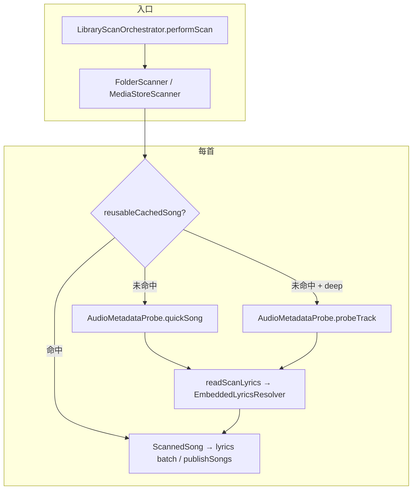

# 曲库扫描架构与性能

> 最后更新：2026-08-07  
> 状态：深度元数据探测（`deepMetadataProbe=true`）+ Mica TagLib fork（`probeTrack` + `bitsPerSample`）已落地；冷扫描性能在 ~260 首规模下接近当前架构合理下界。

---

## 目标与范围

| 项目 | 说明 |
|------|------|
| **输入** | SAF 文件夹（`FolderScanner`）或 MediaStore 设备库（`MediaStoreScanner`） |
| **输出** | 完整曲库 snapshot（歌曲元数据、封面 URI、内嵌/外挂歌词槽、ReplayGain、技术字段）→ Room + 内存发布 |
| **并行度** | `MediaStoreScanner.PROBE_PARALLELISM = 8`（Folder 扫描复用同一常量） |
| **不在本文** | 播放队列同步、封面流切歌性能（见 `PERFORMANCE_INVESTIGATION*.md`）、万曲库 UI 排序极限 |

设计取舍：扫描期尽量把**可复用的元数据一次读齐**（TagLib 合并读、歌词候选优先文本路径），同时保留 **ProbeResult 失败不阻断入库** 与 **generation / storeRevision 协议**（见 `docs/adr/0002-library-snapshot-publication.md`）。

---

## 端到端数据流



**扫描代际**：每次 `performScan` bump `scanGeneration`；Room 写入与内存发布须经 `storeSyncMutex`，旧代际任务不得在副作用边界之后写回（`AGENTS.md` / ADR-0002）。

---

## 扫描模式

### 深度探测 vs 快速探测

由设置 `LibraryScanSettings.deepMetadataProbe` → `ScanOptions.deepMetadataProbe` 控制（默认 **true**）。

| 模式 | 路径 | TagLib | mediaExtractor | 技术位深 | 典型用途 |
|------|------|--------|----------------|----------|----------|
| **深度** | `probeTrack` | ✅ 261/263 | 106 首（m4a/aac/alac/ape 等） | TagLib native 或 `AudioTechnicalProbe` fallback | 常规定价音质展示、FLAC 位深 |
| **快速** | `quickSong` | ❌ | ❌ | fallback `TrackMetadata` | 极快入库；`metadataScanVersion=0` |

### 必走 mediaExtractor 的格式

`TrackDraft.requiresAudioTrackProbe()` 为 true 时调用 `AudioTrackProbe.probe`（`ScanProfiler` stage：`mediaExtractor`）：

- m4a / aac / alac / ape / 泛 `audio/*` 等（**FLAC / MP3 / WAV / OGG / DSF 不走**）

---

## 单首深度探测流水线（probeTrack）

典型 FLAC 路径（TagLib 成功、无需 extractor）：

```text
TagLibReader.read → TagLib.probeTrack(fd)     [taglib]
  ├─ metadata + audioProperties（单次 FileRef）
  ├─ bitsPerSample > 0 → 跳过 AudioTechnicalProbe
  └─ lyricsCandidates → EmbeddedLyricsResolver
readScanLyrics                                  [lyrics]
  ├─ external LRC / TTML（外挂 sidecar）
  ├─ preparsed（DSD 等）
  ├─ TagLib 文本候选 parse
  ├─ MediaMetadataRetriever fallback
  └─ EmbeddedLyricsReader 二进制 fallback      [lyrics.embeddedBinary]
resolveAlbumArtFromBytes                        [albumArt]
CoverColorExtractor                             [coverColor]
readCopyright（MP4 且 TagLib 无 copyright）      [copyright]
→ ScannedSong
```

### TagLib fork（`:taglib`）

Vendored 于 `third_party/taglib/`（**Mica 主仓自维护**，不依赖 Kyant0 Maven 更新）。utfcpp 为 git submodule。扩展说明见 `third_party/taglib/README-MICA.md`。

1. **`AudioProperties.bitsPerSample`**：FLAC/WAV/MP4 等 native 位深；`0` 表示未知，由 `AudioTechnicalProbe` 补全。
2. **`TagLib.probeTrack(fd)`**：单次 fd 返回 `Metadata + AudioProperties`，替代双次 `getMetadata` / `getAudioProperties`。

应用侧入口：`TagLibReader.read` → `AudioMetadataProbe` taglib 路径。

### 歌词解析顺序

`EmbeddedLyricsResolver.resolve`（**已有「TagLib 有可用候选则不调 binary」**）：

1. `preparsedCandidates`（如 DSD 内嵌）
2. `tagLibCandidates`（`LYRICS` / `SYNCEDLYRICS` / `TTML` 等键）
3. `retrieverFallback`
4. `binaryFallback` → `EmbeddedLyricsReader.probeFastEmbeddedDocument`

扫描期文本候选上限：**1,000,000 字符/条**（`EmbeddedLyricsResolver.MAX_CANDIDATE_CHARS`）。成功 TagLib 路径**不保留**原始 embedded bytes（内存上界见 `docs/TESTING.md`）。

### 增量复用（温扫）

`TrackDraft.reusableCachedSong` 在以下均满足时**跳过整首 probe**：

- `scanSongId` 命中缓存，且 `mediaUri` / `sizeBytes` / `dateModifiedMs` / `externalLyricsSignature` 未变
- 未 `forceRefreshLyrics` / `forceRefreshArtwork`
- 专辑封面缓存可读（`AlbumArtCache.hasReadableCachedArt`）
- 深度模式：`hasDeepMetadata()`、`metadataScanVersion` 未过期、DSD 元数据有效等
- MP4 内嵌歌词：`embeddedLyricsProbeRevision` 与文件指纹一致

**冷扫测试**（清库 / 无缓存）会显示 `reused=0`、`reuseMisses=cache-missing=N`；**同文件夹二次扫描**才是日常体感路径。

---

## 性能实测（Xiaomi 22081212C，262 首，SAF 文件夹，冷扫）

诊断来源：`mica-diagnostics(9|10|11).txt`，`reused=0`。

| 指标 | (9) 优化前 | (10) B2 预读 | (11) TagLib fork |
|------|-----------|-------------|------------------|
| **performScan 总耗时** | 18.4 s | 9.8 s | **8.7 s** |
| Scanner 墙钟 | 17.7 s | 9.1 s | **7.9 s** |
| `taglib` avg | 54 ms | 29 ms | 27 ms |
| `technical` avg | 80 ms | 23 ms | **≈0 ms**（16 首 fallback） |
| `lyrics` avg | 44 ms | 24 ms | 28 ms |
| `lyrics.embeddedBinary` | 62 ms × **39** | 27 ms × 39 | 30 ms × **39** |
| `mediaExtractor` | 77 ms × 106 | 44 ms × 106 | 43 ms × 106 |

### 结论（2026-08-07）

1. **最大台阶是 B2**（合并读/预读，technical 大砍），不是 TagLib fork  alone。
2. **TagLib fork** 主要砍掉 FLAC 曲库的 `AudioTechnicalProbe` 二次读盘；`taglib` 本身 29→27 ms 边际很小。
3. **「TagLib 有候选则 skip binary」已在 (4)→(11) 完成**：binary 从「几乎每首」降到 **39 首**（TagLib/retriever 均无可用候选时的兜底）。
4. **冷扫 ~8 s 接近当前架构下界**：剩余时间主要是 TagLib × N、106 首 mediaExtractor、224 首扫描期歌词 parse、263 首 coverColor——均为「每首必做一点事 × 并行度」的硬成本。
5. **温扫**未在上述测试中验证；理论上 unchanged 曲库可 **亚秒级** 完成（跳过 probeTrack）。

### (11) 阶段累计占比（粗算墙钟 ≈ 累计 ÷ 5）

| Stage | 累计 | 约占墙钟 |
|-------|------|----------|
| probeTrack 合计 | 40.4 s | ~7.9 s |
| lyrics（含 parse） | 7.5 s | ~1.5 s |
| taglib | 7.1 s | ~1.4 s |
| mediaExtractor | 4.6 s | ~0.9 s |
| coverColor | 2.6 s | ~0.5 s |
| copyright | 1.4 s | ~0.3 s |
| lyrics.embeddedBinary | 1.2 s | ~0.2 s |
| publish + dbSync（performScan 内） | — | ~0.7 s |

---

## 暂缓的优化方向

以下改动需单独 PRD / 产品确认，**未承诺实施**：

| 方向 | 预估冷扫收益 | 风险 / 代价 |
|------|-------------|-------------|
| **温扫验收与 miss 原因可观测** | 日常 **~8 s → 亚秒** | 低；需补诊断与交错测试 |
| **扫描期 defer 歌词 parse** | ~0.8–1.2 s 墙钟 | 扫完列表歌词可能暂不可用 |
| **coverColor 懒算 / 复用缓存** | ~0.3–0.5 s | UI 主题色短暂 fallback |
| **收窄 mediaExtractor** | ~0.5–0.9 s | 播放 mime / ALAC 路由须逐格式验收 |
| **MP4 copyright 与歌词读盘合并** | ~0.2–0.3 s | 小 refactor |
| **扩展 TagLib 歌词键 / 覆盖剩余 39 首 binary** | ≤ ~0.2–0.4 s | 格式边缘 case |

---

## 诊断日志怎么读

导出 **Mica diagnostics** 后搜索：

| 关键字 | 含义 |
|--------|------|
| `ScanPerf:` | 单次扫描汇总：`wall=` 墙钟、`reused=` / `probed=`、各 stage 累计 ms 与次数 |
| `reuseMisses=` | 未命中增量缓存的原因统计（如 `cache-missing`） |
| `ScanFlacMeta:` | FLAC 位深路径：`path=taglib reason=bits-ok` 表示 native 位深生效 |
| `LibraryScan performScan` | 总耗时、`technicalFailed`、generation |
| `DEBUG-LYRICS-7C31` | 文件夹 sidecar 歌词配对 |

**注意**：`ScanPerf` 中 stage 时间为**各 worker 累计**，不是串行相加；墙钟约为累计 ÷ 并行度（本机 ~5×）。

---

## 相关代码

| 模块 | 路径 |
|------|------|
| 扫描编排 | `app/.../library/LibraryScanOrchestrator.kt` |
| SAF 扫描 | `app/.../scanner/FolderScanner.kt` |
| 元数据探测 | `app/.../scanner/AudioMetadataProbe.kt` |
| 歌词决议 | `app/.../scanner/EmbeddedLyricsResolver.kt` |
| 增量复用 | `app/.../scanner/ScanProfiler.kt`（`reusableCachedSong`） |
| 性能计数 | `app/.../scanner/ScanProfiler.kt` |
| TagLib 封装 | `app/.../scanner/TagLibReader.kt` |
| TagLib native | `third_party/taglib/` |
| 扫描设置 | `app/.../preferences/LibraryScanSettings.kt` |

---

## 测试

**单元 / 契约**

```powershell
.\gradlew :app:testDebugUnitTest `
  --tests "com.mica.music.data.scanner.*" `
  --tests "com.mica.music.data.library.LibraryScanOrchestratorTest" `
  --no-configuration-cache
```

重点套件：`EmbeddedLyricsResolverTest`（TagLib 成功不调 binary）、`ScanProfilerTest`（`requiresAudioTrackProbe`）、`LibraryScanOrchestratorTest`（generation / 歌词 batch 交错）。

**真机验收**：见 `docs/TESTING.md` §扫描诊断、§ProbeResult 线 A。

**性能回归**：同设备、同曲库、导出 diagnostics，对比 `ScanPerf` 的 `wall=` 与 `reused=`；冷扫与温扫须分开记录。

---

## 修订记录

| 日期 | 说明 |
|------|------|
| 2026-08-07 | 初版：架构、TagLib fork、性能 (9)(10)(11) 对比、冷扫上界结论、暂缓优化与诊断指引 |
