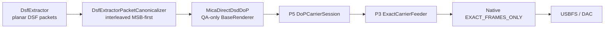

# USB Host 真独占：工程状态、证据、问题与生产化计划

> 性质：动态工程状态册，不替代架构决策记录。  
> 架构决策：[`adr/0001-usb-host-exclusive-output.md`](adr/0001-usb-host-exclusive-output.md)、[`adr/0002-usb-exclusive-playback-protocol.md`](adr/0002-usb-exclusive-playback-protocol.md)。  
> 总架构：[`USB_EXCLUSIVE_AUDIO_ARCHITECTURE.md`](USB_EXCLUSIVE_AUDIO_ARCHITECTURE.md)。  
> 原始实验记录：[`../prototypes/usb-sk02-native/NOTES.md`](../prototypes/usb-sk02-native/NOTES.md)。  
> 最后更新：2026-08-16。  
> 当前结论：**M1 纯协议 reducer/authority algebra 继续保留已验收状态（`0e05399c`；P4 外部 36/36、M1 52/52、1000 次 Retiring/write-drain 交错绿）。针对真实 M3 `RENDERER_STREAM -> TIMELINE_PERIOD` 时序暴露出的共享盲区，主控与 P4/P5/P6 已完成全 M1–M6 assumption audit，矩阵收敛为 A01–A37；P4 directive70、P5 directive31、P6 directive06 最终均 GREEN，未发现需要新 authority plane 或推翻 M1 ownership/lease/receipt algebra 的证据。架构 addendum V2 已正式接受，状态 `FROZEN_V1_CORE / ASSUMPTION_AUDIT_ADDENDUM_V2_ACCEPTED`；内容覆盖 order-independent observation join、PlaybackTopologyEpoch、duplicate-media/EventTime/Adapter provenance、generation≠usable output、authority fail-closed、PCM/Direct typed physical retirement/proof、Direct staged side-effect fencing、supersedable rebuild 和 recovery intent revision fence。Assumption audit 现已 CLOSED，进入 staged repair。P3 directive86 先执行 R0：完整 quarantine 当前 5 个 dirty 失败实验并恢复精确 committed HEAD `4c65a0a9`；随后只做 R1 observation/provenance/output-availability 修复（A01–A09/A15–A17/A30/A37），完成 clean checkpoint 后停给 P4 adversarial review。R2 才处理 PCM/Direct physical proof，R3 再处理 technical intent/rebuild/recovery。M3 physical gates 仍 RED，M4 physical 未开始，所有新硬件资格继续暂停到 R1–R3 软件 repair gates 独立转绿。**

---

## 1. 文档目的与完成度口径

USB 独占横跨 Android USB Host、Linux `usbdevice_fs`、UAC2 描述符、异步等时传输、
Media3 输出、解码精度、播放生命周期、进程死亡恢复和许可证。只说“已经能响”或只给
一个总百分比会掩盖边界。本文记录当前事实、证据、故障、未决项和生产化成本；逐次实验
数字仍放在 prototype `NOTES.md`。

| 口径 | 当前估计 | 含义 |
|---|---:|---|
| 单 SK02 可行性原型 | **约 85–90%，工程收口** | 描述符、claim、feedback、真实 PCM、Media3、暂停/seek/切歌、强杀恢复与关键竞态均已证明；未补齐的完整 90 分钟长测、SharedPcm baseline 和人工听感不再阻塞进入 P1 |
| 可发布 USB 独占子系统 | **约 30–40%** | 通用设备模型、产品 owner、attach/detach、权限 UX、fallback、DAC 矩阵、后台策略、UI、发布测试仍缺失 |

百分比是规划量尺，不是验收结论。“工程收口”表示不再继续给 throwaway prototype 堆能力，
不表示已通过发布验收，也不代表 debug 开关可以进入 release。

---

## 2. 术语与事实边界

### 2.1 什么是 USB Host 真独占

Mica 通过 Android USB Host 获得 `UsbDevice` 权限，打开设备，强制 claim 目标 USB
AudioControl / AudioStreaming interface，并直接向 isochronous endpoint 提交 URB。独占
期间目标音频 interface 的 driver 是 `usbfs` 而非 `snd-usb-audio`，数据不经过 Android
共享 `AudioTrack` USB route。

以下均**不等同于**真独占：`AudioTrack.setPreferredDevice()`、framework direct/offload、
系统选中 USB route、最小 `DefaultAudioSink`、UI 显示 USB DAC、其他应用恰好没出声。

### 2.2 Exclusive 不自动等于 bit-perfect

- **Exclusive** 说明谁持有 interface、是否绕过共享输出。
- **Signal-exact / bit-perfect** 说明最终样本是否与规定的源样本一致。

ReplayGain、软件音量、EQ、响度、声道平衡、fade/crossfade、变速、重采样、位深缩减、
float 量化、dither、channel mixing 都会改变第二个事实。项目的音质 consent 硬规则仍然
适用：不能为了兼容暗中降为 PCM16，也不能在未获明确允许前默认启用有损变化。

---

## 3. 当前范围与非目标

### 3.1 原型范围

- DAC：Fosi Audio SK02，VID/PID `262a:0001`。
- 手机：Xiaomi `22081212C`，Android 12 / API 31。
- 构建：debug/QA only；side-by-side id `com.mica.music.qa`。
- 双声道 PCM16、PCM32，以及可证明精确映射到 signed PCM32 的 float。
- 入口允许 8–384 kHz；真实 Media3 重点验证 48/96 kHz。
- Media3 播放、pause/resume、seek、自动跨轨、rate reconfigure、强杀恢复。
- release 不能加载 debug provider；正式版数据不参与测试。

### 3.2 当前不承诺

- 任意 UAC1/UAC2 DAC、多声道、隐式反馈、多 DAC/hub；
- **生产可用** Native DSD / DoP（当前仅 QA 原型；SK02 上 packed-24 DoP/DSD128 transport 已有物理证据，产品 Direct DSD lifecycle 尚未收口）；
- release UI、设备选择、默认接管和完整权限 UX；
- 所有厂商后台策略下长期存活；
- 进程死亡后无人干预立即恢复；
- 多小时稳定性（长测完成前）；
- 仅凭 exclusive 状态宣称所有格式 bit-perfect。

当前策略是 fail closed：格式不能被证明精确时失败，不静默 fallback 到低位深。

---

## 4. SK02 实机事实

| 项目 | 实测 |
|---|---|
| USB 标识 | `262a:0001`，device revision `0.04` |
| Interface 0 | HID |
| Interface 1 | UAC2 AudioControl |
| Interface 2 | UAC2 AudioStreaming |
| alt 0 | 零带宽/停止 |
| alt 1 | stereo PCM16，2-byte subslot，max packet 200 bytes |
| alt 2 | stereo PCM24，3-byte subslot，max packet 300 bytes |
| alt 3 | stereo PCM32，4-byte subslot，max packet 400 bytes |
| alt 4 | Type-I `bmFormats=0x80000000` raw candidate；尚未证明 DSD framing |
| OUT | asynchronous isochronous `0x03` |
| feedback IN | explicit feedback `0x84` |
| 共享态 driver | `snd-usb-audio` |
| 独占态 driver | `usbfs` |

Android 12 Java queued USB request 不能承担这里的 isochronous queue。当前最小 seam 是：

1. Java `UsbManager` 做发现与权限；
2. `UsbDeviceConnection` 提供已授权 fd；
3. JNI 使用 `USBDEVFS_*` ioctl 提交/回收 isochronous URB。

`claimInterface(..., false)` 因 `snd-usb-audio` 已绑定而失败；对明确的 AudioControl 和
AudioStreaming 使用 force claim 成功，driver 从 `snd-usb-audio` 变为 `usbfs`，正常 release
后再重绑。通用实现不能把 HID 或无关 interface 一起抢走。

---

## 5. 当前架构与数据路径


上图描述的是 **PCM USB 独占路径**。Media3 仍负责 decoder、renderer、timestamp、buffering、flush、play/pause 和 seek；PCM 路径只替换最终 `AudioOutput`，不是另写完整播放器。Native worker 独占唯一 URB queue，Kotlin `write()` 只向有界 ring 送 source bytes。PCM pause 或 underrun 可以使用既有 PCM silence 语义，不重播陈旧 source bytes。

### 5.1 Direct DSD QA 分支

Direct DSD 不能复用上图的 `AudioOutputProvider` seam：DSD 到达该层之前已经经过 FFmpeg / `DsdDecimationAudioProcessor` 转成 PCM。当前 QA 原型改在 **Media3 renderer 层**、FFmpeg 之前分叉，同时继续复用同一个 ExoPlayer / MediaSession / timeline：



截至 2026-08-14 已有两层不同的物理证据，必须分开表述：

- **transport/content proof**：SK02 上真实 DSD128 5.6448 MHz stereo source 已通过 P5 canonicalization → DoP session → P3 feeder → Native exact → 352.8 kHz packed-24 USB carrier，`idlePacked=0`、零 transport/feedback/data 错误并完整 cleanup；
- **Media3 Direct renderer proof**：QA renderer 已能收到 authoritative DSF format、canonicalize extractor packet、建立同一 exact transport 并用真实内容 prefill/arm；但第一次真实 Media3 staircase 暴露 prepare 生命周期错误——在 paused/prepare 阶段过早 arm 后，Media3 因 renderer ready 停止继续 `render()`，Native exact 随后正确报 shortage `10004`。

因此 Direct DSD 启动合同现在明确拆成：

1. **startup prefill readiness**：ENABLED/prepare 阶段允许真实 CONTENT 填入 dormant Native ring；达到现有 transport geometry 推导的 startup threshold 后只允许 `isReady=true`；
2. **transport armed**：只有 renderer 进入 STARTED、`onStarted()` 被 Media3 调用后才允许执行 one-way exact arm。

这不是放宽 underflow。`EXACT_FRAMES_ONLY` 在 armed 后缺 carrier 仍必须 fail closed；Native 不得通过 PCM zero-fill、旧数据 replay 或自造 DSD idle 维持流。

### 5.2 DSD pause / 空窗的后续 ownership

Direct DSD 不能照搬 PCM pause。未来需要一个**独立于 Media3 `render()` cadence 的 carrier liveness owner**，只在一个地方决定当前向 P5 session 提交 CONTENT 还是 GAP：

- PLAYING：source chronology 前进，提交 CONTENT；
- PAUSED / source starvation / track gap：source chronology 不前进，通过 P5 `writeGapFrames()` 持续提交合法 `0x69` DSD gap；
- resume：回到 CONTENT，并保留同一 session 的 pending-half / marker chronology；
- content writer 与 gap filler 不能并发写同一 `DoPCarrierSession`。

P5 已经拥有更严格的 gap contract：先排空 accepted packed bytes；若存在真实 pending half-frame，gap 的第一个半帧用 `0x69` 补齐但仍计为 CONTENT；partial multichannel canonical input 则阻塞 gap，不能越过；marker 相位持续推进。未来 liveness owner 必须复用这套语义，而不是重新实现第二个 DoP encoder。

参考项目只提供架构证据：NeriPlayer（GPLv3）把 USB PCM 的 queued/preroll readiness 与 native transport start 分离，支持“先预填、真正 play 再启动”的生命周期；其 PCM pause 采用 stop/restart，因此不能直接推导 DSD。sylvakru（Apache-2.0）的 DoP/Native DSD 路径则在 pause 时保持 source reader 原位、持续发送 `0x69`，并用 session 级 encoder/idle filler 保持 carrier/marker 连续；新 content worker 接管前会停止并 join filler，避免双 writer。Mica 只吸收这些 lifecycle/ownership 经验，不复制其编码或 USB 算法。

参考项目还可作为兼容测试的 **boundary/capability oracle**：从它们的 descriptor 接受条件、clock/feedback 假设、capacity 计算、recovery 和 quirk 设计中抽取 predicate，再反向生成 Mica 自己的 synthetic 极限 corpus。参考实现“能尝试”不代表 Mica 必须接受；Mica 仍以 exact-only、typed rejection 和 fail-closed 为最终判据。设计与落地阶段见 `docs/USB_COMPATIBILITY_ADVERSARIAL_CORPUS.md`。

### 5.3 代码地图

| 责任 | 路径 |
|---|---|
| 决策 | `docs/adr/0001-usb-host-exclusive-output.md` |
| 本状态册 | `docs/USB_EXCLUSIVE_AUDIO_STATUS.md` |
| USB adversarial corpus 设计 | `docs/USB_COMPATIBILITY_ADVERSARIAL_CORPUS.md` |
| 原始证据 | `prototypes/usb-sk02-native/NOTES.md` |
| Native USBFS | `prototypes/usb-sk02-native/src/main/cpp/usb_sk02_prototype.cpp` |
| Debug receiver | `app/src/debug/.../usbprototype/UsbSk02DescriptorPrototypeReceiver.kt` |
| Media3 provider/output | `app/src/debug/.../usbprototype/UsbSk02AudioOutputProvider.kt` |
| Generation gate | `app/src/debug/.../usbprototype/UsbPrototypeGenerationGate.kt` |
| Release-safe gate | `app/src/main/.../media/UsbHostPrototypeOutput.kt` |
| 输出模式 | `app/src/main/.../media/AudioOutputPathConfig.kt` |
| Renderer/Sink 接线 | `app/src/main/.../media/MicaRenderersFactory.kt` |
| Direct DSD renderer / pump（P3 QA） | `app/src/main/.../media/dsd/DirectDsdMedia3Renderer.kt`、`DirectDsdRendererPump.kt` |
| DSF packet canonicalizer（P3 QA） | `app/src/main/.../media/dsf/DsfExtractorPacketCanonicalizer.kt` |
| DoP session continuity（P5→P3） | `app/src/main/.../media/dsd/DoPCarrierSession.kt` |
| Exact carrier feeder（P3） | `app/src/main/.../media/usb/ExactCarrierFeeder.kt` |
| Direct DSD real transport adapter（debug） | `app/src/debug/.../usbprototype/UsbDirectDsdTransportSession.kt` |
| FFmpeg S32 选择 | `third_party/media3-ffmpeg-decoder/.../FfmpegAudioRenderer.java`、`ffmpeg_jni.cc` |
| Interleaving tests | `app/src/test/.../usbprototype/` |
| Soak / endurance / notify | `scripts/run-usb-sk02-media3-soak.ps1`、`run-usb-sk02-endurance.ps1`、`watch-usb-sk02-endurance.ps1` |

命名债务：`ExactPcm24PrototypePackingTest` 的历史文件名与当前 Media3 主路径的 signed
PCM32 exact packing 不完全一致，生产吸收前应拆清 PCM24/PCM32 合同并改名。

---

## 6. Native transport

### 6.1 队列形状

- 8 个 data URB，每个 8 个 isochronous packet；
- 4 个 feedback URB；
- Native source ring 上限约 2 秒 PCM；
- 非阻塞、有界 write；
- `poll()` + `USBDEVFS_REAPURBNDELAY`；
- stop 时 discard，并在有界 deadline 内 drain；
- Native error 转为可恢复 `AudioOutput.WriteException`；
- underrun 累计 `underrunBytes`，同时通知 Media3 listener 和 diagnostics。

### 6.2 显式反馈

SK02 feedback 是 16.16 fixed-point frames/microframe。worker 使用实时 feedback 累计
fractional phase，决定下一个 microframe frame 数。44.1 kHz 30 秒实测字节数与理论值只差
4 bytes，符合 feedback-driven sizing。

这只证明 SK02。通用 parser 必须验证唯一反馈 endpoint、方向、interval、clock topology、
packet 上限、值域和长调度间隙后的重捕获；不能证明的拓扑必须拒绝，不能猜。

---

## 7. 格式与音质策略

| 场景 | Decoder 输出 | USB 目标 | 结果 |
|---|---|---|---|
| 44.1/16 FLAC 离线 | PCM16 | alt 1 | exact buffer，3 秒成功 |
| 96/24 FLAC 离线 | FFmpeg float，全部精确还原 S24 | alt 2 packed PCM24 | 1.9 秒成功 |
| 48/24 ALAC Media3 | PCM32 或 exact S32 float | alt 3 PCM32 | 播放、pause/resume 成功 |
| 96/24 ALAC Media3 | PCM32 或 exact S32 float | alt 3 PCM32 | seek、切到 48 kHz 成功 |

平台 `c2.android.flac.decoder` 在 96/24 测试文件上给 PCM16，原型因此拒绝并使用 bundled
FFmpeg。测试 ALAC 的 float 又不全是精确 `S24 / 2^23`，强压 packed PCM24 必须取整；后续
确认它们可精确映射 `S32 / 2^31`，所以走 alt 3。

Exact S32 gate 要求 sample finite、`sample * 2^31` 恰为整数且在 signed 32-bit 范围内，
否则错误 `10003`，不降 PCM16。这个结论只覆盖被测 decoder 输出；EQ/ReplayGain/Sonic 等
float DSP 通常不是整点，不能套用。

原型不应用数字 gain。Media3 volume 非 `1.0f` 时静音/停止 source 消费并记录事件，音量交给
SK02 硬件。这是保真优先但体验不完整的策略。

### 7.1 待决信号处理矩阵

| 功能 | bit-perfect 建议 | processed USB 可能性 | 必须决定 |
|---|---|---|---|
| ReplayGain | bypass | 用户显式开启 | 状态标识与 consent |
| EQ | bypass | float DSP + 明确量化 | 位深、dither、headroom |
| 频谱 | 只读 tap | 可用 | tap 不得阻塞/改样本 |
| 变速 | 仅 1.0x | 可选 | 明确取消 bit-perfect |
| fade/crossfade | 关闭 | 可选 | gapless 与队列语义 |
| 重采样 | 源率优先 | 兼容 fallback | 算法、目标率、显式事实 |
| DSD | 不走 PCM processor | 不适用 | Native/DoP 独立决策 |

---

## 8. 生命周期与并发正确性

### 8.1 Owner 与 generation

- 当前 owner：`UsbPrototypeGenerationOwner.gate`；`beginRequest()` 是 mint point。
- token 同时发布给 Native `active_generation`。
- disable、替换、release、新请求都会推进 generation。
- 取消旧任务只是优化；正确性依赖 stale token 在副作用前自检。

### 8.2 唯一串行 seam

`withTransport` 的 `ReentrantLock` 串行化影响同一 transport 的 USB 副作用。新 generation
可以先发布让旧 worker 停止，但新 session 必须等旧 session 恢复/释放完成才可 claim。

### 8.3 等待点与副作用审计

每个 `openDevice`、force claim、clock read/write、`setInterface`、Native `poll`、reap、URB
resubmit、drain 后都需要在下一个副作用前复检 token。

实际副作用包括：detach/claim interface 1/2、读写 clock、选 target alt、submit/reap/
resubmit/discard URB、恢复 alt 0/clock、release、`USBDEVFS_CONNECT`、close。

### 8.4 交错测试

`UsbPrototypeGenerationGateTest.oldRequestPausedAtUsbSideEffectCannotWriteAfterNewRequestWins`
让旧请求停在副作用边界，发布并完成新请求，再释放旧请求，断言旧请求不能写回。真机
supersede 也证明旧队列 `cancelled=true`、drain 为零、恢复/释放后新请求才进入 seam。

### 8.5 切歌 currentness：代次必须随请求到达提交边界

2026-08-15 对本地 RawS、NeriPlayer、sylvakru 三个参考实现复核后，冻结以下设计原则：
**不得在异步 callback 到达后，再通过 application/UI 的 `currentMediaItem`、当前 mediaId、
format facts、playing/pump 状态等全局快照反推这个 callback 属于哪一首/哪一代播放。**
这些状态可能已经提前推进到 C，而 playback/renderer 线程仍在完成 B；如果 B、C 又恰好
具有相同 DSD/PCM facts，单靠格式比较也无法区分 A→B→C 中的 stale B callback。

参考实现采用的共同模式是“身份在请求产生时确定，并贯穿到真实消费/提交边界”：

- **RawS**：same-profile track switch 请求携带单调递增 `serial` 与 playback `generation`；
  新请求 supersede 旧请求，真正的 USB cut 只由 feeder 在其写边界消费并 ACK。controller
  不能以稍后的全局 current state 替旧请求补身份。
- **NeriPlayer**：`UsbAudioSinkReconfigurationCoordinator.begin()` mint generation token；
  `install/isLatest/complete` 均要求 token 精确匹配，新请求可使旧 job 失效。Native runtime
  另有 `nativeStreamGeneration`，recovery `actionGeneration` 不匹配直接 fail closed。
- **sylvakru**：切流由独立 USB worker/session owner 顺序执行，先收住旧 worker/session，再
  commit 新 `playbackId`；其它异步 USB 操作同样携带 session generation，旧 generation
  到达时直接忽略。

因此 Mica 的 track-transition authority 应明确区分至少三层身份：

```text
manual navigation requestId
        + target media identity
        + playback stream / period generation
```

Direct renderer 可优先使用 Media3 在 renderer 生命周期提供的 stream/period identity
（例如 `MediaPeriodId` 或等价、可稳定比较的 generation token）；PCM 侧不得在
`AudioSink.configure()` 仅凭 `Format` 猜代次，而应由 renderer/lifecycle 层把同一
playback-generation token 显式投影到 sink/reconfiguration coordinator。只有 token 与
当前请求/stream epoch 同时匹配时，才允许创建/复用 runtime、prefill、arm、source accept
或发布 transition complete。

标准 stale 探针固定包含：A→B→C 快速连续导航，让 B callback 在 application current 已是 C
后才释放；还要覆盖 B/C **facts 完全相同** 的 logical-track replacement。正确结果必须是 B
无权消费 C 的 request、无权创建/arm C runtime、无权发布 C 的 accept/complete；仅真正的 C
playback generation 可以提交。取消旧工作仍只是优化，generation/token 校验才是正确性保证。

正式版仍需把 prototype singleton 换成 `UsbOutputSessionOwner`，统一持有 device identity、
permission request、generation、negotiated format、active/fallback fact、retry budget、播放
意图与前后台策略。BroadcastReceiver callback 不得绕过 owner fire-and-forget 改共享输出。

---

## 9. 已完成证据链

1. 只读枚举与 descriptor；
2. 非强制 claim 失败与 kernel driver 识别；
3. 授权 fd 上 `USBDEVFS_GETDRIVER`；
4. force claim/release，验证 `snd-usb-audio -> usbfs -> snd-usb-audio`；
5. 单次 feedback IN、单次 silence OUT；
6. 5/30 秒 feedback-controlled queue；
7. 有界非静音生成 buffer；
8. MediaStore 真实 PCM16 decode + CRC 固定 + USB；
9. FFmpeg 真实 96/24 exact 验证 + alt 2；
10. 物理热拔插有界退出、重插后重新获取；
11. generation supersede 真机交错；
12. Media3 provider；
13. 48/96 kHz ALAC、pause/resume、seek、自动换轨；
14. 强杀 QA 后显式 reconnect 与重新播放；
15. soak、endurance、Windows 完成通知。

代表值：30 秒 PCM16 silence 为 30,000 data URB / 240,000 packet / 5,292,004 bytes，
errors 为零、drain 为零；PCM16 decode CRC32 `2275827798`；96/24 packed buffer CRC32
`405717052`；首个完整 lifecycle smoke 约 100 秒并通过 48/96 kHz 与强杀恢复。

---

## 10. 已遇问题：现象、处理与风险

| # | 现象 | 根因/判断 | 处理 | 剩余风险 |
|---:|---|---|---|---|
| 1 | Java queue 不能发 isochronous | Android 12 API 边界 | 授权 fd + Native USBFS | 通用实现需重评自研与 libusb 成本 |
| 2 | 非强制 claim 失败 | `snd-usb-audio` 已绑定 | 精确 interface force claim | parser 错选会影响 HID/其他功能 |
| 3 | 96/24 平台 decoder 给 PCM16 | codec 输出协商降精度 | 拒绝，使用 FFmpeg | 其他格式仍须查真实 encoding |
| 4 | ALAC float 非 exact S24 | 表示不是统一 S24 网格 | exact S32 + alt 3 | 任意 float DSP 不一定 exact |
| 5 | 强杀后 driver 留在 detached | 正常 release 未执行 | 显式 reconnect | 需要 durable startup/attach recovery |
| 6 | 直接 `USBDEVFS_CONNECT` 不生效 | interface ioctl 层级错误 | 通过 `USBDEVFS_IOCTL` tunnel | vendor kernel 仍需矩阵 |
| 7 | 强杀恢复检查仍见 `usbfs` | 先启动 Activity，自动续播抢先 claim | stopped 时先 reconnect/verify | 产品必须由 owner 排序 |
| 8 | ADB daemon startup stderr 被判失败 | PowerShell `ErrorActionPreference=Stop` | 按 `$LASTEXITCODE` 判断 | native wrapper 应统一规则 |
| 9 | 15 分钟 endurance 误报位置慢 | `dumpsys media_session` 为周期 snapshot，单窗口阈值过严 | 4 点/5 秒，多点存活判断 | 不是 sample-accurate 时钟，仍需 underrun 指标 |
| 10 | `UsbManager.deviceList=[]` | DAC 当时未枚举 | fail fast、summary、重插前检查 | detached 时无法验证 driver 恢复 |
| 11 | 手机单口无法普通充电 | 手机同时给 DAC 供电 | 20%/45°C 安全线 | 三小时可能先因电量中止 |
| 12 | 无第二台 DAC | 硬件限制 | 单 DAC tracer bullet | 不能外推兼容性 |
| 13 | 长测 evidence 膨胀 | 每轮全量 log 无界 | CSV 每轮、完整 evidence 抽样 | app diagnostics 自身上界待查 |
| 14 | PS5 中文脚本乱码 | 无 BOM UTF-8 按代码页读 | 通知脚本保持 ASCII | 中文 toast 需 BOM/pwsh7 |
| 15 | GUI 弹窗不是权威事实 | 锁屏/非交互 session 可阻止 | 先写 `.notified` marker | 更可靠通知可用 toast/automation |
| 16 | Lifecycle resume 报 underrun 384/768 B | Native `fill_data` 先在 pause 状态调用 `take_source` 得到 0，随后 `play` 并发切为 true，最后用新的 playing 状态把刚才合法的 pause 静音误记为 underrun；ring 当时接近满 2 秒 | `take_source` 在 source mutex 内同时返回 bytes 与 `playing_when_taken`，计数只使用该快照；同一生产 helper 的确定性交错设备测试先红后绿 | telemetry TOCTOU 已修；修后干净混合 Lifecycle 13 轮/6 次强杀通过，另有被外部安装打断前的 18 轮/9 次强杀有效前缀；完整 90 分钟迁移到 production path 验收 |
| 17 | 强杀恢复偶发 `reconnect=complete` 超时 | 旧流程先把 `snd-usb-audio` 重绑，再启动 App 立即 detach/claim；Native 还无条件依次 CONNECT control/streaming，形成冗余反向操作和枚举竞态 | 强杀后直接 fresh-open 独占；driver 恢复收口到单 owner/generation 协议；control CONNECT 成功或查询到已绑定即终止，不再冗余 CONNECT streaming | 4 分钟专项完成 11 次连续强杀/fresh-open；修后混合回归再完成 6 次，另有 9 次有效前缀；生产 owner 接入后仍需长测 |

尚不能定性：曾见 Mica `dumpsys cpuinfo` 约 130–140%（Android 多核口径可超过 100%），
约 15 分钟电量下降约 8 点，PSS 短窗约 253–263 MB、FD 174–178。需要 SharedPcm baseline
和更长样本；不能现在断言 CPU 根因、稳定耗电率或长期无泄漏。

---

## 11. 自动化测试体系

### 11.1 `Lifecycle` 模式

每轮选择已知 48 kHz 曲目，检查播放和 `usbfs` 独占；pause/resume；seek 到曲末附近并
跨 track boundary；选择已知 96 kHz 曲目；扫描 diagnostics/logcat；采集资源指标；再按
配置轮次 force-stop。强杀后直接重新启动 App，让新的进程重新枚举、open/claim SK02；不在
中间恢复 `snd-usb-audio`，避免“刚重绑又立即 detach”的反向操作和枚举竞态。

### 11.2 `Continuous` 模式

设置 repeat-one，固定曲目，不主动 pause/seek；每 60 秒检查存活和资源，每 5 个 sample
复查 interface driver，完整 evidence 按间隔抽样。退出一定恢复 repeat-off。

### 11.3 `CrashRecovery` 模式

固定 repeat-one，每轮确认播放前进、`usbfs` 独占和无致命诊断后强杀 QA，再以 fresh-open
恢复播放并重新验证；不执行 pause/seek/切歌，用于把进程死亡恢复与 resume underrun 分离。

### 11.4 `ResumeStress` 模式

固定 repeat-one 和同一 48 kHz 曲目，每轮只执行 pause、等待 1 秒、resume，再检查播放前进、
`usbfs` 独占和致命诊断。QA/debug 探针记录 play 请求、首写、消费启停时刻和 ring 水位；Native
只在每次 resume 首次缺数时记录一次详细日志，不改变 PCM、prefill 或 USB 调度策略。

`RebuildResumeStress` 每轮交替选择已知 48/96 kHz 曲目，在输出重建完成后做 pause/resume；
`BoundaryResumeStress` 则固定执行 select、seek 到曲末、跨 track boundary，再做 pause/resume。
二者用于在纯 resume 基线之上分别增加 rebuild 与 seek/boundary 变量。

### 11.5 多点进度存活判断

`dumpsys media_session` 不是 sample-accurate clock。当前最多取 4 点、间隔 5 秒；任一相邻
点前进至少 750 ms 即存活，明显负跳变视为 repeat/track transition；约 15 秒内完全无明确
变化才失败。这只证明“未长期停死”，听感和连续性仍依赖 Native error、`underrunBytes`、
URB error、`WriteException` / `PlaybackException` 与人工听感。

### 11.6 指标、安全与产物

`metrics.csv` 记录 timestamp、mode、phase、cycle、pid、position、PSS、FD、CPU、电量和
温度。电量 `<=20%` 或电池温度 `>=45°C` 自动停止。无论 pass/fail，`finally` 都尝试 disable
prototype、stop QA、reconnect driver、保存 summary。

```powershell
# 单模式连续播放
.\scripts\run-usb-sk02-media3-soak.ps1 `
  -Serial 172.17.57.9:42883 -Mode Continuous -DurationMinutes 120

# 生命周期压力
.\scripts\run-usb-sk02-media3-soak.ps1 `
  -Serial 172.17.57.9:42883 -Mode Lifecycle -DurationMinutes 120 -CrashCycleEvery 3

# 强杀/fresh-open 专项
.\scripts\run-usb-sk02-media3-soak.ps1 `
  -Serial 172.17.57.9:42883 -Mode CrashRecovery -DurationMinutes 10

# 纯 pause/resume 专项
.\scripts\run-usb-sk02-media3-soak.ps1 `
  -Serial 172.17.57.9:42883 -Mode ResumeStress -DurationMinutes 20 -HoldSeconds 2

# 48/96 kHz rebuild 后 resume
.\scripts\run-usb-sk02-media3-soak.ps1 `
  -Serial 172.17.57.9:42883 -Mode RebuildResumeStress -DurationMinutes 10 -HoldSeconds 2

# seek/跨曲后 resume
.\scripts\run-usb-sk02-media3-soak.ps1 `
  -Serial 172.17.57.9:42883 -Mode BoundaryResumeStress -DurationMinutes 10 -HoldSeconds 2

# 两阶段三小时长测；默认有 Windows 完成/失败通知
.\scripts\run-usb-sk02-endurance.ps1 `
  -Serial 172.17.57.9:42883 -ContinuousMinutes 90 -LifecycleMinutes 90 -CrashCycleEvery 3
```

产物位置：

- `.scratch/usb-sk02-soak/<timestamp>/summary.json` 与 `metrics.csv`；
- 抽样/失败的 logcat、Mica diagnostics、media-session dump；
- `.scratch/usb-sk02-endurance/<timestamp>/summary.json`；
- 通知权威 marker：`summary.json.notified`。

---

## 12. 长测状态

截至 2026-08-09 本次更新：

- 1 分钟 `Continuous` 通过；
- 1 分钟 `Lifecycle` 通过，含一次强杀恢复；
- 第一轮 120 分钟 Continuous 约 15 分钟被过严的单窗口位置阈值中止；未发现 Mica
  `PlaybackException`、`WriteException` 或 USB error，driver cleanup 成功；
- 位置判断已改为多点窗口；
- 一次 90+90 分钟任务因启动时 `UsbManager.deviceList=[]` 未进入播放；
- SK02 重新枚举后再次启动了 90+90 分钟任务；第一阶段 `Continuous` 从
  2026-08-09 03:36:57 运行到 04:24:47，约 48 分钟后在手机电量达到 20% 时由
  安全保护主动终止，第二阶段 `Lifecycle` 因此没有启动；
- 本轮采集 43 个一分钟级指标样本，播放位置持续推进并跨过多次曲目边界；观测到的
  sample rate 为 48,000 Hz，PSS 为 173,826–205,342 KB，FD 为 172–178，最高电池
  温度为 38.0°C；
- 本轮 evidence 中未检出 Mica `PlaybackException`、`WriteException`、USB error、
  Mica ANR 或 native crash。日志中的 `AudioFlinger::EffectHandle disconnect` 是系统
  AudioFlinger effect thread 清理信息，没有证据表明它来自 USB 独占 transport 故障；
- 失败原因被准确写入两级 `summary.json`，清理流程完成，`cleanupDriversBound=true`，
  测试结束后无线 ADB 仍在线；这证明安全中止、失败归因、evidence 落盘和 driver
  cleanup 路径按预期工作；
- 原始证据位于 `.scratch/usb-sk02-soak/20260809-033615/`，编排摘要位于
  `.scratch/usb-sk02-endurance/20260809-033615/summary.json`。
- 2026-08-09 13:45 启动的一次 90 分钟 `Lifecycle` **不构成有效完成**：外层执行工具被
  错误设置为 600 秒超时，在约 10 分钟时强制终止了 PowerShell runner。终止前完成 8 个
  完整循环和 8 个指标样本，并完成 2 次“独占状态下强杀 QA 后恢复”；第 9 个循环进行中
  被截断。runner 来不及进入 `finally`，所以没有 `summary.json`，安全采样、最终断言和
  自动 cleanup 也随之停止；
- 上述中断后 QA 进程继续持有独占播放，直到 15:31 人工发现并清理。这个约 96 分钟的
  残留会话没有连续 metrics/lifecycle 驱动，不能冒充 90 分钟 Lifecycle pass，也不能据此
  宣称安全阈值全程有效。人工清理得到 `reconnect=complete`，随后 probe 确认 control 与
  streaming 都重新绑定 `snd-usb-audio`、`detached=false`、`claimed=false`；清理时电量
  48%、温度 33.3°C。该轮原始目录为 `.scratch/usb-sk02-soak/20260809-134509/`。
- 16:56 使用独立后台 runner 重跑 `Lifecycle`，在第 14 轮由真实 underrun 断言停止，而非
  runner/监控故障。此前完成 13 个循环、13 个指标样本和 4 次强杀恢复，同时观测到
  48/96 kHz；PSS 186,001–200,804 KB，FD 174–178，最高 34.7°C。17:11:29.141 resume，
  17:11:29.143 记录 `underrunBytes=384`，播放随后继续推进；按 48 kHz、双声道 PCM32
  计算是 48 帧、约 1 ms 的补零。时间关系与 native `playing`/ring 行为支持“resume 启动
  竞态”，不支持历史日志误判。17:12:19 完成 fail summary、通知与 driver cleanup，
  `cleanupDriversBound=true`。证据目录为 `.scratch/usb-sk02-soak/20260809-165617/`。
- 最初采用“ring 中至少有 1 帧才启动”后，无强杀回归仍在第 11 轮复现 384 B underrun，
  证明单帧 gate 不足。最终改为按实际采样率计算的 20 ms prefill；该改动不改变 PCM 格式、
  位深或采样率，不增加重采样/DSP，但开始或恢复播放最多会多等待约 20 ms。
- 修复后的定向回归从 17:52:50 运行到 18:03:12，共完成 16 个 `Lifecycle` 循环，跨过此前
  第 11、14 轮失效窗口，并覆盖 48/96 kHz、pause/resume、seek、切歌和采样率切换。未检出
  `underrunBytes`、`PlaybackException`、`WriteException`、`exactPcm32Rejected` 或
  `FATAL EXCEPTION`；PSS 184,343–200,335 KB，FD 174–178，最高 35.5°C，结束后
  `cleanupDriversBound=true`。证据目录为 `.scratch/usb-sk02-soak/20260809-175238/`。
- 另一次带强杀的短回归完成 6 轮且未见 underrun，但第二次强杀恢复在
  `reconnect=complete` 等待处超时；cleanup 随后立即恢复成功。这是独立的恢复/枚举竞态，
  不能用本次 prefill 修复的结果覆盖；后续已按下面的专项结果修复并复验；
- 强杀恢复改为 direct fresh-open；后台 driver 恢复由单一 owner 串行执行，每次请求持有
  generation，并在设备枚举、权限、open、driver query、每次 CONNECT 和状态发布边界后
  重新校验。control interface CONNECT 成功，或失败后查询发现 driver 已绑定时，不再执行
  streaming interface 的冗余 CONNECT；
- 2026-08-09 18:33 的混合 `Lifecycle` 中第一次强杀/fresh-open 成功；第 4 轮在 resume 后
  仍出现 384 B underrun，证明这是与强杀恢复分开的剩余问题。runner 正常 cleanup，driver
  最终重新绑定；证据目录为 `.scratch/usb-sk02-soak/20260809-183330/`；
- 2026-08-09 18:38–18:42 的 `CrashRecovery` 专项完成 11 个循环，即 11 次连续强杀和
  fresh-open 恢复；每轮播放均前进且保持 `usbfs` 独占，覆盖 48/96 kHz，未检出 underrun、
  `PlaybackException`、`WriteException` 或 `FATAL EXCEPTION`。PSS 160,178–184,122 KB，
  FD 174–178，最高 35.1°C；最终 probe 确认 control/streaming 都绑定
  `snd-usb-audio`，`cleanupDriversBound=true`。证据目录为
  `.scratch/usb-sk02-soak/20260809-183757/`。
- 2026-08-09 19:25–19:46 的 `ResumeStress` 专项完成 123 次纯 pause/resume，全部播放前进并
  保持 `usbfs` 独占；未检出 underrun、`PlaybackException`、`WriteException` 或
  `FATAL EXCEPTION`，最终两个 interface 均恢复 `snd-usb-audio`。前 121 次完整时间样本中，
  resume→首写 P50/P95/P99 为 2.287/4.760/285.885 ms，最大 597.301 ms；消费启用最大
  0.878 ms，但启用时 ring 最少仍有 40,960 帧，常见为 96,000 帧。最慢首写发生时，ring 从
  76,368 帧降至 50,253 帧，仍未接近 underrun。证据支持“纯 pause/resume 不是充分条件”；
  当时 flush/recreate 后的近空 ring 仍是待检假设。PSS 187,015–198,531 KB，
  FD 172–178，最高 36.2°C，证据目录为 `.scratch/usb-sk02-soak/20260809-192500/`。
- 2026-08-09 20:11–20:19 的 `RebuildResumeStress` 完成 26 次 48/96 kHz 交替重建后的
  pause/resume，全部通过，未检出失败模式；消费启用时最低 4,096 帧，首写最大 31.600 ms。
  PSS 192,183–211,490 KB，FD 174–177，最高 34.3°C，cleanup driver 正常。证据目录为
  `.scratch/usb-sk02-soak/20260809-201102/`；
- 2026-08-09 20:20–20:25 的 `BoundaryResumeStress` 完成 8 次 select、seek 跨曲后的
  pause/resume，覆盖 48/96 kHz，全部通过，未检出失败模式；消费启用和首写观测到的最低
  ring 水位均为 4,096 帧，首写最大 62.530 ms。PSS 191,346–213,067 KB，FD 174–178，
  最高 35.2°C，cleanup driver 正常。证据目录为
  `.scratch/usb-sk02-soak/20260809-202031/`。
- 2026-08-09 22:16–22:28 原样重放混合 `Lifecycle`，每 2 轮强杀一次；在第 15 轮、累计
  7 次成功强杀/fresh-open 后触发 fail-fast。失败实际发生于第 14 轮强杀后的新 96 kHz
  session 首次 play：Native 记录 `sourceBytes=0 missingBytes=768`，但同一时刻累计
  `queuedBytes=1536000`、`completedBytes=0`，Kotlin 读取 `bufferedFrames=192192`，ring 并未
  缺数。代码路径中 `take_source` 只有 pause 或空 ring 会返回 0；结合满 ring，证明 worker
  在 pause 状态取到合法静音后、计数前被 `play` 插入，随后用新的 `playing=true` 错记为
  underrun。这是 telemetry TOCTOU，而非 20 ms prefill 不足；768 B 是 96 kHz/PCM32 的
  1 ms URB，此前 48 kHz 的 384 B 也恰好是同结构的 1 ms URB。测试覆盖 48/96 kHz，
  PSS 196,684–214,364 KB，FD 172–177，最高 32°C，最终 driver cleanup 正常。证据目录为
  `.scratch/usb-sk02-soak/20260809-221547/`。
- 已增加与生产 `fill_data` 共用 `should_count_underrun` 的 Native 确定性交错测试：worker 在
  pause 状态完成取数并停在计数边界，另一线程执行 play，再释放 worker。修复前设备执行得到
  `underrunBytes=768 expected=0` 并失败；修复后得到 `underrunBytes=0 expected=0`，同时反向
  断言“playing 状态真实短取数仍计数”通过。改动没有调整 PCM、20 ms prefill、ring 容量或
  USB packet 形状，因此没有引入音质或延迟策略变化；
- 2026-08-09 22:50 开始的修后混合回归完成 18 个完整循环、9 次强杀/fresh-open，覆盖
  48/96 kHz 且未见 underrun；第 19 轮时 QA 包被 runner 之外的进程执行 package replace，
  当前 PID 随之死亡，因此该轮只能作为**有效前缀证据，不能记为 pass**。证据目录为
  `.scratch/usb-sk02-soak/20260809-225000/`；
- 2026-08-09 23:10–23:21 的干净 10 分钟混合 `Lifecycle` 完成 13 个完整循环和 6 次强杀/
  fresh-open，覆盖 48/96 kHz；未检出 underrun、Native underrun debug、`PlaybackException`、
  `WriteException` 或 `FATAL`。PSS 199,836–215,381 KB，FD 174–178，最高 36.7°C，电量
  79%→73%，最终 `cleanupDriversBound=true`，control/streaming 均恢复 `snd-usb-audio`。证据目录为
  `.scratch/usb-sk02-soak/20260809-231015/`。

结论边界：当前可记为“约 48 分钟 Continuous 有效观测；强杀 direct fresh-open 通过 11 次
连续恢复专项；三个 resume 专项均通过；384/768 B telemetry TOCTOU 已由确定性红绿测试关闭，
修后混合 Lifecycle 有 13 轮/6 次强杀的干净 pass，另有 18 轮/9 次强杀的有效前缀”。这证明
旧报警不应靠扩大 20 ms prefill 处理，但尚无人工听感证明 resume 边界绝对无 click/dropout。
现有结果仍不构成 90 分钟 Continuous、带强杀的 90 分钟 Lifecycle 或三小时 endurance pass。

---

## 13. 外部参考与许可证边界

当前 transport 根据公开 Linux/Android USB 接口、SK02 描述符实测、逐级 probe 和 Media3
公开 API 独立实现。没有复制其他播放器受限 USB 核心，因此当前不需要找作者申请双许可。

| 项目 | 公开许可/状态 | 可参考 | 边界 |
|---|---|---|---|
| [RawS Music](https://github.com/QFDY-GZC/RawS-Music) | 主仓 Apache-2.0；README 明确完整 USB Native 核心未公开，未来独立仓计划 GPLv3 | 上层能力模型、恢复/设置策略、模块边界 | 不能推导或复制未公开核心；未来 GPL 核心不能无条件并入非 GPL 发布 |
| [sylvakru](https://github.com/AfalpHy/sylvakru) | 主仓 Apache-2.0；USB 独占使用专用 beta build/branch | 独立构建门、产品策略 | 使用 beta 代码前逐文件确认许可、来源、依赖，不能只看主仓 badge |
| [Halcyon](https://github.com/Kifranei/Halcyon) | 主仓 Apache-2.0，公开说明 Oboe 与 USB DAC 独占 | Media3/FFmpeg/USB 上层组合、产品行为 | 仍须查具体文件历史与 `THIRD_PARTY_LICENSES.md`；功能描述不证明 transport 相同 |
| [NeriPlayer](https://github.com/cwuom/NeriPlayer) | 根仓 GPL-3.0；README 称只有 `app/src/main/cpp/README.md` 明列的自有 Native 文件有附带条件替代授权 | UAC1/UAC2 matrix、feedback 重捕获、watchdog、健康审计、动态 buffer、runtime report 问题清单 | 默认不能复制进不采用 GPL-3.0 的 Mica；替代许可仅覆盖明列文件，还需核对贡献者 provenance 和署名条件 |

只有未来决定直接吸收 GPL-only 代码且 Mica 不准备按 GPL 分发时，才需要找每个目标文件
的权利人取得覆盖具体版本、修改和分发方式的书面替代许可，并排除第三方/外部贡献。现在
最安全有效的用法是参考“问题清单与策略”，不复制具体表达。

---

## 14. 生产目标架构

### 14.1 `UsbAudioDeviceRepository`

监听 attach/detach，提供 permission 前后 snapshot；区分可重连 identity 与一次连接 runtime
handle。identity 不能只用 `AudioDeviceInfo.id` 或瞬时 `UsbDevice.deviceId`，应考虑 VID/PID、
descriptor fingerprint、可用 serial 与端口/拓扑提示。

### 14.2 `UsbAudioCapabilityParser`

输出 immutable model：UAC version、interface/alt/endpoint、Type-I format、channel、subslot、
bit resolution、sample rate/clock topology、feedback、max packet、interval、quirk/reject reason。
不能持久化 `UsbInterface` runtime object 充当设备能力事实。

### 14.3 `UsbFormatNegotiator`

输入 source format、质量策略、DAC capability、DSP 状态；输出 requested/exact candidate、
negotiated device format、是否重采样/改位深/改信号、reject/fallback reason。格式不可用时
不能默默 PCM16；兼容 fallback 必须显式且遵守音质 consent。

### 14.4 `UsbOutputSessionOwner`

唯一 generation owner 与唯一 USB side-effect seam，统一处理 full-mode rebuild、permission、
attach/detach、process restart、前后台、retry/backoff、stale callback 和 active fact 发布。

### 14.5 `UsbIsochronousTransport`

与设备 model 解耦的 URB queue、feedback strategy、bounded ring、backpressure/underrun/error、
cancel/drain、ABI/sanitizer build，并提供 fake syscall seam 做确定性交错测试。

### 14.6 `PlaybackOutputFacts`

UI 不从设置推断状态。至少发布 requested/active mode、attached/permission/claimed、device、
negotiated format、exclusive、signalExact、active DSP、fallback reason、recovery 与 health。

### 14.7 产品策略/UI

需单独设计：总开关、插入是否接管、remembered device、bit-perfect/processed/compatibility、
硬件/软件音量、permission UX、失败是否回 SharedPcm、后台限制提示、实际格式/重采样/exact、
detach/recovery/fallback 反馈。当前 prototype 不应提前堆 UI。

---

## 15. 能力轨道与依赖 Gate

> **2026-08-14 路线图修订**：旧 P0→P5 是早期线性施工假设，不再作为当前执行顺序。
> 并行协调中的 `P3` / `P4` / `P5` 是 **worker 编号**，不是 roadmap phase；二者不得再混用。

当前路线按五条能力轨道理解：A=ownership/lifecycle foundation，B=Generic UAC PCM core，C=Direct DSD core，D=compatibility evidence，E=productization/release。A 现拆为 A1 USB ownership/session foundation 与 A2 playback-transition protocol：A1 继续冻结，A2 在 `USB_EXCLUSIVE_AUDIO_ARCHITECTURE.md` 下重构并在冻结前阻塞新的 shared transition implementation。A2 冻结后，B/C/D 与跨轨验证基础设施再按边界并行；E 最终汇总产品资格。

| 轨道 | 当前状态 | 主要内容 |
|---|---|---|
| **A — Foundation** | **A1 USB ownership frozen；A2 playback protocol 重构中** | A1: owner/generation、permission/attach/detach、recovery/fallback、wake/background、exact-only/fail-closed；A2: playback intent、mutation/occurrence、PCM/DOP family handoff、activation linearization |
| **B — Generic PCM** | 软件较深，设备矩阵未闭合 | descriptor/clock/capability/selection/transport/reconnect；剩余 UAC1/更多 UAC2、多格式/多 DAC、quirk |
| **C — Direct DSD** | DSD128 已深入真机资格 | DSF canonical、DoP、exact feeder/Native、Media3 Direct；pause/resume core 已证明，当前剩 teardown committed-tail drain，之后是 seek/transition/mixed/reconnect/DSD256/RAW_DATA |
| **D — Compatibility evidence** | 已启动，早期系统化 | 多 DAC/controller-family evidence、static quirk vs learned fact、reference predicate/provenance、adversarial corpus |
| **E — Productization / release** | 尚未收口 | 设置/UX/fallback、后台/route、长稳/插拔/process death、资源/听感/SharedPcm baseline、回归、合规、release matrix |

以下旧 P0–P5 计划保留用于解释历史 commit / artifact 和早期成本估算，**不再表示依赖顺序或当前完成度**。主要映射：P0→A prototype evidence；P1→A；P2→A+E；P3→B+D；P4→跨 B/C/D 的验证基础设施 + E；P5→C+D。

```text
                    ┌────────────── B. Generic PCM core ──────────────┐
A1. USB ownership ──┐
   FROZEN            ├─ A2. Playback protocol ─┤                         ├──→ E. Productization / release
                     │    RE-DESIGN / FREEZE    └──── C. Direct DSD core ─┤
                       \                                             │
                        └────→ D. Compatibility evidence ────────────┘
```

Gate 规则：A1 的 frozen USB owner/generation/fallback/exact-policy 不被破坏；A2 playback protocol 在 `FROZEN_V1` 前，任何涉及 shared PLAY/PAUSE/navigation/seek/PCM↔DOP authority 的生产改动都暂停。A2 冻结后，B/C 可按协议边界并行；B/C 的能力仍必须分别按 software + physical evidence 宣称；没有多设备 evidence / provenance 时不得宣称 generic DAC compatibility；E 的设置/UX/fallback、长稳、SharedPcm baseline、听感、资源、回归与合规未闭合前，QA/单 DAC proof 不得升级为 release 能力。

### 15.1 历史线性阶段细节

以下为旧线性计划的工程日估算；不含等硬件、用户验收、商店审核和 vendor
kernel 意外。机器长测 wall-clock 单列。

### P0：单 SK02 可行性原型（已工程收口）

已完成可行性所需的 descriptor、claim、feedback、真实 PCM、Media3 接入、格式切换、生命周期、
进程死亡恢复、物理断开和确定性交错验证。原型代码保持 debug/QA 隔离，不直接提升为 production。

原计划中的两个完整 90 分钟长测、SharedPcm baseline 和人工听感仍是**未取得的证据**，但继续在
throwaway harness 上补齐的边际价值低，因此迁移到 P1/P2 的真实接入路径执行。P0 不再追加功能，
估计完成度冻结为 **85–90%**；这不是 100% 验收或发布声明。

### P1：抽 production contract，仍只支持 SK02

正式 session owner、device/capability/format/session/transport interface、generation seam、
requested/active/fallback facts；debug receiver 退为 harness，release 仍默认关闭。

**4–7 工程日**。

### P2：SK02 developer beta

设置 gate、permission/attach/detach、full-mode rebuild 与队列/位置/播放意图恢复、foreground/
background、明确 fallback、diagnostics、SharedPcm 回归。

**5–8 工程日**；累计到可供开发者日用的 SK02-only beta 约 **2–3 周**。

### P3：通用 UAC1/UAC2 Type-I PCM

descriptor/clock parser、UAC1/2 control 差异、endpoint/feedback cadence、PCM16/24/32、常用
采样率、quirk、identity/reconnect 与多 DAC matrix。

**3–6 周**，强依赖真实 DAC。只有 SK02 无法诚实完成。

### P4：发布级稳定性与产品体验

过夜 soak、屏幕/后台/焦点/route 并发、高频插拔、process death、CPU/电量优化、UI、ABI/
sanitizer、发布回归和合规。

**2–4 周**，可与 P3 部分并行。从现在到较可信的通用 PCM release 总计约 **5–9 周**。

### P5：DoP / Native DSD（已进入分层实装）

截至 2026-08-14，DSF/DFF reader、canonical DSD、DoP carrier planner、gap/marker continuity、exact feeder/activation，以及 SK02 上的 idle DoP 与真实 DSD128 packed-24 transport 都已有证据。

当前主线已转到 Media3 Direct renderer 生命周期：先完成 prepare-prefill → STARTED-arm，再处理 pause carrier liveness、seek/transition/mixed queue、产品 mode/fallback、active-DSD reconnect、DSD256 packing 与多 DAC matrix。Native RAW_DATA/alt4 仍为 `FramingUnproven`。

原先“额外 2–5 周”只是早期粗略估算，已不作为当前完成度口径；PCM transport 完成仍不自动等于 DSD 产品支持。

---

## 16. 验收矩阵

### 16.1 单 DAC prototype

- [x] descriptor、force claim/release、driver 独占证明；
- [x] feedback IN、data OUT、feedback-controlled queue；
- [x] 真实 PCM16 与 high-resolution sample；
- [x] Media3、pause/resume、seek/transition/rate reconfigure；
- [x] generation interleaving；
- [x] underrun telemetry 确定性交错红绿测试；
- [x] physical detach bounded exit、reconnect/reacquire；
- [x] 强杀后显式 reconnect；
- [x] 两模式自动化与完成通知；
- [ ] 两个完整 90 分钟长测通过（迁移到 P1/P2 真实接入路径）；
- [ ] 人工听感无明显 click/dropout（迁移到 P1/P2）；
- [ ] SharedPcm baseline 与正式包无影响复核（必须在生产接入后完成）。

### 16.2 Production PCM

- [ ] 产品 contract、release owner、通用 parser、显式 format/fallback；
- [ ] permission/attach/detach UX、process death durable recovery、后台策略；
- [ ] UAC1 + 多个 UAC2 DAC；
- [ ] PCM16/24/32 与 44.1/48 系/高采样率矩阵；
- [ ] 资源上界、厂商矩阵、音质行为确认；
- [ ] 开源合规、release 默认策略与回滚方案。

---

## 17. 风险清单

| 风险 | 影响 | 控制 |
|---|---|---|
| DAC 拓扑差异 | 高 | parser + reject by proof + matrix |
| 进程死亡遗留 detached driver | 高 | durable startup/attach recovery |
| 后台调度使 feedback 陈旧/underrun | 高 | wake policy、recapture、health audit、bounded recovery |
| 兼容时偷偷降质 | 高 | format facts、fail closed、显式 consent |
| Native 卡死拖住 Media3 | 高 | deadline、generation cancel、watchdog、sink rebuild |
| rebuild 交错写 USB | 高 | 单 owner、统一 seam、interleaving test |
| 单口供电耗尽手机 | 中 | battery threshold；有源 hub 作为独立拓扑测试 |
| GPL 污染 | 高 | 不复制、逐文件 provenance、必要时书面许可 |
| prototype 腐烂进 production | 中 | P1 吸收/删除，不长期维护 ADB receiver |
| 只测能播遗漏听感 | 高 | underrun telemetry + 听感/录音 + 长稳 |

---

## 18. 下一步

1. **C / Direct DSD**：先闭合当前唯一的 pause/resume final blocker——owner-driven teardown 下只排空 already-accepted carrier tail；保持一 session/arm、source freeze、GAP chronology 和 exact fail-closed 不变。新 artifact 必须由独立 replay validator 复核。
2. **C / Direct DSD**：完整 pause/resume PASS 后依次处理 seek/reset/re-prefill、auto-next/track transition、mixed DSD↔PCM queue、product mode/fallback、active-DSD reconnect；DSD256 DoP 与 RAW_DATA 分开资格。
3. **B / Generic PCM**：继续补 UAC1/更多 UAC2 topology、selector/multiplier/feedback cadence、PCM16/24/32 与采样率矩阵；没有第二 DAC 时不把 SK02 结果冒充 generic compatibility。
4. **D / Compatibility evidence**：P5/reference audit 产出 capability predicate/provenance；P4 把已批准 predicate 转成 deterministic adversarial corpus，优先 capacity/clock/ambiguity/metamorphic 边界，并保持 static quirk 与 learned runtime fact 分层。
5. **E / Productization**：B/C/D 足够稳定后再收口设置 gate、remembered device、permission UX、明确 fallback/错误反馈、foreground/background/route 行为和发布默认策略。
6. **E / Release qualification**：在真实 production path 上补完整长稳、SharedPcm baseline、人工听感/录音、CPU/电量/温度、ABI/sanitizer、process death/高频插拔和 release regression；有第二 DAC 时作为独立 topology/device qualification。

当前交接点（2026-08-14）：**A 已基本冻结；B 与 C 并行推进；C 的 DSD128 正常 PLAY 已物理通过，pause/resume core 也已物理证明，当前只剩 owner-driven cleanup tail 的 final qualification；D 已开始系统化，E 尚未进入发布收口。** release fail-fast 与 SharedPcm 默认路径不得因此放宽。

---

## 19. 维护规则

- 架构方向变化写 ADR；当前进度/问题/计划更新本文；原始 probe 数字写 prototype NOTES。
- 用户可见能力同步 `CURRENT_FEATURE_STATUS.md`、`TODO.md` 和设置文档。
- 新增第三方代码同步 `OPEN_SOURCE_NOTICES.md`，记录精确文件 provenance。
- 音质默认变化先获明确允许，再改代码和格式矩阵。
- 宣称异步问题已修复前必须覆盖实际副作用的确定性交错测试；只测取消标志不够。
