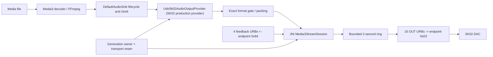

# USB Host 真独占：工程状态、证据、问题与生产化计划

> 性质：动态工程状态册，不替代架构决策记录。
> 架构决策：[`adr/0001-usb-host-exclusive-output.md`](adr/0001-usb-host-exclusive-output.md)。
> 原始实验记录：[`../prototypes/usb-sk02-native/NOTES.md`](../prototypes/usb-sk02-native/NOTES.md)。
> 最后更新：2026-08-12。
> 当前结论：**单台 Fosi Audio SK02 的 P2 production path 已完成 Release/Perf 晋级，完整 90 分钟 Continuous、Lifecycle、OemBackground 与 SharedPcmBaseline 均已通过，2026-08-12 Perf 真机人工听感矩阵也已完成。权限/拔出生命周期、播放意图迁移、durable recovery、1/2 秒 backoff、三连失败 SharedPcm fallback、wake policy 和正式权限 UX/UI 已接入。Release/Perf 默认关闭且沿用 exact-only/fail-closed 音质合同。已知 96 kHz seek/输出切换恢复偏慢与一次 16.811 ms 后台 completion gap 作为显式观察项保留，未产生 underrun 或可重复听感异常。通用 UAC1/UAC2、多 DAC 与格式矩阵属于 P3，不能由单 SK02 结果代替。**

---

## 1. 文档目的与完成度口径

USB 独占横跨 Android USB Host、Linux `usbdevice_fs`、UAC2 描述符、异步等时传输、
Media3 输出、解码精度、播放生命周期、进程死亡恢复和许可证。只说“已经能响”或只给
一个总百分比会掩盖边界。本文记录当前事实、证据、故障、未决项和生产化成本；逐次实验
数字仍放在 prototype `NOTES.md`。

| 口径 | 当前估计 | 含义 |
|---|---:|---|
| 单 SK02 可行性原型 | **约 85–90%，工程收口** | 描述符、claim、feedback、真实 PCM、Media3、暂停/seek/切歌、强杀恢复与关键竞态均已证明；未补齐的完整 90 分钟长测、SharedPcm baseline 和人工听感不再阻塞进入 P1 |
| 可发布 USB 独占子系统 | **约 30–40%** | 通用设备模型、产品 owner、attach/detach、权限 UX、fallback、DAC 矩阵、后台策略、UI、发布测试仍缺失 |

百分比是规划量尺，不是验收结论。“工程收口”表示不再继续给 throwaway prototype 堆能力，
不表示已通过发布验收，也不代表 debug 开关可以进入 release。

---

## 2. 术语与事实边界

### 2.1 什么是 USB Host 真独占

Mica 通过 Android USB Host 获得 `UsbDevice` 权限，打开设备，强制 claim 目标 USB
AudioControl / AudioStreaming interface，并直接向 isochronous endpoint 提交 URB。独占
期间目标音频 interface 的 driver 是 `usbfs` 而非 `snd-usb-audio`，数据不经过 Android
共享 `AudioTrack` USB route。

以下均**不等同于**真独占：`AudioTrack.setPreferredDevice()`、framework direct/offload、
系统选中 USB route、最小 `DefaultAudioSink`、UI 显示 USB DAC、其他应用恰好没出声。

### 2.2 Exclusive 不自动等于 bit-perfect

- **Exclusive** 说明谁持有 interface、是否绕过共享输出。
- **Signal-exact / bit-perfect** 说明最终样本是否与规定的源样本一致。

ReplayGain、软件音量、EQ、响度、声道平衡、fade/crossfade、变速、重采样、位深缩减、
float 量化、dither、channel mixing 都会改变第二个事实。项目的音质 consent 硬规则仍然
适用：不能为了兼容暗中降为 PCM16，也不能在未获明确允许前默认启用有损变化。

---

## 3. 当前范围与非目标

### 3.1 原型范围

- DAC：Fosi Audio SK02，VID/PID `262a:0001`。
- 手机：Xiaomi `22081212C`，Android 12 / API 31。
- 构建：provider/JNI 已进入 Debug/Perf/Release；验收使用 side-by-side id `com.mica.music.qa`，正式入口默认关闭。
- 双声道 PCM16、PCM32，以及可证明精确映射到 signed PCM32 的 float。
- 入口允许 8–384 kHz；真实 Media3 重点验证 48/96 kHz。
- Media3 播放、pause/resume、seek、自动跨轨、rate reconfigure、强杀恢复。
- release 不能加载 debug provider；正式版数据不参与测试。

### 3.2 当前不承诺

- 任意 UAC1/UAC2 DAC、多声道、隐式反馈、多 DAC/hub；
- Native DSD / DoP；
- 多设备选择、未验证 DAC 的默认接管与通用权限 UX；
- 所有厂商后台策略下长期存活；
- 未经 OEM 豁免时的厂商杀进程自动恢复；
- 过夜/多小时稳定性；
- 仅凭 exclusive 状态宣称所有格式 bit-perfect。

当前策略是 fail closed：格式不能被证明精确时失败，不静默 fallback 到低位深。

---

## 4. SK02 实机事实

| 项目 | 实测 |
|---|---|
| USB 标识 | `262a:0001`，device revision `0.04` |
| Interface 0 | HID |
| Interface 1 | UAC2 AudioControl |
| Interface 2 | UAC2 AudioStreaming |
| alt 0 | 零带宽/停止 |
| alt 1 | stereo PCM16，2-byte subslot，max packet 200 bytes |
| alt 2 | stereo PCM24，3-byte subslot，max packet 300 bytes |
| alt 3 | stereo PCM32，4-byte subslot，max packet 400 bytes |
| alt 4 | Type-I `bmFormats=0x80000000` raw candidate；尚未证明 DSD framing |
| OUT | asynchronous isochronous `0x03` |
| feedback IN | explicit feedback `0x84` |
| 共享态 driver | `snd-usb-audio` |
| 独占态 driver | `usbfs` |

Android 12 Java queued USB request 不能承担这里的 isochronous queue。当前最小 seam 是：

1. Java `UsbManager` 做发现与权限；
2. `UsbDeviceConnection` 提供已授权 fd；
3. JNI 使用 `USBDEVFS_*` ioctl 提交/回收 isochronous URB。

`claimInterface(..., false)` 因 `snd-usb-audio` 已绑定而失败；对明确的 AudioControl 和
AudioStreaming 使用 force claim 成功，driver 从 `snd-usb-audio` 变为 `usbfs`，正常 release
后再重绑。通用实现不能把 HID 或无关 interface 一起抢走。

---

## 5. 当前架构与数据路径



Media3 仍负责 decoder、renderer、timestamp、buffering、flush、play/pause 和 seek；原型只
替换最终 `AudioOutput`，不是另写完整播放器。Native worker 独占唯一 URB queue，Kotlin
`write()` 只向有界 ring 送 source bytes。pause 或 underrun 时 worker 输出 silence，不重播
陈旧 source bytes。

### 5.1 代码地图

| 责任 | 路径 |
|---|---|
| 决策 | `docs/adr/0001-usb-host-exclusive-output.md` |
| 本状态册 | `docs/USB_EXCLUSIVE_AUDIO_STATUS.md` |
| 原始证据 | `prototypes/usb-sk02-native/NOTES.md` |
| Native USBFS | `prototypes/usb-sk02-native/src/main/cpp/usb_sk02_prototype.cpp` |
| Debug receiver | `app/src/debug/.../usbprototype/UsbSk02DescriptorPrototypeReceiver.kt` |
| Media3 provider/output | `app/src/main/.../usbprototype/UsbSk02AudioOutputProvider.kt` |
| Production contract | `app/src/main/.../media/usb/UsbAudioContracts.kt`、`PlaybackOutputFacts.kt` |
| SK02 capability/format | `app/src/main/.../media/usb/Sk02UsbContract.kt` |
| Generation/session owner | `app/src/main/.../media/usb/UsbOutputSessionOwner.kt` |
| Output adapter seam | `app/src/main/.../media/UsbHostOutputAdapter.kt` |
| Release-safe gate | `app/src/main/.../media/UsbHostOutputPreferences.kt` |
| 输出模式 | `app/src/main/.../media/AudioOutputPathConfig.kt` |
| Renderer/Sink 接线 | `app/src/main/.../media/MicaRenderersFactory.kt` |
| FFmpeg S32 选择 | `third_party/media3-ffmpeg-decoder/.../FfmpegAudioRenderer.java`、`ffmpeg_jni.cc` |
| Production interleaving tests | `app/src/test/.../media/usb/UsbOutputSessionOwnerTest.kt` |
| Prototype/packing tests | `app/src/test/.../usbprototype/` |
| Soak / endurance / notify | `scripts/run-usb-sk02-media3-soak.ps1`、`run-usb-sk02-endurance.ps1`、`watch-usb-sk02-endurance.ps1` |

历史的 `ExactPcm24PrototypePackingTest` 已更名为 `ExactPcm32PackingTest`；Media3 当前路径
验证的是 signed PCM32 exact packing，不能把该测试外推成任意 float 或 PCM24 合同。

---

## 6. Native transport

### 6.1 队列形状

- 16 个 data URB，每个 8 个 isochronous packet，名义 ahead window 约 16 ms；
- 4 个 feedback URB；
- Native source ring 上限约 2 秒 PCM；
- 非阻塞、有界 write；
- `poll()` + `USBDEVFS_REAPURBNDELAY`；
- stop 时 discard，并在有界 deadline 内 drain；
- Native error 转为可恢复 `AudioOutput.WriteException`；
- underrun 累计 `underrunBytes`，同时通知 Media3 listener 和 diagnostics。

### 6.2 显式反馈

SK02 feedback 是 16.16 fixed-point frames/microframe。worker 使用实时 feedback 累计
fractional phase，决定下一个 microframe frame 数。44.1 kHz 30 秒实测字节数与理论值只差
4 bytes，符合 feedback-driven sizing。

这只证明 SK02。通用 parser 必须验证唯一反馈 endpoint、方向、interval、clock topology、
packet 上限、值域和长调度间隙后的重捕获；不能证明的拓扑必须拒绝，不能猜。

---

## 7. 格式与音质策略

| 场景 | Decoder 输出 | USB 目标 | 结果 |
|---|---|---|---|
| 44.1/16 FLAC 离线 | PCM16 | alt 1 | exact buffer，3 秒成功 |
| 96/24 FLAC 离线 | FFmpeg float，全部精确还原 S24 | alt 2 packed PCM24 | 1.9 秒成功 |
| 48/24 ALAC Media3 | PCM32 或 exact S32 float | alt 3 PCM32 | 播放、pause/resume 成功 |
| 96/24 ALAC Media3 | PCM32 或 exact S32 float | alt 3 PCM32 | seek、切到 48 kHz 成功 |

平台 `c2.android.flac.decoder` 在 96/24 测试文件上给 PCM16，原型因此拒绝并使用 bundled
FFmpeg。测试 ALAC 的 float 又不全是精确 `S24 / 2^23`，强压 packed PCM24 必须取整；后续
确认它们可精确映射 `S32 / 2^31`，所以走 alt 3。

Exact S32 gate 要求 sample finite、`sample * 2^31` 恰为整数且在 signed 32-bit 范围内，
否则错误 `10003`，不降 PCM16。这个结论只覆盖被测 decoder 输出；EQ/ReplayGain/Sonic 等
float DSP 通常不是整点，不能套用。

原型不应用数字 gain。Media3 volume 非 `1.0f` 时静音/停止 source 消费并记录事件，音量交给
SK02 硬件。这是保真优先但体验不完整的策略。

### 7.1 待决信号处理矩阵

| 功能 | bit-perfect 建议 | processed USB 可能性 | 必须决定 |
|---|---|---|---|
| ReplayGain | bypass | 用户显式开启 | 状态标识与 consent |
| EQ | bypass | float DSP + 明确量化 | 位深、dither、headroom |
| 频谱 | 只读 tap | 可用 | tap 不得阻塞/改样本 |
| 变速 | 仅 1.0x | 可选 | 明确取消 bit-perfect |
| fade/crossfade | 关闭 | 可选 | gapless 与队列语义 |
| 重采样 | 源率优先 | 兼容 fallback | 算法、目标率、显式事实 |
| DSD | 不走 PCM processor | 不适用 | Native/DoP 独立决策 |

---

## 8. 生命周期与并发正确性

### 8.1 Owner 与 generation

- 当前正式 owner：`UsbOutputRuntime.owner`（`UsbOutputSessionOwner`）。
- `replace()` 在等待 transport seam 前 mint generation，并通过惰性 bridge 发布给 Native
  `active_generation`；旧 worker 可立即停止，新 session 仍须等待旧 session cleanup。
- restart、active release、disable、替换和新请求都会推进 generation；stale session 的
  `release()` 不得推进 generation 或打断 winner。
- debug raw transport actions 已 retired；只读诊断、Media3 harness 和 owner-serialized
  reconnect 保留。active production session 存在时 harness request 不 mint generation。
- 取消旧任务只是优化；正确性依赖 request lease 在每个后续 IO/副作用前自检。

### 8.2 唯一串行 seam

`UsbOutputSessionOwner` 的 `ReentrantLock` 同时串行化 open/claim、active Media3 callback、
restart、release/reconnect 与 facts 发布。新 generation 可以先发布让旧 worker 停止，但新
session 必须等旧 session 恢复 alt/clock、release/reconnect/close 完成才可 claim。
cleanup 使用独立 cleanup lease：即使发起 cleanup 的 request 又被 supersede，已经持锁的
恢复与释放仍必须完成。

### 8.3 等待点与副作用审计

每个 `openDevice`、force claim、clock read/write、`setInterface`、Native `poll`、reap、URB
resubmit、drain 后都需要在下一个副作用前复检 token。

实际副作用包括：detach/claim interface 1/2、读写 clock、选 target alt、submit/reap/
resubmit/discard URB、恢复 alt 0/clock、release、`USBDEVFS_CONNECT`、close。

### 8.4 交错测试

`UsbOutputSessionOwnerTest` 确定性覆盖：旧 open 停在 claim/submit 边界后被新请求淘汰；
替换请求再次被第三个请求淘汰时旧 session cleanup 仍完成；active write 停在 Native submit
边界后不能在 replacement generation 发布后写入；active session 存在时 debug harness 不能
mint generation 或进入 transport。既有 Native underrun TOCTOU 交错测试继续保留。

P2 才会把 permission request、attach/detach、retry budget、播放意图、前后台策略和
full-mode rebuild 纳入 owner；P1 不提前实现这些产品行为。

---

## 9. 已完成证据链

1. 只读枚举与 descriptor；
2. 非强制 claim 失败与 kernel driver 识别；
3. 授权 fd 上 `USBDEVFS_GETDRIVER`；
4. force claim/release，验证 `snd-usb-audio -> usbfs -> snd-usb-audio`；
5. 单次 feedback IN、单次 silence OUT；
6. 5/30 秒 feedback-controlled queue；
7. 有界非静音生成 buffer；
8. MediaStore 真实 PCM16 decode + CRC 固定 + USB；
9. FFmpeg 真实 96/24 exact 验证 + alt 2；
10. 物理热拔插有界退出、重插后重新获取；
11. generation supersede 真机交错；
12. Media3 provider；
13. 48/96 kHz ALAC、pause/resume、seek、自动换轨；
14. 强杀 QA 后显式 reconnect 与重新播放；
15. soak、endurance、Windows 完成通知。

代表值：30 秒 PCM16 silence 为 30,000 data URB / 240,000 packet / 5,292,004 bytes，
errors 为零、drain 为零；PCM16 decode CRC32 `2275827798`；96/24 packed buffer CRC32
`405717052`；首个完整 lifecycle smoke 约 100 秒并通过 48/96 kHz 与强杀恢复。

---

## 10. 已遇问题：现象、处理与风险

| # | 现象 | 根因/判断 | 处理 | 剩余风险 |
|---:|---|---|---|---|
| 1 | Java queue 不能发 isochronous | Android 12 API 边界 | 授权 fd + Native USBFS | 通用实现需重评自研与 libusb 成本 |
| 2 | 非强制 claim 失败 | `snd-usb-audio` 已绑定 | 精确 interface force claim | parser 错选会影响 HID/其他功能 |
| 3 | 96/24 平台 decoder 给 PCM16 | codec 输出协商降精度 | 拒绝，使用 FFmpeg | 其他格式仍须查真实 encoding |
| 4 | ALAC float 非 exact S24 | 表示不是统一 S24 网格 | exact S32 + alt 3 | 任意 float DSP 不一定 exact |
| 5 | 强杀后 driver 留在 detached | 正常 release 未执行 | 显式 reconnect | 需要 durable startup/attach recovery |
| 6 | 直接 `USBDEVFS_CONNECT` 不生效 | interface ioctl 层级错误 | 通过 `USBDEVFS_IOCTL` tunnel | vendor kernel 仍需矩阵 |
| 7 | 强杀恢复检查仍见 `usbfs` | 先启动 Activity，自动续播抢先 claim | stopped 时先 reconnect/verify | 产品必须由 owner 排序 |
| 8 | ADB daemon startup stderr 被判失败 | PowerShell `ErrorActionPreference=Stop` | 按 `$LASTEXITCODE` 判断 | native wrapper 应统一规则 |
| 9 | 15 分钟 endurance 误报位置慢 | `dumpsys media_session` 为周期 snapshot，单窗口阈值过严 | 4 点/5 秒，多点存活判断 | 不是 sample-accurate 时钟，仍需 underrun 指标 |
| 10 | `UsbManager.deviceList=[]` | DAC 当时未枚举 | fail fast、summary、重插前检查 | detached 时无法验证 driver 恢复 |
| 11 | 手机单口无法普通充电 | 手机同时给 DAC 供电 | 20%/45°C 安全线 | 三小时可能先因电量中止 |
| 12 | 无第二台 DAC | 硬件限制 | 单 DAC tracer bullet | 不能外推兼容性 |
| 13 | 长测 evidence 膨胀 | 每轮全量 log 无界 | CSV 每轮、完整 evidence 抽样 | app diagnostics 自身上界待查 |
| 14 | PS5 中文脚本乱码 | 无 BOM UTF-8 按代码页读 | 通知脚本保持 ASCII | 中文 toast 需 BOM/pwsh7 |
| 15 | GUI 弹窗不是权威事实 | 锁屏/非交互 session 可阻止 | 先写 `.notified` marker | 更可靠通知可用 toast/automation |
| 16 | Lifecycle resume 报 underrun 384/768 B | Native `fill_data` 先在 pause 状态调用 `take_source` 得到 0，随后 `play` 并发切为 true，最后用新的 playing 状态把刚才合法的 pause 静音误记为 underrun；ring 当时接近满 2 秒 | `take_source` 在 source mutex 内同时返回 bytes 与 `playing_when_taken`，计数只使用该快照；同一生产 helper 的确定性交错设备测试先红后绿 | telemetry TOCTOU 已修；修后干净混合 Lifecycle 13 轮/6 次强杀通过，另有被外部安装打断前的 18 轮/9 次强杀有效前缀；完整 90 分钟迁移到 production path 验收 |
| 17 | 强杀恢复偶发 `reconnect=complete` 超时 | 旧流程先把 `snd-usb-audio` 重绑，再启动 App 立即 detach/claim；Native 还无条件依次 CONNECT control/streaming，形成冗余反向操作和枚举竞态 | 强杀后直接 fresh-open 独占；driver 恢复收口到单 owner/generation 协议；control CONNECT 成功或查询到已绑定即终止，不再冗余 CONNECT streaming | 4 分钟专项完成 11 次连续强杀/fresh-open；修后混合回归再完成 6 次，另有 9 次有效前缀；生产 owner 接入后仍需长测 |

尚不能定性：曾见 Mica `dumpsys cpuinfo` 约 130–140%（Android 多核口径可超过 100%），
约 15 分钟电量下降约 8 点，PSS 短窗约 253–263 MB、FD 174–178。需要 SharedPcm baseline
和更长样本；不能现在断言 CPU 根因、稳定耗电率或长期无泄漏。

---

## 11. 自动化测试体系

### 11.1 `Lifecycle` 模式

每轮选择已知 48 kHz 曲目，检查播放和 `usbfs` 独占；pause/resume；seek 到曲末附近并
跨 track boundary；选择已知 96 kHz 曲目；扫描 diagnostics/logcat；采集资源指标；再按
配置轮次 force-stop。强杀后直接重新启动 App，让新的进程重新枚举、open/claim SK02；不在
中间恢复 `snd-usb-audio`，避免“刚重绑又立即 detach”的反向操作和枚举竞态。

### 11.2 `Continuous` 模式

设置 repeat-one，固定曲目，不主动 pause/seek；每 60 秒检查存活和资源，每 5 个 sample
复查 interface driver，完整 evidence 按间隔抽样。退出一定恢复 repeat-off。

### 11.3 `CrashRecovery` 模式

固定 repeat-one，每轮确认播放前进、`usbfs` 独占和无致命诊断后强杀 QA，再以 fresh-open
恢复播放并重新验证；不执行 pause/seek/切歌，用于把进程死亡恢复与 resume underrun 分离。

### 11.4 `ResumeStress` 模式

固定 repeat-one 和同一 48 kHz 曲目，每轮只执行 pause、等待 1 秒、resume，再检查播放前进、
`usbfs` 独占和致命诊断。QA/debug 探针记录 play 请求、首写、消费启停时刻和 ring 水位；Native
只在每次 resume 首次缺数时记录一次详细日志，不改变 PCM、prefill 或 USB 调度策略。

`RebuildResumeStress` 每轮交替选择已知 48/96 kHz 曲目，在输出重建完成后做 pause/resume；
`BoundaryResumeStress` 则固定执行 select、seek 到曲末、跨 track boundary，再做 pause/resume。
二者用于在纯 resume 基线之上分别增加 rebuild 与 seek/boundary 变量。

### 11.5 多点进度存活判断

`dumpsys media_session` 不是 sample-accurate clock。当前最多取 4 点、间隔 5 秒；任一相邻
点前进至少 750 ms 即存活，明显负跳变视为 repeat/track transition；约 15 秒内完全无明确
变化才失败。这只证明“未长期停死”，听感和连续性仍依赖 Native error、`underrunBytes`、
URB error、`WriteException` / `PlaybackException` 与人工听感。

### 11.6 指标、安全与产物

`metrics.csv` 记录 timestamp、mode、phase、cycle、pid、position、PSS、FD、CPU、电量和
温度。电量 `<=20%` 或电池温度 `>=45°C` 自动停止。无论 pass/fail，`finally` 都尝试 disable
prototype、stop QA、reconnect driver、保存 summary。

```powershell
# 单模式连续播放
.\scripts\run-usb-sk02-media3-soak.ps1 `
  -Serial 172.17.57.9:42883 -Mode Continuous -DurationMinutes 120

# 生命周期压力
.\scripts\run-usb-sk02-media3-soak.ps1 `
  -Serial 172.17.57.9:42883 -Mode Lifecycle -DurationMinutes 120 -CrashCycleEvery 3

# 强杀/fresh-open 专项
.\scripts\run-usb-sk02-media3-soak.ps1 `
  -Serial 172.17.57.9:42883 -Mode CrashRecovery -DurationMinutes 10

# 纯 pause/resume 专项
.\scripts\run-usb-sk02-media3-soak.ps1 `
  -Serial 172.17.57.9:42883 -Mode ResumeStress -DurationMinutes 20 -HoldSeconds 2

# 48/96 kHz rebuild 后 resume
.\scripts\run-usb-sk02-media3-soak.ps1 `
  -Serial 172.17.57.9:42883 -Mode RebuildResumeStress -DurationMinutes 10 -HoldSeconds 2

# seek/跨曲后 resume
.\scripts\run-usb-sk02-media3-soak.ps1 `
  -Serial 172.17.57.9:42883 -Mode BoundaryResumeStress -DurationMinutes 10 -HoldSeconds 2

# 两阶段三小时长测；默认有 Windows 完成/失败通知
.\scripts\run-usb-sk02-endurance.ps1 `
  -Serial 172.17.57.9:42883 -ContinuousMinutes 90 -LifecycleMinutes 90 -CrashCycleEvery 3
```

产物位置：

- `.scratch/usb-sk02-soak/<timestamp>/summary.json` 与 `metrics.csv`；
- 抽样/失败的 logcat、Mica diagnostics、media-session dump；
- `.scratch/usb-sk02-endurance/<timestamp>/summary.json`；
- 通知权威 marker：`summary.json.notified`。

---

## 12. 长测状态

截至 2026-08-11 本次更新：

- P2 full-mode rebuild 实体机 smoke 已通过：SharedPcm 基线 → UsbDirectPcm → SharedPcm →
  UsbDirectPcm 的四段发布结果依次为 generation 0/1/2/3，播放进度与每段 driver 归属均通过；
  随后完成 4 个 Lifecycle 循环，覆盖 48/96 kHz，PSS 198,111–201,743 KB、FD 179–180、
  最高 33.2°C，最终 `cleanupDriversBound=true`。证据目录为
  `.scratch/usb-sk02-soak/20260810-053648/`。本轮结束时电量 55%，不足以按既有耗电数据完成
  90 分钟 Lifecycle，因此未启动长测，不能据此宣称 90 分钟通过；

- 2026-08-11 在 `172.17.57.10:38897` 上安装带 recovery executor 的 QA APK；1 分钟 `Continuous`
  通过，包含 SharedPcm → UsbDirectPcm → SharedPcm → UsbDirectPcm 四段 rebuild，覆盖 48/96 kHz，
  5 个采样点，PSS 240,235–248,963 KB、FD 175–177、最高 30.0°C，结束 cleanup 成功；随后显式
  `TRANSPORT_ERROR` recovery 返回 `actionId=1 attempt=1 result=succeeded`，新 USB session fresh-open
  后播放位置由 129,288 ms 推进至 137,736 ms，MediaSession `state=3/error=null`，native probe 确认
  control/streaming 均为 `usbfs`；最终 disable/reconnect 后两 interface 均恢复 `snd-usb-audio`，
  电量 84%、温度 30.7°C。本次是显式 recovery smoke，不是自动 health→recovery 或 90 分钟长测。

- 同日修正 soak runner 的 service readiness 与瞬时 BUFFERING 判定后，最新 QA APK 的 1 分钟
  `CrashRecovery` 通过：完成 SharedPcm → UsbDirectPcm → SharedPcm → UsbDirectPcm 四段 rebuild，
  随后连续 3 次强杀并 cold-start fresh-open；每轮 `play` 后位置推进、control/streaming 均为 `usbfs`，
  观测 48 kHz，PSS 163,850–175,165 KB、FD 175–177、最高 31.0°C、电量 64%；最终 cleanup
  确认两个 interface 均恢复 `snd-usb-audio`。artifact：
  `.scratch/usb-sk02-soak/20260811-035057/`。本轮没有命中“显式 PLAY 先于延迟 restore 完成”的竞态
  窗口，因此该交错仍由确定性 JVM 测试证明，不能单凭本轮真机 PASS 宣称所有 OEM 时序已覆盖。

- 2026-08-11 首次 90 分钟 `Lifecycle` 尝试在约 20 分钟、18 个循环后暴露真实竞态：独占中强杀后
  debug PLAY 已接受，但它发生在队列 timeline 发布前，没有触发底层 `playWhenReady` listener；随后
  restore 以 `resumed=false` 覆盖该意图并停在 `PAUSED`。修复后 composite 的显式 PLAY/PAUSE intent
  直接进入 `ServicePlaybackStateCoordinator`，与既有 pending restore 在主线程串行消费；确定性交错
  测试覆盖 PLAY 先到及 PLAY 后 PAUSE。1 分钟 `CrashRecovery` 连续两次强杀通过，artifact：
  `.scratch/usb-sk02-soak/20260811-182057/`。

- 修复后的完整 90 分钟 `Lifecycle` 通过：80 个循环与 80 个指标采样，周期性独占中强杀/冷启动、
  pause/resume、末尾 seek、跨曲和 0/1 索引切换均通过；观察到 48/96 kHz。PSS
  178,473–198,297 KB，FD 172–177，最高 39.7°C，结束电量 30%；最终 cleanup 确认 control/streaming
  两个 interface 均恢复 `snd-usb-audio`。artifact：`.scratch/usb-sk02-soak/20260811-182638/`。

- 1 分钟 `Continuous` 通过；
- 1 分钟 `Lifecycle` 通过，含一次强杀恢复；
- 第一轮 120 分钟 Continuous 约 15 分钟被过严的单窗口位置阈值中止；未发现 Mica
  `PlaybackException`、`WriteException` 或 USB error，driver cleanup 成功；
- 位置判断已改为多点窗口；
- 一次 90+90 分钟任务因启动时 `UsbManager.deviceList=[]` 未进入播放；
- SK02 重新枚举后再次启动了 90+90 分钟任务；第一阶段 `Continuous` 从
  2026-08-09 03:36:57 运行到 04:24:47，约 48 分钟后在手机电量达到 20% 时由
  安全保护主动终止，第二阶段 `Lifecycle` 因此没有启动；
- 本轮采集 43 个一分钟级指标样本，播放位置持续推进并跨过多次曲目边界；观测到的
  sample rate 为 48,000 Hz，PSS 为 173,826–205,342 KB，FD 为 172–178，最高电池
  温度为 38.0°C；
- 本轮 evidence 中未检出 Mica `PlaybackException`、`WriteException`、USB error、
  Mica ANR 或 native crash。日志中的 `AudioFlinger::EffectHandle disconnect` 是系统
  AudioFlinger effect thread 清理信息，没有证据表明它来自 USB 独占 transport 故障；
- 失败原因被准确写入两级 `summary.json`，清理流程完成，`cleanupDriversBound=true`，
  测试结束后无线 ADB 仍在线；这证明安全中止、失败归因、evidence 落盘和 driver
  cleanup 路径按预期工作；
- 原始证据位于 `.scratch/usb-sk02-soak/20260809-033615/`，编排摘要位于
  `.scratch/usb-sk02-endurance/20260809-033615/summary.json`。
- 2026-08-09 13:45 启动的一次 90 分钟 `Lifecycle` **不构成有效完成**：外层执行工具被
  错误设置为 600 秒超时，在约 10 分钟时强制终止了 PowerShell runner。终止前完成 8 个
  完整循环和 8 个指标样本，并完成 2 次“独占状态下强杀 QA 后恢复”；第 9 个循环进行中
  被截断。runner 来不及进入 `finally`，所以没有 `summary.json`，安全采样、最终断言和
  自动 cleanup 也随之停止；
- 上述中断后 QA 进程继续持有独占播放，直到 15:31 人工发现并清理。这个约 96 分钟的
  残留会话没有连续 metrics/lifecycle 驱动，不能冒充 90 分钟 Lifecycle pass，也不能据此
  宣称安全阈值全程有效。人工清理得到 `reconnect=complete`，随后 probe 确认 control 与
  streaming 都重新绑定 `snd-usb-audio`、`detached=false`、`claimed=false`；清理时电量
  48%、温度 33.3°C。该轮原始目录为 `.scratch/usb-sk02-soak/20260809-134509/`。
- 16:56 使用独立后台 runner 重跑 `Lifecycle`，在第 14 轮由真实 underrun 断言停止，而非
  runner/监控故障。此前完成 13 个循环、13 个指标样本和 4 次强杀恢复，同时观测到
  48/96 kHz；PSS 186,001–200,804 KB，FD 174–178，最高 34.7°C。17:11:29.141 resume，
  17:11:29.143 记录 `underrunBytes=384`，播放随后继续推进；按 48 kHz、双声道 PCM32
  计算是 48 帧、约 1 ms 的补零。时间关系与 native `playing`/ring 行为支持“resume 启动
  竞态”，不支持历史日志误判。17:12:19 完成 fail summary、通知与 driver cleanup，
  `cleanupDriversBound=true`。证据目录为 `.scratch/usb-sk02-soak/20260809-165617/`。
- 最初采用“ring 中至少有 1 帧才启动”后，无强杀回归仍在第 11 轮复现 384 B underrun，
  证明单帧 gate 不足。最终改为按实际采样率计算的 20 ms prefill；该改动不改变 PCM 格式、
  位深或采样率，不增加重采样/DSP，但开始或恢复播放最多会多等待约 20 ms。
- 修复后的定向回归从 17:52:50 运行到 18:03:12，共完成 16 个 `Lifecycle` 循环，跨过此前
  第 11、14 轮失效窗口，并覆盖 48/96 kHz、pause/resume、seek、切歌和采样率切换。未检出
  `underrunBytes`、`PlaybackException`、`WriteException`、`exactPcm32Rejected` 或
  `FATAL EXCEPTION`；PSS 184,343–200,335 KB，FD 174–178，最高 35.5°C，结束后
  `cleanupDriversBound=true`。证据目录为 `.scratch/usb-sk02-soak/20260809-175238/`。
- 另一次带强杀的短回归完成 6 轮且未见 underrun，但第二次强杀恢复在
  `reconnect=complete` 等待处超时；cleanup 随后立即恢复成功。这是独立的恢复/枚举竞态，
  不能用本次 prefill 修复的结果覆盖；后续已按下面的专项结果修复并复验；
- 强杀恢复改为 direct fresh-open；后台 driver 恢复由单一 owner 串行执行，每次请求持有
  generation，并在设备枚举、权限、open、driver query、每次 CONNECT 和状态发布边界后
  重新校验。control interface CONNECT 成功，或失败后查询发现 driver 已绑定时，不再执行
  streaming interface 的冗余 CONNECT；
- 2026-08-09 18:33 的混合 `Lifecycle` 中第一次强杀/fresh-open 成功；第 4 轮在 resume 后
  仍出现 384 B underrun，证明这是与强杀恢复分开的剩余问题。runner 正常 cleanup，driver
  最终重新绑定；证据目录为 `.scratch/usb-sk02-soak/20260809-183330/`；
- 2026-08-09 18:38–18:42 的 `CrashRecovery` 专项完成 11 个循环，即 11 次连续强杀和
  fresh-open 恢复；每轮播放均前进且保持 `usbfs` 独占，覆盖 48/96 kHz，未检出 underrun、
  `PlaybackException`、`WriteException` 或 `FATAL EXCEPTION`。PSS 160,178–184,122 KB，
  FD 174–178，最高 35.1°C；最终 probe 确认 control/streaming 都绑定
  `snd-usb-audio`，`cleanupDriversBound=true`。证据目录为
  `.scratch/usb-sk02-soak/20260809-183757/`。
- 2026-08-09 19:25–19:46 的 `ResumeStress` 专项完成 123 次纯 pause/resume，全部播放前进并
  保持 `usbfs` 独占；未检出 underrun、`PlaybackException`、`WriteException` 或
  `FATAL EXCEPTION`，最终两个 interface 均恢复 `snd-usb-audio`。前 121 次完整时间样本中，
  resume→首写 P50/P95/P99 为 2.287/4.760/285.885 ms，最大 597.301 ms；消费启用最大
  0.878 ms，但启用时 ring 最少仍有 40,960 帧，常见为 96,000 帧。最慢首写发生时，ring 从
  76,368 帧降至 50,253 帧，仍未接近 underrun。证据支持“纯 pause/resume 不是充分条件”；
  当时 flush/recreate 后的近空 ring 仍是待检假设。PSS 187,015–198,531 KB，
  FD 172–178，最高 36.2°C，证据目录为 `.scratch/usb-sk02-soak/20260809-192500/`。
- 2026-08-09 20:11–20:19 的 `RebuildResumeStress` 完成 26 次 48/96 kHz 交替重建后的
  pause/resume，全部通过，未检出失败模式；消费启用时最低 4,096 帧，首写最大 31.600 ms。
  PSS 192,183–211,490 KB，FD 174–177，最高 34.3°C，cleanup driver 正常。证据目录为
  `.scratch/usb-sk02-soak/20260809-201102/`；
- 2026-08-09 20:20–20:25 的 `BoundaryResumeStress` 完成 8 次 select、seek 跨曲后的
  pause/resume，覆盖 48/96 kHz，全部通过，未检出失败模式；消费启用和首写观测到的最低
  ring 水位均为 4,096 帧，首写最大 62.530 ms。PSS 191,346–213,067 KB，FD 174–178，
  最高 35.2°C，cleanup driver 正常。证据目录为
  `.scratch/usb-sk02-soak/20260809-202031/`。
- 2026-08-09 22:16–22:28 原样重放混合 `Lifecycle`，每 2 轮强杀一次；在第 15 轮、累计
  7 次成功强杀/fresh-open 后触发 fail-fast。失败实际发生于第 14 轮强杀后的新 96 kHz
  session 首次 play：Native 记录 `sourceBytes=0 missingBytes=768`，但同一时刻累计
  `queuedBytes=1536000`、`completedBytes=0`，Kotlin 读取 `bufferedFrames=192192`，ring 并未
  缺数。代码路径中 `take_source` 只有 pause 或空 ring 会返回 0；结合满 ring，证明 worker
  在 pause 状态取到合法静音后、计数前被 `play` 插入，随后用新的 `playing=true` 错记为
  underrun。这是 telemetry TOCTOU，而非 20 ms prefill 不足；768 B 是 96 kHz/PCM32 的
  1 ms URB，此前 48 kHz 的 384 B 也恰好是同结构的 1 ms URB。测试覆盖 48/96 kHz，
  PSS 196,684–214,364 KB，FD 172–177，最高 32°C，最终 driver cleanup 正常。证据目录为
  `.scratch/usb-sk02-soak/20260809-221547/`。
- 已增加与生产 `fill_data` 共用 `should_count_underrun` 的 Native 确定性交错测试：worker 在
  pause 状态完成取数并停在计数边界，另一线程执行 play，再释放 worker。修复前设备执行得到
  `underrunBytes=768 expected=0` 并失败；修复后得到 `underrunBytes=0 expected=0`，同时反向
  断言“playing 状态真实短取数仍计数”通过。改动没有调整 PCM、20 ms prefill、ring 容量或
  USB packet 形状，因此没有引入音质或延迟策略变化；
- 2026-08-09 22:50 开始的修后混合回归完成 18 个完整循环、9 次强杀/fresh-open，覆盖
  48/96 kHz 且未见 underrun；第 19 轮时 QA 包被 runner 之外的进程执行 package replace，
  当前 PID 随之死亡，因此该轮只能作为**有效前缀证据，不能记为 pass**。证据目录为
  `.scratch/usb-sk02-soak/20260809-225000/`；
- 2026-08-09 23:10–23:21 的干净 10 分钟混合 `Lifecycle` 完成 13 个完整循环和 6 次强杀/
  fresh-open，覆盖 48/96 kHz；未检出 underrun、Native underrun debug、`PlaybackException`、
  `WriteException` 或 `FATAL`。PSS 199,836–215,381 KB，FD 174–178，最高 36.7°C，电量
  79%→73%，最终 `cleanupDriversBound=true`，control/streaming 均恢复 `snd-usb-audio`。证据目录为
  `.scratch/usb-sk02-soak/20260809-231015/`。

结论边界：当前可记为“约 48 分钟 Continuous 有效观测；强杀 direct fresh-open 通过 11 次
连续恢复专项；三个 resume 专项均通过；384/768 B telemetry TOCTOU 已由确定性红绿测试关闭，
修后混合 Lifecycle 有 13 轮/6 次强杀的干净 pass，另有 18 轮/9 次强杀的有效前缀”。这证明
旧报警不应靠扩大 20 ms prefill 处理。后续 production path 已取得 90 分钟
Continuous/Lifecycle 与 2026-08-12 人工听感证据；这些后续结果不改写本节原型
历史，也不等同于三小时/过夜 endurance pass。

---

## 13. 外部参考与许可证边界

当前 transport 根据公开 Linux/Android USB 接口、SK02 描述符实测、逐级 probe 和 Media3
公开 API 独立实现。没有复制其他播放器受限 USB 核心，因此当前不需要找作者申请双许可。

| 项目 | 公开许可/状态 | 可参考 | 边界 |
|---|---|---|---|
| [RawS Music](https://github.com/QFDY-GZC/RawS-Music) | 主仓 Apache-2.0；README 明确完整 USB Native 核心未公开，未来独立仓计划 GPLv3 | 上层能力模型、恢复/设置策略、模块边界 | 不能推导或复制未公开核心；未来 GPL 核心不能无条件并入非 GPL 发布 |
| [sylvakru](https://github.com/AfalpHy/sylvakru) | 主仓 Apache-2.0；USB 独占使用专用 beta build/branch | 独立构建门、产品策略 | 使用 beta 代码前逐文件确认许可、来源、依赖，不能只看主仓 badge |
| [Halcyon](https://github.com/Kifranei/Halcyon) | 主仓 Apache-2.0，公开说明 Oboe 与 USB DAC 独占 | Media3/FFmpeg/USB 上层组合、产品行为 | 仍须查具体文件历史与 `THIRD_PARTY_LICENSES.md`；功能描述不证明 transport 相同 |
| [NeriPlayer](https://github.com/cwuom/NeriPlayer) | 根仓 GPL-3.0；README 称只有 `app/src/main/cpp/README.md` 明列的自有 Native 文件有附带条件替代授权 | UAC1/UAC2 matrix、feedback 重捕获、watchdog、健康审计、动态 buffer、runtime report 问题清单 | 默认不能复制进不采用 GPL-3.0 的 Mica；替代许可仅覆盖明列文件，还需核对贡献者 provenance 和署名条件 |

只有未来决定直接吸收 GPL-only 代码且 Mica 不准备按 GPL 分发时，才需要找每个目标文件
的权利人取得覆盖具体版本、修改和分发方式的书面替代许可，并排除第三方/外部贡献。现在
最安全有效的用法是参考“问题清单与策略”，不复制具体表达。

---

## 14. 生产目标架构

### 14.1 `UsbAudioDeviceRepository`

监听 attach/detach，提供 permission 前后 snapshot；区分可重连 identity 与一次连接 runtime
handle。identity 不能只用 `AudioDeviceInfo.id` 或瞬时 `UsbDevice.deviceId`，应考虑 VID/PID、
descriptor fingerprint、可用 serial 与端口/拓扑提示。

### 14.2 `UsbAudioCapabilityParser`

输出 immutable model：UAC version、interface/alt/endpoint、Type-I format、channel、subslot、
bit resolution、sample rate/clock topology、feedback、max packet、interval、quirk/reject reason。
不能持久化 `UsbInterface` runtime object 充当设备能力事实。

### 14.3 `UsbFormatNegotiator`

输入 source format、质量策略、DAC capability、DSP 状态；输出 requested/exact candidate、
negotiated device format、是否重采样/改位深/改信号、reject/fallback reason。格式不可用时
不能默默 PCM16；兼容 fallback 必须显式且遵守音质 consent。

### 14.4 `UsbOutputSessionOwner`

唯一 generation owner 与唯一 USB side-effect seam，统一处理 full-mode rebuild、permission、
attach/detach、process restart、前后台、retry/backoff、stale callback 和 active fact 发布。

### 14.5 `UsbIsochronousTransport`

与设备 model 解耦的 URB queue、feedback strategy、bounded ring、backpressure/underrun/error、
cancel/drain、ABI/sanitizer build，并提供 fake syscall seam 做确定性交错测试。

### 14.6 `PlaybackOutputFacts`

UI 不从设置推断状态。至少发布 requested/active mode、attached/permission/claimed、device、
negotiated format、exclusive、signalExact、active DSP、fallback reason、recovery 与 health。

### 14.7 产品策略/UI

需单独设计：总开关、插入是否接管、remembered device、bit-perfect/processed/compatibility、
硬件/软件音量、permission UX、失败是否回 SharedPcm、后台限制提示、实际格式/重采样/exact、
detach/recovery/fallback 反馈。当前 prototype 不应提前堆 UI。

---

## 15. 分期与成本

以下是单人熟悉当前代码、复用现有原型的工程日；不含等硬件、用户验收、商店审核和 vendor
kernel 意外。机器长测 wall-clock 单列。

### P0：单 SK02 可行性原型（已工程收口）

已完成可行性所需的 descriptor、claim、feedback、真实 PCM、Media3 接入、格式切换、生命周期、
进程死亡恢复、物理断开和确定性交错验证。原型代码保持 debug/QA 隔离，不直接提升为 production。

原计划中的两个完整 90 分钟长测、SharedPcm baseline 和人工听感已迁移到
P1/P2 真实接入路径并取得证据。P0 不再追加功能，
估计完成度冻结为 **85–90%**；这不是 100% 验收或发布声明。

### P1：抽 production contract，仍只支持 SK02

正式 session owner、device/capability/format/session/transport interface、generation seam、
requested/active/fallback facts；debug receiver 退为 harness，release 仍默认关闭。

2026-08-10 代码状态：contract、immutable SK02 capability、exact-only negotiator、typed Host
request、`PlaybackOutputFacts`、正式 owner/output adapter 已接入；active Media3 Native 调用与
open/restart/release/reconnect 已进入统一 seam，legacy raw transport probes 已 retired。
真机 open 已实际消费 negotiator 返回的 streaming profile，并在 `openDevice`/claim 前验证
interface/alt、data endpoint `0x03`（max packet 200/300/400、interval 1）和 feedback endpoint
`0x84`（max packet 4、interval 4）；不再维护第二套 alt/packet 映射。协商位于 owner request
内部，因此拒绝格式同样推进 generation、释放旧 session、发布 FAILED facts，且不执行新 claim。
USB 定向单测与
debug/release Kotlin 编译通过。2026-08-10 更新后的 Lifecycle smoke 完成 2 个循环，覆盖
48/96 kHz、pause/resume、seek/跨曲、独占断言与 cleanup 后 `snd-usb-audio` 恢复。
同日 Continuous 长测完成请求的 90 分钟（83 个分钟样本）：48/96 kHz 被观察到，无
`PlaybackException`、`WriteException`、underrun、崩溃或独占丢失；PSS 191112–211371 KB，
首尾增加 7571 KB 且测试中多次回落，FD 175–180、首尾增加 3，最高 34.8°C，结束后
`snd-usb-audio` 恢复。**90 分钟 Lifecycle 已于 2026-08-11 通过；SharedPcmBaseline 与
Perf 真机人工听感已于 2026-08-12 完成。**

**4–7 工程日**。

### P2：SK02 developer beta

设置 gate、permission/attach/detach、full-mode rebuild 与队列/位置/播放意图恢复、foreground/
background、明确 fallback、diagnostics、SharedPcm 回归。

当前已完成的首个离线 slice：

- `AndroidUsbAudioDeviceRepository` 提供仅识别已验证 SK02 的只读 snapshot，稳定 identity 与本次
  Android 枚举的 runtime handle 分离；
- permission request/result 与 physical detach 进入 `UsbOutputSessionOwner` 的同一 generation 和
  transport seam。新请求先发布 generation；Android `requestPermission` 只可经有效 lease 发出；
  result 必须同时匹配 generation、runtime handle 和 `REQUESTED` 状态；
- detach 在等待 transport lock 前先使当前 generation 失效，随后在同一 seam 中 release session
  并发布 detached failure；旧 runtime detach 不生成新 generation；
- 确定性交错测试覆盖：旧权限回调不能覆盖新授权、错误 runtime 回调被拒绝、权限请求先释放
  active session、detach 在写入副作用边界使旧写入失效并释放 session、旧 runtime detach 不影响
  当前 session；完整 Debug 单测与 Release Kotlin 编译通过；
- 权限成功只发布事实，不自动启用 USB、重建播放器或回退 SharedPcm。release 默认路径仍关闭。

第二个离线 slice 已完成：

- `PlaybackOutputRebuildCoordinator` 独立拥有 playback-stack generation 与发布锁；新请求先使旧
  候选失效并调用 USB owner `invalidate()`，候选构建完成后在同一发布 seam 内再次校验。重建
  generation 管理 MediaSession/player-scoped 共享状态，USB generation 管理 transport/session
  事实，两者不交叉持有锁，避免 `ExoPlayer.release()` 与 USB cleanup 反向等待；
- `PlaybackStackSnapshot` 内存捕获并恢复完整 MediaItem 队列、当前索引、位置、`playWhenReady`、
  repeat、shuffle 与 playback parameters；重建不读取磁盘旧 snapshot 覆盖本次实时意图；
- 候选 stack 先构建并 prepare，失败时恢复旧 player 的播放意图；成功后切换 MediaSession player、
  发布新的 Exo/composite 引用、重绑 ReplayGain/状态持久化/通知歌词/车机蓝牙/playback engine/
  offload/pipeline/equalizer listeners，再 best-effort 释放旧 Exo；
- debug enable/disable 通过仅授予同包 controller 的 MediaSession custom command 执行原地重建，
  不再要求重启服务；命令异步等待，不阻塞主线程，失败会回滚 debug gate；release 不暴露命令且
  默认仍为 SharedPcm；
- 确定性交错测试覆盖旧候选停在构建边界、新候选完成发布后旧候选只能释放，以及新 generation
  不能切开正在执行的共享状态发布；构建失败不能触碰已发布 stack。完整 Debug 单测和 Release
  Kotlin 编译通过。

第三个离线 slice 已完成最小 runtime health snapshot（观测与自动恢复判定）：

- `PlaybackOutputFacts.runtimeHealth` 每秒最多发布一次当前 SK02 session 的单调时钟采样时间、
  completed/buffered frames、累计 underrun bytes、transport error code、播放请求与实际消费状态；
  当前 Native 没有可证明的 feedback-lock getter，因此 snapshot 不虚构 feedback lock 状态；
- generation owner 仍是 `UsbOutputSessionOwner`。Native getter 只在 active-session transport seam 内
  读取，`get*` 是不可取消 JNI/Native IO；每次后续 getter 会先校验 lease，最后一次 getter 后在
  facts 实际写入前再次校验 generation/session/phase；facts 写入继续只经 `publishFor` 串行发布；
- 实际副作用是 `factsRef` 发布和 session-local 下一采样时刻更新。后者只在 facts 成功发布后更新；
  restart 会清空已发布 health 并强制新 session 尽快重采样；
- 确定性交错测试把旧 health 停在 `factsRef` 写入边界，先发布 replacement generation，再释放旧
  发布，断言旧 snapshot 被拒绝且最终 facts 属于 replacement。此 slice 不重开 transport、不回退
  SharedPcm、不改变 PCM、prefill、packet、格式或音质策略。

第四个离线 slice 已完成 bounded recovery protocol（只发 action，不自动执行）：

- `UsbRecoveryCoordinator` 为每次 incident 建立绑定 USB session generation 的 recovery epoch；
  fresh-open action 带独立单调 action generation、actionId、canonical trigger 和 epoch 内 attempt；
- 同一 epoch 同时只允许一个 pending action，执行方必须 ACK 完整 action；成功 ACK 关闭 epoch，失败
  ACK 才允许下一次 fresh-open，每个 epoch 最多 3 次，耗尽后明确返回 `BudgetExhausted`；
- epoch 状态、action 发布、ACK 与 budget 统一经 coordinator lock 串行；ACK 异步返回后在任何状态
  副作用前重新比对 epoch 和完整 pending action。确定性交错测试让旧 ACK 停在发布边界，完成新
  session epoch/action 后再释放旧 ACK，断言旧结果被拒绝且当前 action 未被清除；
- 当前 recovery action 已由 service policy owner 调用，并接入 full-mode rebuild、backoff 与预算耗尽后的
  明确 SharedPcm fallback；仍不能据此宣称 transport 已在真机故障下自动恢复。

第五个离线 slice 已把 recovery action 接到 debug-only full-mode rebuild executor：

- debug receiver 的 `USB_SK02_MEDIA3_RECOVER` 显式命令经 process-local bridge 交给 service；release
  manifest 不暴露该 receiver。service 主线程签发 action，并对当前 `UsbDirectPcm` path 执行既有
  `PlaybackOutputRebuildCoordinator.rebuild()`，不另建 executor、线程或 publication seam；
- `PlaybackOutputRebuildResult.Published` 现在只表示 replacement Exo stack 已发布，不再直接当作 USB
  recovery 成功 ACK。fresh-open action 会保持 pending，直到 replacement transport 的 runtime facts 证明
  `ACTIVE + permission=GRANTED + claimed + exclusive + signalExact` 且 request 与 incident 一致；若中断前
  正在播放，还必须观察到新 session 的真实 `completedFrames > 0`。暂停恢复只要求 transport ACTIVE；
  `FAILED/open` 或 5 秒 activation timeout 记为失败 ACK，继续既有 backoff/budget。不同 request/session
  抢占则把旧 recovery 判为 stale 而不污染新 session；普通 enable/disable rebuild 成功仍会清旧 epoch；
- action 执行中的 candidate generation、不可取消 stack build、MediaSession/player 发布及旧 candidate
  释放继续由 `PlaybackOutputRebuildCoordinator` 及其既有交错测试保护；异步 ACK 在 recovery 状态写入
  前再次比对 epoch 与完整 pending action。结果通过 debug broadcast 和 `UsbRecovery` diagnostics 发布；
- `UsbHealthRecoveryController` 已接入 service 主线程轮询：`transportErrorCode != 0` 立即分类为
  `TRANSPORT_ERROR`；在 playback requested 且 source consumption active 时，要求 `completedFrames`
  连续 3 个 >=750 ms 的采样间隔不变，才分类为 `STALLED_PROGRESS`。此外新增保守的
  `DEGRADED_TRANSPORT`：只有连续两个有效采样周期出现互相印证的 transport 症状才触发，例如
  `dataPacketErrorCount` 持续增长且当次 data completion gap >=50 ms，或 feedback/poll-timeout 与异常
  completion gap 同时出现。单次错包、underrun 增长、zero/repeated PCM/source starvation 都不会单独
  reopen；暂停、消费停止、generation 变化和重复/过期采样会清除或抑制证据。
- 决策在 recovery side-effect seam 前后都重新校验 generation 与精确采样时间；确定性交错测试覆盖
  旧决策停在边界、新 generation 发布后旧决策不得触发 rebuild。自动路径复用已有 bounded coordinator
  与 debug full-mode rebuild；当前未把 underrun 增长作为触发条件。
- 当前 JVM 定向单测与 Debug 编译通过；2026-08-11 已通过 debug-only recovery failure budget 在
  真机触发真实 recovery executor，详见下方“三连失败注入”记录。该注入验证 service/rebuild/backoff/
  fallback 链路，不等同于伪造 native transport health getter 的原始故障。

第六个 slice 完成 process-restart 的最小 durable intent 与恢复交错保护：

- debug USB gate 改为同一进程锁内同步 `SharedPreferences.commit()`；commit 失败 fail closed，冷启动只读取
  已提交意图。Robolectric 覆盖已提交 USB 意图可恢复，以及最新提交覆盖旧值；
- `ServicePlaybackStateCoordinator` 保持普通冷启动恢复默认暂停，但 pending restore 期间记录最新显式
  PLAY/PAUSE 意图，并在实际 restore 副作用阶段应用；确定性测试覆盖 PLAY 先于延迟 timeline/restore 时
  最终继续播放，以及 PLAY 后 PAUSE 时最终仍暂停；
- 参考 NeriPlayer 的行为模型是把 manual resume request 与 persisted restore state 分开拥有、恢复后消费
  最新明确意图。Mica 只采用该模型，没有复制 GPL-3.0 源码；
- 最新 QA APK 的 1 分钟 `CrashRecovery` 连续 3 次强杀恢复通过，详见 §12。该轮 restore 均先于 runner
  的 PLAY，因此不能替代上述交错测试；也不等同于真机故障注入或 SharedPcm fallback 验收。

第七个 slice 完成 recovery backoff 与明确 SharedPcm fallback：

- fresh-open 仍以每个 epoch 最多 3 次为上限；第 1、2 次失败后分别等待 1、2 秒，第 3 次失败后立即
  尝试 full-mode rebuild 到现有 `AudioOutputPathConfig.PRODUCTION`。延迟任务绑定 recovery epoch，手动
  rebuild、新 epoch 和 service destroy 都会使旧任务失效；每次 rebuild 前重新校验 epoch 与当前输出模式；
- fallback 成功后同步关闭 durable debug USB gate，避免进程重启后立即重入已失败的 USB 路径；USB facts
  发布 `stage=recovery-exhausted`、`fallbackToSharedPcm=true`，并明确 `exclusive=false`、
  `signalExact=false`。发布仍经过 `UsbOutputSessionOwner` 的 generation 与 transport seam；
- 用户已明确批准“连续播放”策略：只回现有 SharedPcm，不强制 PCM16、不新增降采样/重采样、不新增或
  默认开启 DSP。SharedPcm 继续遵循既有用户设置与系统路由，因此 fallback 后不再承诺 bit-perfect；
- 确定性交错测试覆盖旧 fallback 停在实际 facts 写入边界、新请求发布后旧 facts 不得覆盖 replacement；
  可控单调时钟测试覆盖 1/2 秒 backoff 与三次预算。扩展 USB 定向单测及 Debug Kotlin/Java 编译通过。
  2026-08-11 已在 `172.17.57.10:38897` 注入连续 3 次 fresh-open 失败：attempt 1/2/3 均被消费，
  前两次分别记录约 997 ms/1998 ms backoff，第三次后发布 `budget-exhausted` 和
  `fallback-succeeded`。MediaSession 保持 `PLAYING`，位置 52,176→55,186 ms；最终 control/
  streaming 都由 `snd-usb-audio` 驱动。注入只存在于 debug manifest/runtime，不进入 release。
- 2026-08-11 更新 QA APK 后首次 smoke 因物理拔插后的 USB permission 等待超时，未进入测试；重新拔插后
  同一 APK 的 1 分钟 `Continuous` 完整通过，覆盖 SharedPcm → UsbDirectPcm → SharedPcm →
  UsbDirectPcm，3 个播放采样均推进且未误触发 recovery，PSS 190,750–194,966 KB、FD 175–178、
  最高 31.0°C、电量 52%→51%，最终 `cleanupDriversBound=true`。证据目录为
  `.scratch/usb-sk02-soak/20260811-050500/`。这证明正常路径无误触发，不等同于三连失败 fallback 注入验收。

2026-08-11 attach/detach 更新：

- 参考 NeriPlayer 的行为结构，将中断前 `resumePlaybackRequested` 与当前 player 的瞬时
  `playWhenReady` 分开拥有；detach 重建到 SharedPcm、permission 后重建回 UsbDirectPcm 时均使用
  保存意图，player swap 内部暂停不会覆盖用户意图；
- 实体机完成播放中物理拔插与暂停中物理拔插：两者均成功 SharedPcm fallback、重插授权后恢复
  UsbDirectPcm 与 `usbfs` 独占；播放场景无需额外 PLAY 即继续推进，暂停场景两次采样位置不变；
- permission denial 会使本次 permission generation 失效但保留 interrupted intent；拒绝后的再次 detach
  继续携带该 intent，下一次物理 attach 可绑定新 generation 重试，旧授权不得恢复。确定性交错测试覆盖
  旧拒绝停在状态写入边界时不得清除新 attach，并回归拒绝→再次 detach→attach 的完整序列。实体机验证
  permission generation 10 拒绝后 SharedPcm 继续推进，第二次 attach 以 lifecycle generation 4、permission
  generation 12 重新弹窗并恢复 UsbDirectPcm，无额外 PLAY，最终重新取得 `usbfs` 独占；设置页复用正式
  facts 显示等待、拒绝、detach 与 fallback 状态；
- 尚未完成高频连续插拔、process-death durable recovery、
  长期 OEM foreground/background，以及自动 health/backoff/fallback 故障注入验收。

2026-08-12 P1/P2 参考实现复核后的 hardening：

- detach owner 新增 `RELEASED_CURRENT / ORPHANED_CURRENT / STALE_RUNTIME` 分类。runtime 与 generation
  判定在 generation publication lock 内原子完成；只有仍代表当前枚举的 detach 才先抢新 generation，
  因而既保持“正在 native write 的旧 lease 立即失效”，又防止旧 runtime 的迟到广播给 replacement
  session 再 mint generation。receiver 对 `STALE_RUNTIME` 不再创建 lifecycle token 或 dispatch detach；
  transport 已先关闭时返回 `ORPHANED_CURRENT`，仍允许 lifecycle 保存中断播放意图；
- recovery ACK 与 transport degraded classifier 同步按上文新规则收紧。新增确定性单测覆盖 replacement
  generation 已发布而 transport lock 仍被旧 write 持有时，迟到 detach 必须被拒绝且新 session 最终
  ACTIVE；同时覆盖 stack publication 不能直接 ACK、播放态必须等真实 completion、暂停态 ACTIVE 即可、
  open failure/timeout 失败，以及持续 correlated transport degradation 与 source-starvation 反例。

2026-08-12 hardening 后 SK02 真机复验：

- 在 `172.17.57.10:40569` 上用最新 side-by-side QA build 跑 1 分钟 `Continuous`，先完整覆盖
  SharedPcm → UsbDirectPcm → SharedPcm → UsbDirectPcm，再进入 4 个稳态采样；播放位置持续推进，
  `usbfs` 独占保持，未出现 `UsbRecovery` 误触发，最终 cleanup 成功恢复 `snd-usb-audio`。artifact：
  `.scratch/usb-sk02-soak/20260812-210128/`；
- 播放态显式 `TRANSPORT_ERROR` recovery：21:04:47.978 先发布 `activation-waiting`，21:04:48.015
  replacement USB transport 才真正 `opened`，21:04:49.487 才发布 `succeeded`，MediaSession 继续 PLAYING。
  证明 `PlaybackOutputRebuildResult.Published` 已不再被误当成 fresh-open 成功 ACK；
- 暂停态显式 recovery：21:05:17.247 `activation-waiting`，21:05:17.620 `succeeded`，MediaSession 最终
  仍为 PAUSED，符合暂停恢复只要求 transport ACTIVE、不要求 frame progress 的新规则；
- 连续 3 次 debug fresh-open failure 注入仍严格执行既有预算：attempt 1 后约 998 ms backoff，attempt 2
  后约 1998 ms backoff，attempt 3 后 `budget-exhausted`，随后 `fallback-succeeded`。fallback 后
  MediaSession 仍为 PLAYING，SK02 control/streaming 两接口均重新绑定 `snd-usb-audio`，未观察到第四次尝试
  或残留 USB ownership；
- 本轮仍缺物理 detach/re-enumeration 对新 `STALE_RUNTIME` 分支的真机复验；软件注入不能等价替代
  Android USB detach 广播的真实枚举时序。

2026-08-11 foreground/background 更新：

- 正式 `ExoPlaybackStackFactory` 为初始 stack 和每次 full-mode rebuild 的 replacement stack 统一设置
  Media3 `C.WAKE_MODE_LOCAL`。播放请求有效时由 Media3 持有 partial wake lock，暂停时自动释放；该改动
  不改变 PCM 格式、采样率、位深、DSP、prefill 或 USB transport 参数；
- service 继续独立于 Activity，由 manifest 中的 `MediaSessionService`、`mediaPlayback` foreground service
  type 与 `WAKE_LOCK` 权限承载。现有 `MediaServiceLifecyclePolicy` 保证有效播放在 task removal 后不主动
  `stopSelf()`，暂停、空队列或播放结束时才停止；对应 JVM policy 测试通过；
- `172.17.57.10:38897` 的 QA smoke 中，按 HOME 后 25 秒仍为 `PLAYING`，位置由 13,177 ms 推进至
  42,114 ms，进程保持；熄屏 35 秒时系统为 `Dozing`，`ExoPlayer:WakeLockManager` partial wake lock
  持续存在，播放跨曲后仍为 `PLAYING`，两个 SK02 interface 均保持 `usbfs`，未观察到 underrun、fallback
  或 recovery failure；暂停后位置在 42,585 ms 保持 12 秒不变，wake lock 已释放但 interface 仍为
  `usbfs`，恢复播放后 wake lock 重新获得。最终 disable cleanup 后两个 interface 均恢复
  `snd-usb-audio`；
- 以上只是当时的短时 smoke。后续已在 MIUI 系统豁免条件下完成 90 分钟
  OemBackground 与受控进程回收；默认 OEM 策略曾在第 7 分钟 `AutoPowerKill`，历史失败
  证据仍保留。过夜稳定性和其他厂商矩阵仍不在 SK02-only P2 承诺内。

2026-08-11 产品权限 UX/UI 与剩余验收工具更新：

- USB 独占从“诊断”迁入“音频与设备”，按正式设置规范使用方形状态标记、留白分组和文字操作，
  不使用独立圆角卡片。UI 不从开关推断运行态，而是把 durable intent、SK02 snapshot 与正式
  `PlaybackOutputFacts` 映射为关闭/待接入/待系统确认/拒绝/连接中/ACTIVE/自动回退/错误状态；状态
  标题与说明支持可访问性礼貌播报，不依赖颜色传意。拒绝后提供“授权并重试”，并明确 Android 系统
  弹窗不能静默绕过；同时说明已验证设备、exact-only 处理边界、硬件音量和 SharedPcm fallback。
  fallback 清除 gate 后 UI 会同步为关闭。2026-08-12 provider/JNI 已晋级 Main source set，入口由
  `USB_EXCLUSIVE_SK02_AVAILABLE` 控制并进入 Debug/Perf/Release；新正式 preference 确保升级安装仍默认关闭。
- soak runner 新增 `SharedPcmBaseline`：同一 QA build、同一曲目与采样周期，不申请 USB 权限，
  通过 sysfs 验证 `snd-usb-audio`，采集同样的 PSS/FD/CPU/电量/温度。1 分钟 smoke 通过，4 个
  指标样本，PSS 174,636–191,466 KB、FD 174–177、电量 33%→32%、最高 32.9°C；artifact：
  `.scratch/usb-sk02-soak/20260811-203508/`。这只证明 runner 与短时 SharedPcm 稳定，不能替代
  请求的 90 分钟 baseline。
- runner 新增 `OemBackground`：HOME + 熄屏、每样本校验 Exo partial wake lock、播放推进与
  `usbfs`，并按有界周期用同 UID `kill -9` 模拟非 force-stop 进程回收，随后验证新 PID、恢复播放和
  重新独占；finally 恢复初始屏幕状态和 kernel driver。当前电量降至约 22–23%，未完成该模式 smoke
  或长期运行，不能标记为验收通过。
- 2026-08-11 电量 92% 时启动 90 分钟 `OemBackground`。先修复 runner 对包装后的 ADB
  `dumpsys power` 输出未扁平化的问题，并用 Pester 合约测试覆盖 `Dozing` 与 Exo wake lock 解析。
  真正计时后前 6 个一分钟样本全部通过：持续 `Dozing`、播放推进、wake lock 存在、两个 interface
  保持 `usbfs`，观察到 48 kHz；PSS 125,099–136,178 KB、FD 恒为 143、最高 31.0°C。约第 7 分钟，
  MIUI `PowerSaveService` 以 `AutoPowerKill` 对仍处于 importance 125 的 QA 前台播放进程发送
  SIGKILL；`ApplicationExitInfo` 同样记录 `description=stop com.mica.music.qa due to AutoPowerKill`。
  系统没有自动恢复 MediaSession，runner 在计划的第 30 分钟模拟回收之前即失败；最终 cleanup
  `cleanupDriversBound=true`，电量 89%。artifact：`.scratch/usb-sk02-soak/20260811-223931/`。
  这是真实 OEM 后台策略失败，不是 USB transport、内存、温度或 runner 解析失败；在默认设备策略下
  该轮长期 OEM 后台/系统回收验收明确未通过，后续修复与通过记录不能抹掉这份历史失败证据。
- 用户将 MIUI 后台/电池策略改为系统豁免后（standby bucket 由 10 变为 5），使用同一 APK、队列和
  参数复验。进程成功越过上次第 7 分钟的 `AutoPowerKill` 窗口，前 10 个一分钟样本均保持
  `Dozing`、wake lock、播放推进与 `usbfs`；PSS 126,947–133,086 KB、FD 恒为 143，最高 30.7°C。
  但约第 12 分钟 native USB 输出记录真实 `underrunBytes=16344 resume=1 elapsedUs=739916776
  bufferedFrames=4096`，发生在任何计划模拟回收之前；MediaSession 随后仍为 PLAYING，但严格无丢流
  验收立即失败并完成 driver cleanup，电量 83%。artifact：
  `.scratch/usb-sk02-soak/20260811-225227/`。该记录不是 runner 对零值的误判；豁免策略解决了早期
  `AutoPowerKill`，但长期熄屏 USB 调度仍存在至少一次可恢复 underrun，不能标记为通过。
- OEM smoke 的 full-mode 前置切换暴露一次可恢复的 `AudioTrack write failed: 10001`：
  `UsbDirectPcm → SharedPcm` candidate 在旧 USB session 释放前开始向系统 USB route 写入，Media3
  随后自愈且位置继续推进。证据：`.scratch/usb-sk02-soak/20260811-203640/`。现已参考
  NeriPlayer 的 release barrier 改为 break-before-make：candidate 只 stage 队列，旧 player 与同步 USB
  cleanup 完成后才允许 prepare/activate；并补充确定性交错测试，证明 release 完成前 candidate 不会
  激活、新 generation 不能越过 retirement。Debug 全量单测与 Release Kotlin 编译通过，但尚未在
  SK02 真机复验，因此当前只能标记为“实现完成、待验证”，不能声称 `10001` 已消失。长期 OEM
  测试与自动 fallback 的最终验收仍受设备电量条件约束。

**5–8 工程日**；累计到可供开发者日用的 SK02-only beta 约 **2–3 周**。

### P3：通用 UAC1/UAC2 Type-I PCM

descriptor/clock parser、UAC1/2 control 差异、endpoint/feedback cadence、PCM16/24/32、常用
采样率、quirk、identity/reconnect 与多 DAC matrix。

**3–6 周**，强依赖真实 DAC。只有 SK02 无法诚实完成。

### P4：发布级稳定性与产品体验

过夜 soak、屏幕/后台/焦点/route 并发、高频插拔、process death、CPU/电量优化、UI、ABI/
sanitizer、发布回归和合规。

**2–4 周**，可与 P3 部分并行。从现在到较可信的通用 PCM release 总计约 **5–9 周**。

### P5：DoP / Native DSD

验证 alt 4 framing、DSD rate/packing/marker、Native/DoP capability、音量/DSP/fallback、
DSF/DFF handoff 与 DAC matrix。

**额外 2–5 周**；PCM transport 完成不自动等于 DSD 支持。

---

## 16. 验收矩阵

### 16.1 单 DAC prototype

- [x] descriptor、force claim/release、driver 独占证明；
- [x] feedback IN、data OUT、feedback-controlled queue；
- [x] 真实 PCM16 与 high-resolution sample；
- [x] Media3、pause/resume、seek/transition/rate reconfigure；
- [x] generation interleaving；
- [x] underrun telemetry 确定性交错红绿测试；
- [x] physical detach bounded exit、reconnect/reacquire；
- [x] 强杀后显式 reconnect；
- [x] 两模式自动化与完成通知；
- [x] 一个完整 90 分钟 Continuous 长测通过（P1 真实接入路径）；
- [x] 一个完整 90 分钟 Lifecycle 长测通过；
- [x] Perf 真机人工听感矩阵完成，无可重复 click/dropout（2026-08-12，详见 `USB_EXCLUSIVE_LISTENING_ACCEPTANCE.md`）；
- [x] SharedPcm 90 分钟 baseline 与默认路径复核通过（2026-08-12，73 个样本）。

### 16.2 Production PCM

- [x] P1 device/capability/format/session/transport contract、release owner、typed request、
  requested/active/failure facts与 exact-only SK02 negotiator；
- [x] P1 真机 open 消费 negotiated profile、claim 前 endpoint topology fail-closed 与短时
  Lifecycle smoke；
- [x] P2 SK02 snapshot、代际化 permission request/result、physical detach 失效/释放基础与
  stale callback/side-effect boundary 确定性交错测试；
- [x] P2 debug gate full-mode rebuild、MediaSession player 切换、队列/位置/播放意图迁移与
  stale candidate/serialized publication 确定性交错测试（实体机 smoke 已完成）；
- [x] P2 自动 health 分类、1/2 秒 bounded recovery backoff、三次失败后显式 SharedPcm fallback 与
  stale health/fallback side-effect boundary 确定性交错测试（真机三连失败注入已完成）；
- [x] P2 本地播放 wake policy、Activity 切后台与锁屏/暂停 smoke，以及 MIUI 豁免条件下 90 分钟 OEM 后台/受控系统回收；
- [ ] P3 通用 UAC1/UAC2 parser、通用 format/fallback 与多 DAC identity/reconnect；
- [x] attach/permission/detach 正式产品 UX/UI，已进入 Debug/Perf/Release，默认关闭；
- [x] 单台 MIUI/SK02、系统豁免条件下 90 分钟 OEM 后台与两次受控进程死亡恢复通过；真实 OEM 低内存/厂商矩阵仍属发布矩阵边界；
- [ ] UAC1 + 多个 UAC2 DAC；
- [ ] PCM16/24/32 与 44.1/48 系/高采样率矩阵；
- [ ] 资源上界、厂商矩阵、音质行为确认；
- [ ] 开源合规、release 默认策略与回滚方案。

---

## 17. 风险清单

| 风险 | 影响 | 控制 |
|---|---|---|
| DAC 拓扑差异 | 高 | parser + reject by proof + matrix |
| 进程死亡遗留 detached driver | 高 | durable startup/attach recovery |
| 后台调度使 feedback 陈旧/underrun | 高 | wake policy、recapture、health audit、bounded recovery |
| 兼容时偷偷降质 | 高 | format facts、fail closed、显式 consent |
| Native 卡死拖住 Media3 | 高 | deadline、generation cancel、watchdog、sink rebuild |
| rebuild 交错写 USB | 高 | 单 owner、统一 seam、interleaving test |
| 单口供电耗尽手机 | 中 | battery threshold；有源 hub 作为独立拓扑测试 |
| GPL 污染 | 高 | 不复制、逐文件 provenance、必要时书面许可 |
| prototype 腐烂进 production | 中 | P1 吸收/删除，不长期维护 ADB receiver |
| 只测能播遗漏听感 | 高 | underrun telemetry + 听感/录音 + 长稳 |

---

## 18. 下一步

1. 冻结 SK02-only P2 基线：Release/Perf 默认关闭，exact-only/fail-closed 和 generation/副作用串行协议不得退化。
2. 将 96 kHz 冷 seek 延迟、BUFFERING 期间暂停图标、USB↔SharedPcm 恢复延迟作为产品体验后续项；修复不得以降低位深、重采样或默认开 DSP 换取速度。
3. 保留 `maximumDataCompletionGapUs=16811` 的后台峰值作为 P4/过夜稳定性观测基线；当前无 underrun，不伪造成已证明所有 OEM 调度安全。
4. P3 只能从通用 UAC1/UAC2 parser、format/fallback contract、identity/reconnect 和真实 DAC 矩阵向前推进；没有新硬件时不得把 SK02 结果复制为通用结论。

当前交接点：**SK02-only P2 完成；下一阶段是 P3 通用 DAC，P4 继续承接过夜/OEM 稳定性与体验优化。**

---

## 19. 维护规则

- 架构方向变化写 ADR；当前进度/问题/计划更新本文；原始 probe 数字写 prototype NOTES。
- 用户可见能力同步 `CURRENT_FEATURE_STATUS.md`、`TODO.md` 和设置文档。
- 新增第三方代码同步 `OPEN_SOURCE_NOTICES.md`，记录精确文件 provenance。
- 音质默认变化先获明确允许，再改代码和格式矩阵。
- 宣称异步问题已修复前必须覆盖实际副作用的确定性交错测试；只测取消标志不够。
